# AI4S Data Agent Swarm — 系统部署与 API 接口文档

> 文档版本：v2.1
> 更新日期：2026-05-21
> 项目仓库：https://github.com/WASIDJ/AI4S_Data_Agent_Swarm（origin）

---

## 目录

1. [系统概述与架构](#1-系统概述与架构)
2. [运行环境要求](#2-运行环境要求)
3. [Docker 部署](#3-docker-部署)
4. [源码运行](#4-源码运行)
5. [运行验证](#5-运行验证)
6. [日志与数据查看](#6-日志与数据查看)
7. [SDK 探针验证](#7-sdk-探针验证)
8. [Hook 事件通道配置](#8-hook-事件通道配置)
9. [API 接口文档](#9-api-接口文档)
   - [9.1 通用规范](#91-通用规范)
   - [9.2 认证接口](#92-认证接口)
   - [9.3 健康检查](#93-健康检查)
   - [9.4 项目管理](#94-项目管理)
   - [9.5 Agent 管理](#95-agent-管理)
   - [9.6 Task 管理](#96-task-管理)
   - [9.7 文件上传](#97-文件上传)
   - [9.8 数据流水线](#98-数据流水线)
   - [9.9 Autodata 弱-强对抗](#99-autodata-弱-强对抗)
   - [9.10 Copilot](#910-copilot)
   - [9.11 Hook 事件接口](#911-hook-事件接口)
   - [9.12 World 接口](#912-world-接口)
   - [9.13 Capability 接口](#913-capability-接口)
   - [9.14 WebSocket](#914-websocket)
10. [组委会验证流程](#10-组委会验证流程)
11. [常见问题与排障](#11-常见问题与排障)
12. [附录：技术栈明细](#12-附录技术栈明细)

---

## 1. 系统概述与架构

### 1.1 系统简介

**AI4S Data Agent Swarm** 是一个本地部署的 Web 应用，用于管理和协调多个 AI Agent 完成 AI4S（AI for Science）数据合成任务。系统本身不实现 Agent 推理逻辑，而是通过 `@anthropic-ai/claude-agent-sdk`（版本 ^0.1.0）调用 Claude Code CLI 作为执行后端，将多个 Claude Code 会话包装为专业化 Agent，以看板界面呈现，支持任务分配、启动、进度跟踪、人工干预与取消。

**核心定位**：Claude Code 的编排层和可视化层。平台关注的是 Agent 生命周期管理、任务调度、事件收集和工具调用安全管控，而非 AI 推理本身。

**v2.1 关键变更**（2026-05-21）：
- **工具调用默认自动批准**：新增 `AUTO_APPROVE_ALL_TOOLS` 环境变量（默认 `true`），除高危 Bash 命令外所有工具调用自动放行，避免长时任务被人工确认阻塞
- **跨平台路径校验**：Task 启动时校验 Project 路径是否存在，对 Windows/macOS 跨平台路径错误提供友好提示
- **Spawn 兼容性修复**：SDK 调用时始终继承 `process.env`，修复 macOS 下 "spawn node ENOENT" 错误

### 1.2 典型场景

- **AI4S 数据合成**：爬取论文 → 解析 PDF（MinerU）→ 合成 Q&A 训练数据 → 质量验证（格式检查、事实验证、去重）
- **Sci-Evo 科学演化数据**：解析 PDF → 生成科学演化三段式 JSON（前身 → 突破 → 影响）
- **弱-强对抗验证（Autodata）**：Challenger 出题 → Weak/Strong Solver 解答 → Judge 评分 → 多轮迭代
- **代码审查流水线**：静态分析 → 自动修复 → 人工复审
- **文档批量生成**：模板填充 → 格式转换 → 质量检查

### 1.3 系统架构


### 1.4 核心组件

| 组件 | 技术栈 | 版本 | 说明 |
|------|--------|------|------|
| 后端运行时 | Node.js | >= 18 (推荐 20) | ES Module (`"type": "module"`) |
| 后端框架 | Express + ws | ^4.21 / ^8.18 | REST API + WebSocket 同端口 |
| 前端框架 | React + Vite | ^19.2 / ^7.2 | TypeScript SPA |
| UI 组件库 | Radix UI + TailwindCSS | 多个 ^1.x / ^3.4 | 无障碍访问组件 |
| 数据存储 | JSON 文件 | - | `_schema_version` 支持迁移 |
| 并发控制 | proper-lockfile + p-queue | ^4.1 / ^8.0 | 文件锁 + 队列序列化 |
| 核心 SDK | @anthropic-ai/claude-agent-sdk | ^0.1.0 | Claude Code 程序化调用 |
| AI SDK | ai + @ai-sdk/* | ^6.0 / ^3.0 | Copilot 多模型支持 |
| 认证 | jsonwebtoken | ^9.0 | JWT Bearer Token |
| 验证 | zod | ^4.4 | 请求体 schema 校验 |
| 文件上传 | multer | ^2.1 | multipart/form-data 处理 |
| 容器化 | Docker + Docker Compose | 24+ / v2 | 多阶段构建 |

### 1.5 核心数据模型


### 1.6 Task 状态机



### 1.7 事件收集双通道


### 1.8 数据流

#### 任务启动流程

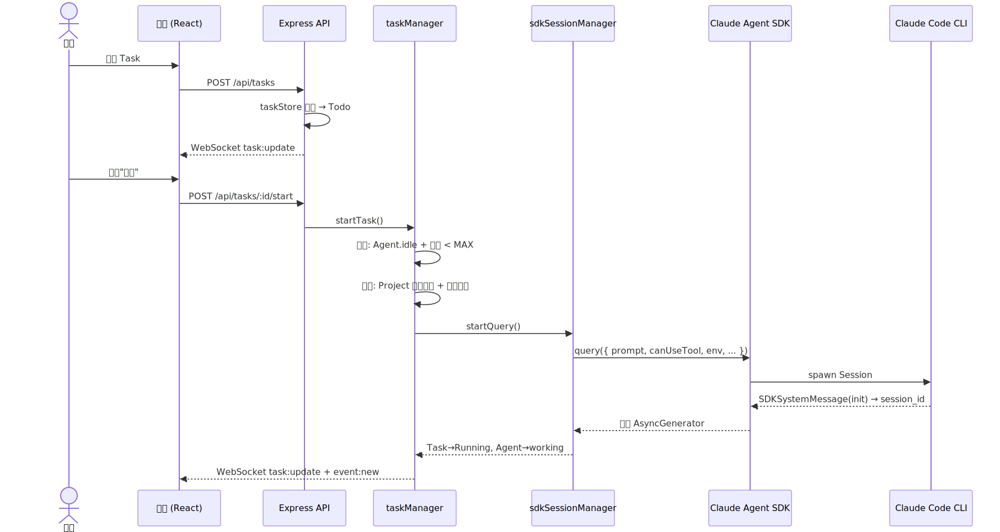

#### 工具调用安全管控


#### 人工介入 (Stuck → Running)

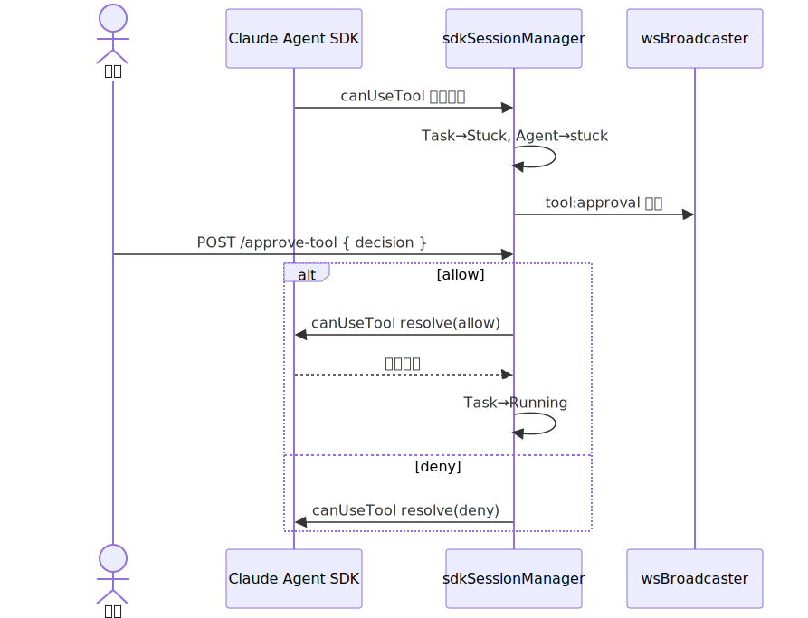

---

## 2. 运行环境要求

### 2.1 操作系统

| 平台 | 支持情况 | 已验证版本 | 备注 |
|------|---------|-----------|------|
| Linux x86_64 | ✅ 推荐 | Ubuntu 22.04 LTS, Debian 12 | 生产部署首选 |
| macOS (Intel) | ✅ 支持 | macOS 14+ (Sonoma) | Docker Desktop |
| macOS (Apple Silicon) | ✅ 支持 | macOS 14+ (Sonoma) | Docker Desktop，原生 ARM |
| Windows 10/11 | ✅ 支持 | Windows 10 22H2, Windows 11 23H2 | Docker Desktop + WSL2 |

### 2.2 基础软件（Docker 方式，推荐）

| 软件 | 最低版本 | 验证版本 | 说明 |
|------|---------|---------|------|
| Docker Engine | 24.0+ | 27.x | 容器运行时 |
| Docker Compose | v2 (2.x) | 集成于 Docker CLI | `docker compose`（无连字符） |
| Git | 2.30+ | 2.43+ | 克隆仓库 |

### 2.3 基础软件（源码方式）

| 软件 | 最低版本 | 推荐版本 | 说明 |
|------|---------|---------|------|
| Node.js | 18.0+ | 20.x LTS | 运行时，建议使用 nvm 管理版本 |
| npm | 9.0+ | 10.x | 随 Node.js 分发 |
| Claude Code CLI | 最新稳定版 | - | Agent 执行后端（可选，无 API Key 时仅 CRUD） |
| jq | 1.6+ | - | Hook 脚本 JSON 处理（macOS/Linux 通常预装） |
| curl | 7.0+ | - | Hook 事件转发 |

**Windows 源码环境额外需求**：
| 软件 | 说明 |
|------|------|
| Git for Windows | 提供 Git Bash，SDK 调用 Claude Code 子进程时需要 |
| 环境变量 `CLAUDE_CODE_GIT_BASH_PATH` | 指向 Git Bash 可执行文件，如 `D:\Git\bin\bash.exe` |

### 2.4 硬件资源

| 配置 | 最低要求 | 推荐配置 | 说明 |
|------|---------|---------|------|
| CPU | 2 核 | 4 核+ | 基础操作资源需求低；Agent 并发执行时 CPU 需求增加 |
| 内存 | 4 GB | 8 GB+ | Docker 环境建议分配 4GB+；每并发 Agent ~500MB |
| 磁盘 | 10 GB | 20 GB+ (SSD) | 项目文件、上传 PDF、生成训练数据、事件日志 |
| 网络 | 公网访问 | 稳定带宽 | Agent 执行需调用外部模型 API（DeepSeek / OpenAI / Anthropic 等） |

> **说明**：基础界面浏览、健康检查、项目/Agent/Task 管理等 CRUD 操作对资源要求极低（< 100MB 内存）。Agent 实际执行任务、Copilot 对话或 MinerU PDF 解析时，依赖外部模型 API，会增加 CPU、内存与网络开销。

### 2.5 环境变量完整参考

#### 核心服务变量

| 变量名 | 默认值 | 必填 | 说明 |
|--------|--------|------|------|
| `PORT` | `3456` | 否 | 服务监听端口 |
| `HOST` | `127.0.0.1` | 否 | 监听地址；Docker 部署必须设为 `0.0.0.0` |
| `NODE_ENV` | - | 否 | `production` 时提供前端静态文件服务 + SPA fallback |
| `MAX_CONCURRENT_TASKS` | `10` | 否 | 系统最大并发执行任务数 |
| `MAX_WS_CLIENTS` | `10` | 否 | WebSocket 最大连接数 |
| `TOOL_APPROVAL_TIMEOUT_MS` | `300000` | 否 | 工具审批超时（毫秒），超时自动拒绝（5分钟）。仅 `AUTO_APPROVE_ALL_TOOLS=false` 时有效 |
| `USER_MESSAGE_TIMEOUT_MS` | `1800000` | 否 | Stuck 状态下等待用户消息超时（30分钟） |
| `AUTO_APPROVE_ALL_TOOLS` | `true` | 否 | 工具调用自动批准策略。`true`（默认）：除高危 Bash 命令外全部自动放行；`false`：恢复交互式审批模式（仅 Read/Glob/Grep 自动允许，其余需人工确认） |

#### 认证变量

| 变量名 | 默认值 | 必填 | 说明 |
|--------|--------|------|------|
| `JWT_SECRET` | `ai4s-swarm-local-dev-secret-2026` | 否 | JWT 签名密钥，生产环境建议修改 |
| `DEFAULT_USER_EMAIL` | `admin` | 否 | 首次启动自动创建的管理员账号 |
| `DEFAULT_USER_PASSWORD` | `admin123` | 否 | 首次启动自动创建的管理员密码 |

> 密码使用 SHA-256 哈希存储，不保存明文。

#### 模型 API 变量

| 变量名 | 必填 | 说明 |
|--------|------|------|
| `ANTHROPIC_AUTH_TOKEN` | 否* | Anthropic API Token（与 API_KEY 二选一） |
| `ANTHROPIC_API_KEY` | 否* | 模型 API Key（支持 DeepSeek、OpenAI 等第三方兼容 API） |
| `ANTHROPIC_BASE_URL` | 否 | 模型服务基地址（OpenAI 兼容端点） |
| `ANTHROPIC_MODEL` | 否 | 主模型名，如 `deepseek-chat` |
| `ANTHROPIC_DEFAULT_HAIKU_MODEL` | 否 | 备选/快速模型名 |
| `COPILOT_MODEL` | 否 | Copilot 模型名，默认 `glm-5` |
| `API_TIMEOUT_MS` | 否 | API 调用超时（毫秒），默认 `600000`（10分钟） |
| `CLAUDE_CODE_DISABLE_NONESSENTIAL_TRAFFIC` | 否 | 设为 `1` 减少 Claude Code 非必要遥测流量 |

> *Agent/Copilot 执行时需要配置；纯界面和 CRUD 验证无需。

#### PDF 解析变量

| 变量名 | 必填 | 说明 |
|--------|------|------|
| `MINERU_TOKEN` | 否* | MinerU Open API Token |
| `MINERU_API_KEY` | 否* | MinerU API Key（与 TOKEN 等价） |

> *仅在使用 MinerU PDF 解析流水线时需要。

#### Windows 特有

| 变量名 | 必填 | 说明 |
|--------|------|------|
| `CLAUDE_CODE_GIT_BASH_PATH` | Windows 环境必需 | Git Bash 可执行文件路径，如 `D:\Git\bin\bash.exe` |

---

## 3. Docker 部署

### 3.1 快速开始

```bash
# 1. 克隆仓库
git clone https://github.com/GitHub-Ninghai/AI4S_Data_Agent_Swarm.git
cd AI4S_Data_Agent_Swarm

# 2. 配置环境变量
cp .env.example .env
# 编辑 .env，至少确保 HOST=0.0.0.0（Docker 网络需要）

# 3. 创建工作目录
mkdir -p workspace

# 4. 构建并启动
docker compose up --build -d

# 5. 验证
curl http://localhost:3456/api/health
```

启动后访问：**http://localhost:3456**

### 3.2 构建镜像（分步）

```bash
# 基本构建
docker build -t ai4s-data-agent-swarm:latest .

# 国内用户使用 npm 镜像加速
docker build -t ai4s-data-agent-swarm:latest \
  --build-arg NPM_REGISTRY=https://registry.npmmirror.com .
```

**Dockerfile 构建阶段说明**：

| 阶段 | 基础镜像 | 操作 |
|------|---------|------|
| build | node:20-bookworm-slim | npm ci (server + web) → tsc 编译 → vite build |
| runtime | node:20-bookworm-slim | 仅复制 dist/ + node_modules → 启动 |

**构建优化**：
- 多阶段构建，运行时镜像仅包含生产依赖和编译产物
- `package-lock.json` 锁定依赖版本，确保可重现构建
- Web 前端跳过 `tsc -b` 类型检查（预存 TS 类型错误不阻塞 Docker 构建；类型检查应在独立 CI 步骤处理）
- HEALTHCHECK 指令每 30s 检查 `/api/health`，连续 3 次失败标记不健康

### 3.3 docker-compose.yml 详解

```yaml
services:
  ai4s-data-agent-swarm:
    build:
      context: .
      dockerfile: Dockerfile
    container_name: ai4s-data-agent-swarm
    ports:
      - "${PORT:-3456}:3456"          # 端口映射，支持 .env 自定义
    environment:
      NODE_ENV: production             # 启用前端静态文件服务
      HOST: 0.0.0.0                   # 容器内必须监听所有接口
      PORT: 3456
      MAX_CONCURRENT_TASKS: ${MAX_CONCURRENT_TASKS:-10}
      MAX_WS_CLIENTS: ${MAX_WS_CLIENTS:-10}
      TOOL_APPROVAL_TIMEOUT_MS: ${TOOL_APPROVAL_TIMEOUT_MS:-300000}
      USER_MESSAGE_TIMEOUT_MS: ${USER_MESSAGE_TIMEOUT_MS:-1800000}
      ANTHROPIC_AUTH_TOKEN: ${ANTHROPIC_AUTH_TOKEN:-}
      ANTHROPIC_API_KEY: ${ANTHROPIC_API_KEY:-}
      ANTHROPIC_BASE_URL: ${ANTHROPIC_BASE_URL:-}
      COPILOT_MODEL: ${COPILOT_MODEL:-}
      MINERU_TOKEN: ${MINERU_TOKEN:-}
    volumes:
      - ./data:/app/data               # 持久化数据
      - ./workspace:/workspace         # 项目工作目录
    restart: unless-stopped            # 自动重启策略
```

### 3.4 挂载目录

| 宿主机目录 | 容器内目录 | 持久化内容 |
|-----------|-----------|-----------|
| `./data` | `/app/data` | agents.json, tasks.json, projects.json, sessions.json, users.json, events/, logs/ |
| `./workspace` | `/workspace` | 项目文件、上传 PDF、Agent 输出、生成的训练数据 |

> **注意**：创建项目时 `path` 参数必须为容器内绝对路径（如 `/workspace`），系统会校验路径是否存在。不指定 `path` 时自动创建 `data/projects/{name}`。

### 3.5 服务管理

```bash
# 查看运行状态
docker compose ps

# 查看实时日志
docker compose logs -f

# 查看最近 100 行日志
docker compose logs --tail=100

# 仅查看服务日志（不含 build 输出）
docker compose logs ai4s-data-agent-swarm

# 停止服务
docker compose down

# 停止并删除数据卷（⚠️ 会丢失所有持久化数据）
docker compose down -v

# 重启服务
docker compose restart

# 重新构建并启动（代码更新后）
docker compose up --build -d

# 进入容器调试
docker exec -it ai4s-data-agent-swarm bash
```

### 3.6 健康检查

Dockerfile 内置 HEALTHCHECK：

```
HEALTHCHECK --interval=30s --timeout=5s --start-period=20s --retries=3 \
  CMD node -e "fetch('http://127.0.0.1:3456/api/health')..."
```

查看健康状态：

```bash
# Docker 健康状态
docker inspect ai4s-data-agent-swarm --format='{{.State.Health.Status}}'

# 手动健康检查
curl http://localhost:3456/api/health
```

---

## 4. 源码运行

### 4.1 环境准备

```bash
# 安装 Node.js 20（推荐使用 nvm）
nvm install 20
nvm use 20

# 验证版本
node --version   # 应输出 v20.x.x
npm --version    # 应输出 10.x.x

# 克隆仓库
git clone https://github.com/GitHub-Ninghai/AI4S_Data_Agent_Swarm.git
cd AI4S_Data_Agent_Swarm

# 配置环境变量
cp .env.example .env
# 编辑 .env 填入 API Key（如需 Agent 执行功能）
```

### 4.2 安装依赖

```bash
# 后端依赖
cd server && npm install && cd ..

# 前端依赖
cd web && npm install && cd ..

# 创建工作目录（用于项目文件存储）
mkdir -p workspace
```

**后端核心依赖** (`server/package.json`)：

| 依赖 | 版本 | 用途 |
|------|------|------|
| `@anthropic-ai/claude-agent-sdk` | ^0.1.0 | Claude Code 程序化调用 |
| `express` | ^4.21.2 | HTTP 框架 |
| `ws` | ^8.18.0 | WebSocket 服务 |
| `cors` | ^2.8.5 | 跨域支持 |
| `jsonwebtoken` | ^9.0.3 | JWT 认证 |
| `multer` | ^2.1.1 | 文件上传处理 |
| `p-queue` | ^8.0.1 | 并发任务队列 |
| `proper-lockfile` | ^4.1.2 | 文件锁（JSON 写入安全） |
| `zod` | ^4.4.3 | 请求验证 |
| `dotenv` | ^16.4.7 | 环境变量加载 |
| `ai` + `@ai-sdk/*` | ^6.0 / ^3.0 | Copilot 多模型 AI SDK |

**前端核心依赖** (`web/package.json`)：

| 依赖 | 版本 | 用途 |
|------|------|------|
| `react` + `react-dom` | ^19.2.0 | UI 框架 |
| `vite` | ^7.2.4 | 构建工具 |
| `@radix-ui/*` | 多个 ^1.x / ^2.x | 无障碍 UI 组件 |
| `tailwindcss` | ^3.4.19 | 原子化 CSS |
| `framer-motion` | ^12.38.0 | 动画库 |
| `recharts` | ^2.15.4 | 图表库 |
| `react-router-dom` | ^7.15.0 | 路由 |
| `react-hook-form` | ^7.70.0 | 表单管理 |
| `zod` | ^4.3.5 | 前端验证 |
| `lucide-react` | ^0.562.0 | 图标库 |
| `sonner` | ^2.0.7 | Toast 通知 |
| `phaser` | ^4.1.0 | 像素世界游戏引擎 |

### 4.3 启动方式

#### 方式一：一键启动（推荐）

```bash
# 开发模式（tsx watch + vite dev，自动重启）
node start.js

# 生产模式（需先编译）
node start.js --prod
```

`start.js` 启动器功能：
- 同时启动后端（port 3456）和前端开发服务器（port 5173）
- 自动检测并释放被占用的端口（同项目进程）
- 子进程 stdout/stderr 实时输出，带时间戳标签
- 跨平台支持（Windows/macOS/Linux）
- Ctrl+C 优雅关闭所有子进程

#### 方式二：分别启动

```bash
# 终端 1：启动后端（开发模式，tsx watch 自动重启）
cd server && npx tsx watch index.ts

# 终端 2：启动前端开发服务器（可选，HMR 热更新）
cd web && npm run dev
```

**访问地址**：
- 后端生产服务：**http://localhost:3456**（提供完整前端 + API）
- 前端开发服务器：**http://localhost:5173**（HMR 模式，代理 API 到 :3456）

#### 方式三：生产构建

```bash
# 1. 编译后端 TypeScript
cd server && npm run build    # → server/dist/

# 2. 构建前端
cd web && npx vite build      # → web/dist/

# 3. 启动生产服务
cd server && NODE_ENV=production node dist/index.js

# 访问 http://localhost:3456 （前后端一体化）
```

**TypeScript 编译配置** (`server/tsconfig.json`)：
| 选项 | 值 | 说明 |
|------|-----|------|
| target | ES2022 | 输出 ES2022 语法 |
| module | NodeNext | ESM 模块系统 |
| moduleResolution | NodeNext | Node.js ESM 解析 |
| strict | true | 严格类型检查 |
| outDir | ./dist | 编译输出目录 |
| rootDir | . | 源码根目录 |

### 4.4 开发环境 Vite 代理

前端开发服务器 (`web/vite.config.ts`) 自动代理：

```typescript
proxy: {
  "/api": {
    target: "http://localhost:3456",  // REST API 代理
    changeOrigin: true,
  },
  "/ws": {
    target: "ws://localhost:3456",    // WebSocket 代理
    ws: true,
  },
}
```

这意味着在开发模式下：
- `fetch("/api/agents")` → 自动代理到 `http://localhost:3456/api/agents`
- `new WebSocket("ws://localhost:5173/ws")` → 自动代理到 `ws://localhost:3456/ws`

### 4.5 开发环境 CORS

后端允许以下开发源跨域访问：
- `http://localhost:5173`
- `http://127.0.0.1:5173`

生产模式（`NODE_ENV=production`）下前后端一体化，无跨域问题。

---

## 5. 运行验证

### 5.1 基础可用性验证

#### 5.1.1 访问 Web UI

打开浏览器访问 `http://localhost:3456`，应看到系统登录页面。

> 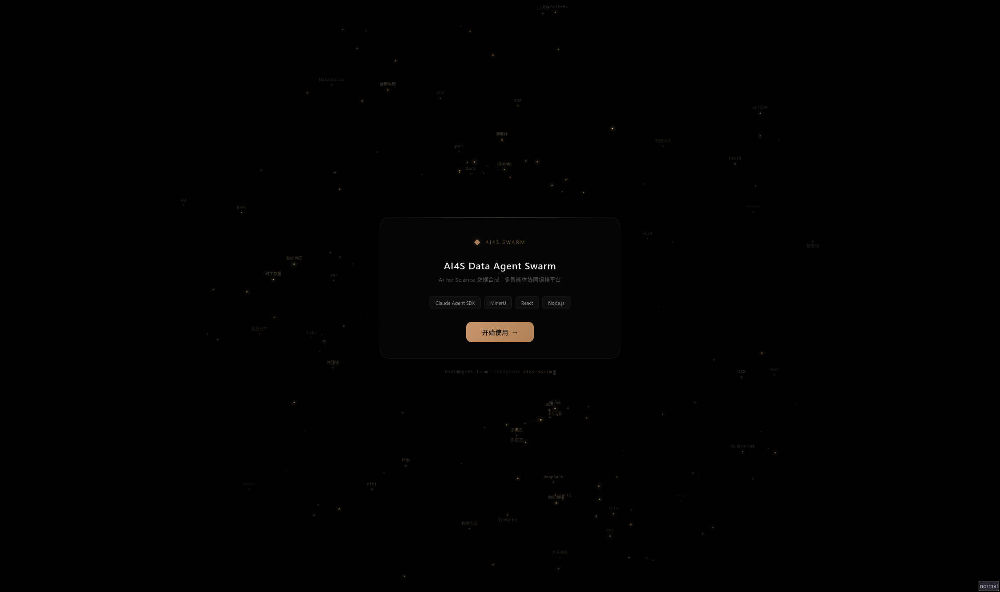
> *图：系统首页 / 登录页面*

进入系统：

> 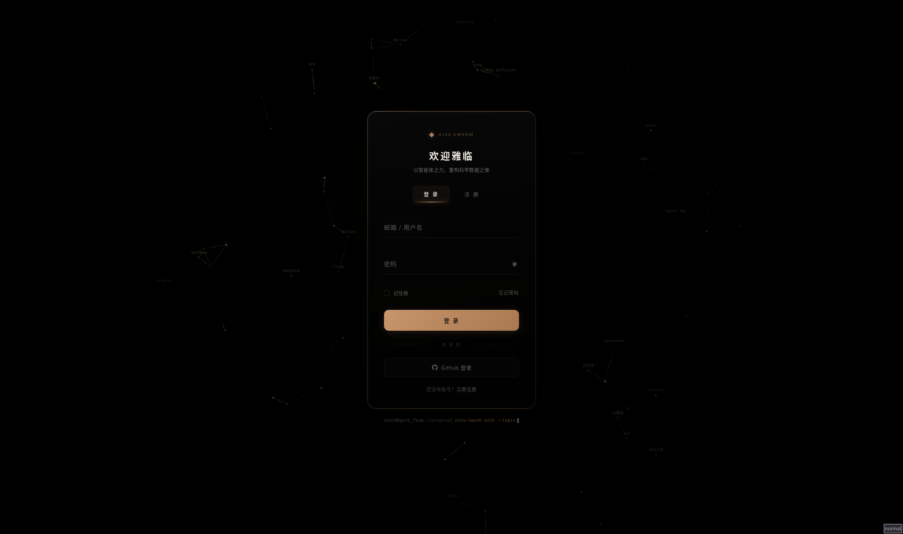
> *图：系统登录页面*

填写默认管理员账号 `admin` / `admin123` 登录：

> 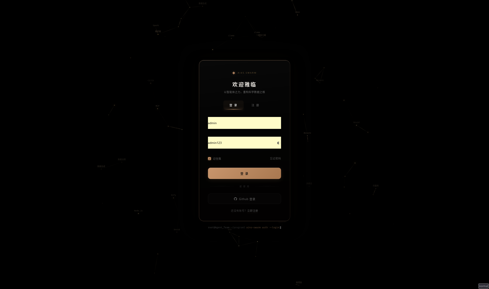
> *图：登录信息填写*

登录成功后进入主界面：

> 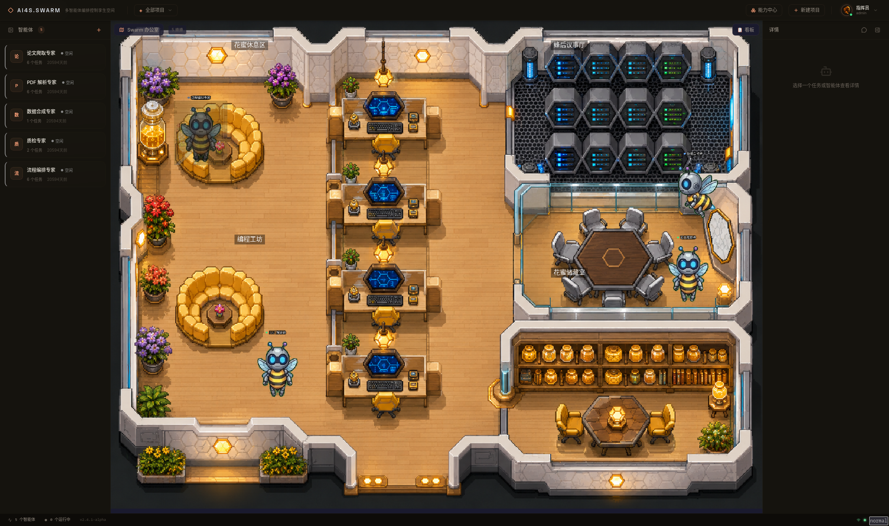
> 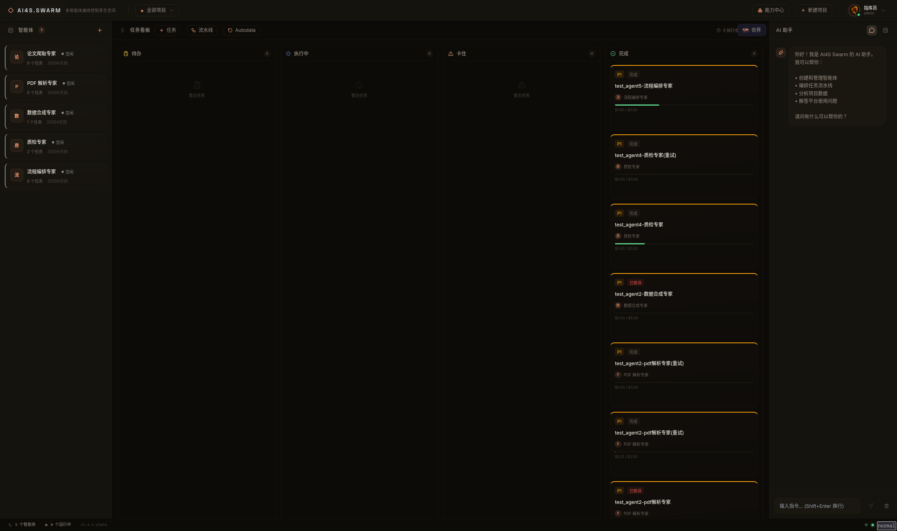
> *图：系统主界面 — Agent 面板、看板、详情面板三栏布局*

#### 5.1.2 健康检查

```bash
curl http://localhost:3456/api/health
```

预期响应：

```json
{
  "status": "ok",
  "version": "0.1.0",
  "uptime": 12.345,
  "activeTaskCount": 0,
  "maxConcurrentTasks": 10,
  "storageOk": true
}
```

响应字段说明：

| 字段 | 类型 | 说明 |
|------|------|------|
| `status` | string | 服务状态，`"ok"` 表示正常 |
| `version` | string | 系统版本号（来自 package.json） |
| `uptime` | number | 进程运行秒数（`process.uptime()`） |
| `activeTaskCount` | number | Running + Stuck 状态的任务数 |
| `maxConcurrentTasks` | number | 配置的最大并发数 |
| `storageOk` | boolean | JSON 文件存储是否可读写 |

#### 5.1.3 Docker 容器健康状态

```bash
# 查看容器健康检查状态
docker inspect ai4s-data-agent-swarm --format='{{.State.Health.Status}}'
# 预期: healthy

# 查看最近 5 次健康检查结果
docker inspect ai4s-data-agent-swarm --format='{{range .State.Health.Log}}{{.Output}}{{end}}'
```

### 5.2 认证与业务接口验证

以下脚本可一键验证核心 API 链路：

```bash
#!/bin/bash
BASE="http://localhost:3456"

# 1. 获取 Token
echo "=== 1. Login ==="
LOGIN_RESP=$(curl -s -X POST $BASE/api/auth/login \
  -H 'Content-Type: application/json' \
  -d '{"account":"admin","password":"admin123"}')
echo "$LOGIN_RESP" | python3 -m json.tool
TOKEN=$(echo "$LOGIN_RESP" | python3 -c "import sys,json; print(json.load(sys.stdin)['data']['token'])")
echo "Token obtained: ${TOKEN:0:20}..."

# 2. 创建项目
echo -e "\n=== 2. Create Project ==="
PROJ_RESP=$(curl -s -X POST $BASE/api/projects \
  -H 'Content-Type: application/json' \
  -H "Authorization: Bearer $TOKEN" \
  -d '{"name":"eval-project","path":"/workspace","description":"committee verification"}')
echo "$PROJ_RESP" | python3 -m json.tool
PROJ_ID=$(echo "$PROJ_RESP" | python3 -c "import sys,json; print(json.load(sys.stdin)['project']['id'])")

# 3. 查询项目列表
echo -e "\n=== 3. List Projects ==="
curl -s $BASE/api/projects -H "Authorization: Bearer $TOKEN" | python3 -m json.tool

# 4. 查询 Agent 列表
echo -e "\n=== 4. List Agents ==="
curl -s $BASE/api/agents -H "Authorization: Bearer $TOKEN" | python3 -m json.tool

# 5. 查询 Task 列表
echo -e "\n=== 5. List Tasks ==="
curl -s $BASE/api/tasks -H "Authorization: Bearer $TOKEN" | python3 -m json.tool

# 6. 获取用户信息
echo -e "\n=== 6. Get Profile ==="
curl -s $BASE/api/user/profile -H "Authorization: Bearer $TOKEN" | python3 -m json.tool

echo -e "\n=== All checks passed ==="
```

### 5.3 前端功能验证清单

依次验证以下功能点：

| # | 功能点 | 操作步骤 | 预期结果 |
|---|--------|---------|---------|
| 1 | **Project 选择** | 顶部栏右侧下拉框切换项目 | 页面数据按项目过滤 |
| 2 | **创建 Project** | 点击"新建项目"按钮，填写表单 | 弹窗关闭，列表刷新 |
| 3 | **创建 Agent** | 点击"创建 Agent"按钮，填写名称/角色/prompt/工具/模型 | Agent 出现在左侧面板 |
| 4 | **编辑 Agent** | 点击 Agent 卡片编辑按钮 | 表单回填，可修改 |
| 5 | **启用/停用 Agent** | 切换 Agent 开关 | 状态变更，停用后无法分配任务 |
| 6 | **创建 Task** | 在看板 Todo 列点击"新建"，选择 Agent/项目 | Task 卡片出现在 Todo 列 |
| 7 | **启动 Task** | 点击 Task 卡片的"启动"按钮 | Task 移动到 Running 列（需 API Key） |
| 8 | **停止 Task** | 点击 Running 中 Task 的"停止" | Task 移动到 Cancelled |
| 9 | **Agent 详情** | 点击左侧 Agent 卡片 | 详情面板展示统计、最近任务 |
| 10 | **Task 详情** | 点击 Task 卡片 | 详情面板展示事件时间线、预算条 |
| 11 | **Copilot 对话** | 右侧 Copilot 面板输入消息 | 助手回复，可能需要确认操作 |
| 12 | **用户中心** | 右上角用户头像下拉菜单 | 可查看/编辑个人信息 |
| 13 | **Agent 大厅** | 切换到大厅视图 | 像素世界可视化 Agent 状态 |
| 14 | **能力中心** | 切换到能力视图 | 管理 Agent 能力绑定 |
| 15 | **WebSocket 状态** | 底部状态栏 | 显示绿色连接指示器 |

> 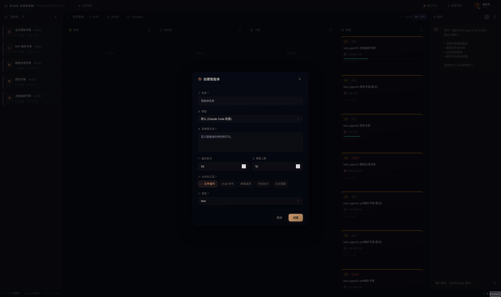
> *图：创建 Agent 表单*

> 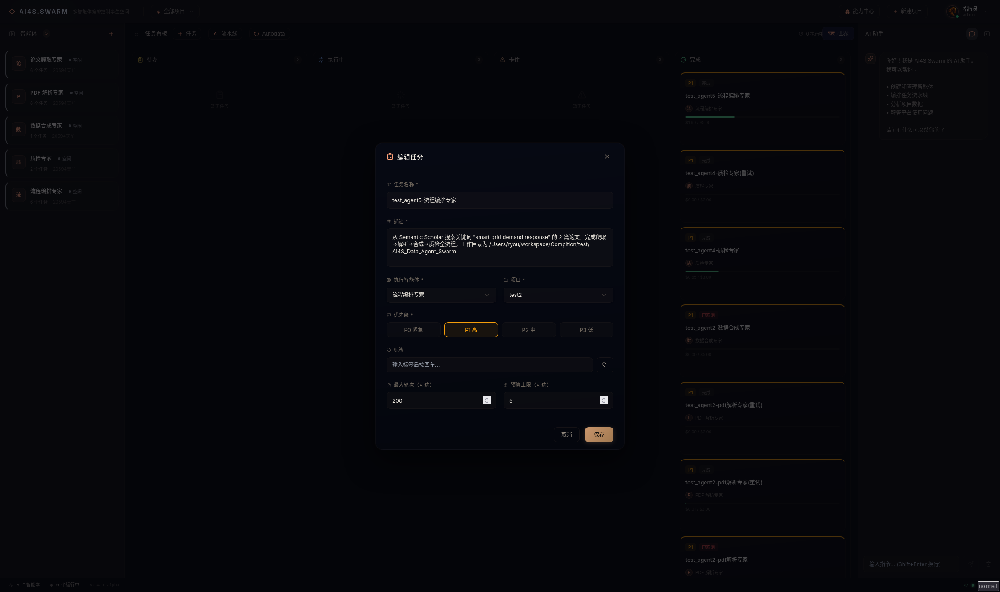
> *图：创建 Task 表单*

> 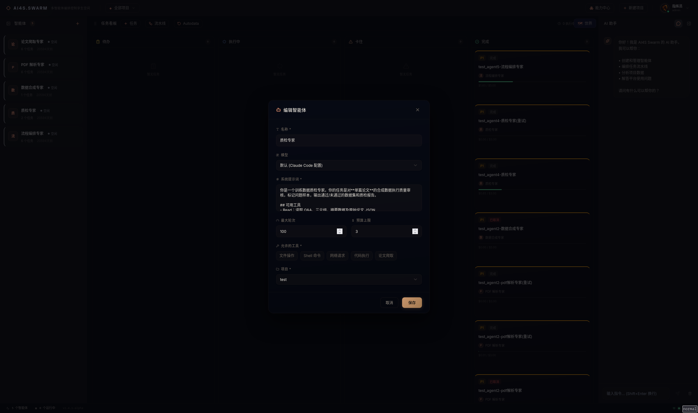
> *图：Agent 详情面板*

> 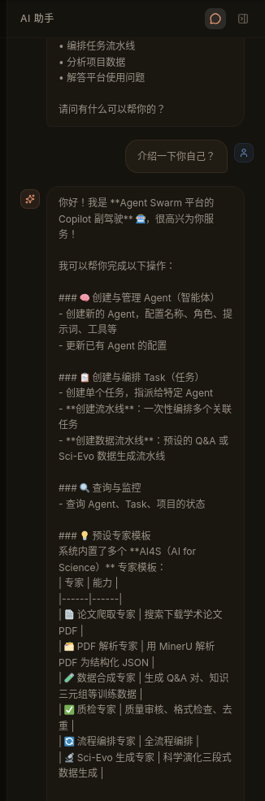
> *图：Copilot 对话界面*

> 
> *图：Agent 大厅可视化界面*

### 5.4 自动化测试

#### 5.4.1 后端单元/集成测试

```bash
cd server && npx vitest run
```

**测试配置** (`server/vitest.config.ts`)：

```typescript
{
  fileParallelism: false,    // 串行执行（JSON 文件存储，避免竞争）
  hookTimeout: 30000,        // 钩子超时 30s
  testTimeout: 15000,        // 单测超时 15s
  pool: 'forks',             // 进程隔离
}
```

**测试覆盖范围**：

| 测试文件 | 覆盖内容 |
|---------|---------|
| `routes/agents.test.ts` | Agent CRUD 全流程：创建/列表/详情/更新/删除/启用/停用 |
| `routes/tasks.test.ts` | Task CRUD 全流程：创建/列表/详情/更新/删除/过滤/搜索/分页 |
| `routes/taskActions.test.ts` | Task 操作：启动/停止/标记完成/重试/发送消息 |
| `routes/taskEvents.test.ts` | 事件查询：分页/按类型过滤/时间线 |
| `routes/projects.test.ts` | Project CRUD：创建/列表/更新/删除/路径校验 |
| `routes/events.test.ts` | Hook 事件接口：事件接收/去重/持久化 |
| `server.test.ts` | 服务启动/关闭/健康检查 |
| `server.shutdown.test.ts` | 优雅关闭：Running Task → Stuck / SDK 停止 |
| `server.recovery.test.ts` | 崩溃恢复：启动时恢复 Running/Stuck 任务 |
| `store/memoryStores.test.ts` | 存储层：JSON 读写/并发安全/数据迁移 |
| `store/fileStore.test.ts` | 文件存储：上传/列表/删除 |
| `sdk/messageParser.test.ts` | SDK 消息解析：各消息类型→Event 转换 |
| `sdk/queryWrapper.test.ts` | SDK 调用包装：query 参数构建/会话管理 |
| `services/eventProcessor.test.ts` | 事件处理：去重/持久化/归档 |
| `services/sdkSessionManager.test.ts` | 会话管理：启动/中断/并发控制 |
| `services/stuckDetector.test.ts` | 卡住检测：超时/恢复/通知 |
| `services/wsBroadcaster.test.ts` | WebSocket 广播：消息分发/客户端管理 |
| `services/logRotator.test.ts` | 日志轮转：大小限制/压缩/归档 |
| `providers/*.test.ts` | 模型提供商：API 连接测试/Provider 注册 |

#### 5.4.2 运行单个测试文件

```bash
cd server

# 运行特定测试文件
npx vitest run routes/agents.test.ts

# 运行特定测试（按名称匹配）
npx vitest run -t "should create agent"

# Watch 模式（开发时使用）
npx vitest
```

#### 5.4.3 前端测试

```bash
cd web && npx vitest run
```

前端测试覆盖：
| 测试文件 | 覆盖内容 |
|---------|---------|
| `components/KanbanBoard.test.tsx` | 看板渲染/列拖拽/Task 卡片 |
| `components/modals/AgentFormModal.test.tsx` | Agent 表单验证/提交 |
| `components/modals/TaskFormModal.test.tsx` | Task 表单验证/Agent 选择 |
| `components/shared/ActivityTimeline.test.tsx` | 事件时间线渲染 |
| `components/shared/BudgetBar.test.tsx` | 预算消耗进度条 |

---

## 6. 日志与数据查看

### 6.1 容器日志

```bash
# 实时查看所有日志
docker compose logs -f

# 查看最近 100 行
docker compose logs --tail=100

# 仅查看服务日志
docker compose logs ai4s-data-agent-swarm

# 按时间范围查看（需配合 grep）
docker compose logs --since 2026-05-19T10:00:00
```

**日志输出标记**：

| 前缀 | 来源 | 示例 |
|------|------|------|
| `[Agent Swarm]` | 系统启动/关闭 | `[Agent Swarm] Server listening on http://127.0.0.1:3456` |
| `[Seed]` | 数据初始化 | `[Seed] Default admin user created: admin` |
| `[Recovery]` | 崩溃恢复 | `[Recovery] Found 2 Running task(s), recovering...` |
| `[Warning]` | 警告信息 | `[Warning] Disk space low: 450MB free in data directory` |
| `[ERROR]` | 错误（5xx） | `[ERROR] INTERNAL_ERROR: ...` |

### 6.2 持久化数据目录

```text
data/
├── agents.json              # Agent 元数据 [{ id, name, prompt, status, ... }]
├── tasks.json               # Task 元数据 [{ id, title, status, agentId, ... }]
├── sessions.json            # SDK 会话映射 [{ id, taskId, agentId, cwd, status }]
├── projects.json            # 项目元数据 [{ id, name, path, description }]
├── users.json               # 用户数据 [{ id, email, passwordHash, role }]
├── providers.json           # 模型提供商注册信息
├── capabilities.json        # Agent 能力绑定
├── world-state.json         # 虚拟世界 Agent 状态
├── events/
│   ├── <task-id>.jsonl      # 任务事件流（JSONL，每行一个事件）
│   └── <task-id>.jsonl.gz   # 归档事件（>100MB 时自动 gzip 压缩）
├── logs/
│   └── hooks.log            # Hook 原始事件日志（JSONL）
├── uploads_tmp/             # 文件上传临时目录（multer 中间态）
└── projects/                # 自动创建的项目目录（path 未指定时）
    └── <project-name>/
        ├── uploads/         # 上传的 PDF 文件
        └── papers/          # 论文文件
```

### 6.3 JSON 文件并发安全机制

所有 JSON 文件写入采用 `safeWrite` 模式，通过 `p-queue` 序列化（concurrency=1），防止并发写入导致数据损坏。

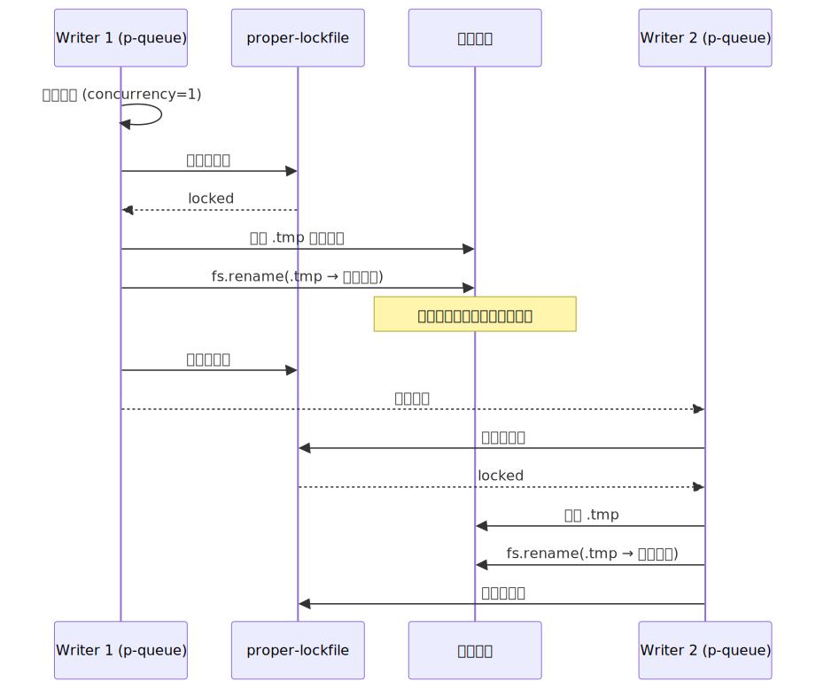

> `.tmp.*` 残留文件是崩溃后的产物，可安全删除：`find data/ -name "*.tmp.*" -delete`

### 6.4 事件日志格式

`data/events/<task-id>.jsonl` 每行为一个 JSON 对象：

```json
{
  "id": "event-uuid",
  "taskId": "task-uuid",
  "sessionId": "session-uuid",
  "eventType": "PreToolUse",
  "source": "sdk",
  "toolName": "Bash",
  "toolInput": "{\"command\":\"ls -la\"}",
  "toolOutput": "[文件列表...]",
  "duration": 1234,
  "timestamp": 1716000000000,
  "raw": "{\"完整SDK消息\": ...}"
}
```

### 6.5 日志轮转

`logRotator` 服务自动管理事件日志大小：
- 单个事件文件超过 **100MB** 时触发压缩
- 压缩为 `.jsonl.gz` 格式
- 仅保留压缩版，原始文件截断

### 6.6 常用数据查看命令

```bash
# 查看 Task 列表（格式化 JSON）
cat data/tasks.json | python3 -m json.tool

# 统计各状态 Task 数量
cat data/tasks.json | python3 -c "
import sys,json
from collections import Counter
tasks = json.load(sys.stdin)['tasks']
c = Counter(t['status'] for t in tasks)
print(dict(c))
"

# 查看指定 Task 的事件流（前 100 行）
cat data/events/<task-id>.jsonl | head -100

# 统计指定 Task 的事件类型分布
cat data/events/<task-id>.jsonl | python3 -c "
import sys,json
from collections import Counter
types = Counter(json.loads(l)['eventType'] for l in sys.stdin)
print(dict(types))
"

# 实时监控 Hook 日志
tail -f data/logs/hooks.log

# 查看事件文件大小
ls -lah data/events/

# 查看项目列表
cat data/projects.json | python3 -m json.tool

# 查看 Agent 配置
cat data/agents.json | python3 -m json.tool

# 查看 SDK 会话
cat data/sessions.json | python3 -m json.tool

# 清理残留的 .tmp 文件
find data/ -name "*.tmp.*" -delete
```

### 6.7 日志分析矩阵

| 信息源 | 查看方式 | 用途 |
|--------|---------|------|
| `docker compose logs` | 标准输出 | Server 运行日志、错误堆栈、启动信息、崩溃恢复 |
| `data/logs/hooks.log` | JSONL 文件 | Claude Hook 原始事件记录（补充通道全量数据） |
| `data/events/*.jsonl` | JSONL 文件 | 每个 Task 的详细执行事件（工具调用、输出、耗时） |
| `data/tasks.json` | JSON 文件 | Task 元数据和最终输出摘要（`output` 字段） |
| `data/sessions.json` | JSON 文件 | SDK 会话映射和工作目录 |
| `data/agents.json` | JSON 文件 | Agent 配置和统计数据 |
| `workspace/` | 文件系统 | Agent 执行生成的所有输出文件 |

---

## 7. SDK 探针验证

### 7.1 概述

SDK 探针脚本 (`scripts/sdk-probe.ts`) 验证 `@anthropic-ai/claude-agent-sdk` 的 7 个关键假设，确保 SDK API 行为与架构设计一致。**强烈建议在开始任何开发工作前运行此脚本。**

### 7.2 前置条件

1. Claude Code CLI 已安装并完成认证
2. 网络可访问 Anthropic API（或配置了兼容 API）
3. 有一定的 API 额度（总消耗约 $0.01-$0.05）

### 7.3 运行探针

```bash
# 在项目根目录运行
npx tsx scripts/sdk-probe.ts

# 或从 server 目录运行
cd server && npx tsx ../scripts/sdk-probe.ts
```

### 7.4 验证假设列表

| # | 假设 | 验证内容 | 关键验证点 |
|---|------|---------|-----------|
| 1 | query() 参数签名 | query 是函数，返回 AsyncGenerator | 类型定义与运行时一致 |
| 2 | session_id 存在于 init 消息 | system init 消息的 subtype 和 session_id | UUID 格式的会话标识 |
| 3 | abortController 支持 | abort() 后流正常停止 | 外部中断机制可用 |
| 4 | resume 机制 | 新 query 可恢复旧 session | 跨 query 上下文保持 |
| 5 | canUseTool 阻塞等待 | 回调返回 Promise，SDK 等待 resolve | 工具审批阻塞模式 |
| 6 | 预算超限行为 | maxBudgetUsd 极低值触发超限 | 返回 error_max_budget_usd |
| 7 | SDK 已公开发布 | npm 安装验证 + 版本确认 | SDK 可正常 import |

### 7.5 探针报告

探针完成后自动生成报告：`scripts/sdk-probe-report.md`

报告包含：
- 每个假设的通过/失败状态
- 详细验证信息（session_id、模型名、工具列表等）
- 失败项的建议备选方案
- 通过率汇总

---

## 8. Hook 事件通道配置

### 8.1 概述

Hook 系统是 SDK Message Stream 之外的补充事件通道。当 Claude Code 执行过程中触发特定事件（工具调用前后、会话启停等），Hook 脚本自动将事件转发到平台 Server。

### 8.2 Hook 脚本

`hooks/eventHook.sh` — Claude Code 事件转发脚本。

**工作原理**：
1. 从 stdin 读取 Claude Code 传入的 JSON
2. 使用 `jq` 提取关键字段（hook_event_name, session_id, tool_name, tool_input, tool_output）
3. tool_input 截断至 10KB（防止巨型输入撑爆存储）
4. 追加完整 JSON 到 `data/logs/hooks.log`
5. POST 到 `http://localhost:3456/event`（静默失败，不影响 Claude Code 正常运行）

### 8.3 注册 Hook

```bash
# 使用项目提供的注册脚本
node scripts/register-hooks.js
```

### 8.4 支持的 Hook 事件

| Hook 事件名 | 触发时机 | 内部 EventType | 说明 |
|------------|---------|---------------|------|
| `SessionStart` | Claude Code 会话启动 | SessionStart | 含 session_id, cwd, model |
| `SessionEnd` | 会话结束 | SessionEnd | 含 duration |
| `PreToolUse` | 工具调用前 | PreToolUse | 含 tool_name, tool_input |
| `PostToolUse` | 工具调用后 | PostToolUse | 含 tool_output |
| `Stop` | Agent 主动停止 | Stop | 含 stop_reason |
| `UserPromptSubmit` | 用户提交提示 | UserPromptSubmit | 含 prompt 文本 |
| `Notification` | 系统通知 | Notification | 含 message, level |

### 8.5 去重机制

SDK 和 Hook 可能重复报告同一事件（如工具调用）。`eventProcessor` 通过以下逻辑去重：
- PreToolUse/PostToolUse：如果已存在同 session_id + tool_name + 近似时间戳（±2s）的 SDK 来源事件，则跳过 Hook 事件
- 优先保留 SDK 来源的事件（数据更完整）
- Hook 事件作为兜底：SDK 未捕获的事件由 Hook 补充

---

## 9. API 接口文档

### 9.1 通用规范

#### 9.1.1 Base URL

```
http://localhost:3456
```

所有业务 API 请求以 `/api/` 为前缀。Hook 事件接口路径为 `/event`（无 `/api` 前缀）。WebSocket 路径为 `/ws`。

在 Vite 开发模式下，前端通过代理访问 API，Base URL 为空字符串（同源）。

#### 9.1.2 认证方式

**JWT Bearer Token 认证**。

算法：HS256，密钥由 `JWT_SECRET` 环境变量控制（默认 `ai4s-swarm-local-dev-secret-2026`），有效期 7 天。

**无需认证的接口**：

| 接口 | 路径 | 认证要求 |
|------|------|---------|
| 健康检查 | `GET /api/health` | 无需 |
| 用户注册 | `POST /api/auth/register` | 无需 |
| 用户登录 | `POST /api/auth/login` | 无需 |
| 用户登出 | `POST /api/auth/logout` | 无需 |
| Hook 事件 | `POST /event` | 无需（仅本地调用） |
| 所有业务接口 | `/api/*` | ✅ 需 Bearer Token |

**请求头格式**：

```
Authorization: Bearer <token>
```

**Token 获取**：

```bash
curl -X POST http://localhost:3456/api/auth/login \
  -H 'Content-Type: application/json' \
  -d '{"account":"admin","password":"admin123"}'
```

**认证中间件实现** (`server/middleware/auth.ts`)：

- `requireAuth` — 强制认证：无 Token 返回 401，无效 Token 返回 401
- `requireAdmin` — 管理员权限：非 admin 角色返回 403
- `optionalAuth` — 可选认证：尝试解析 Token 但不强制

#### 9.1.3 请求格式

| 接口类型 | Content-Type | 说明 |
|---------|-------------|------|
| 业务接口 | `application/json` | JSON body，最大 10MB |
| 文件上传 | `multipart/form-data` | 通过 multer 处理 |

#### 9.1.4 响应格式

**认证接口** 使用统一信封：

```json
{
  "code": 0,
  "data": { ... },
  "message": "ok",
  "timestamp": 1716000000000
}
```

**业务接口** 使用简化格式：

```json
// 列表
{ "agents": [...] }
{ "tasks": [...], "total": 1, "page": 1, "limit": 20, "totalPages": 1 }
{ "projects": [...] }

// 单体
{ "agent": { ... } }
{ "task": { ... } }
{ "project": { ... } }

// 操作确认
{ "ok": true }
```

#### 9.1.5 错误响应格式

```json
{
  "error": {
    "code": "ERROR_CODE",
    "message": "Human-readable error message",
    "details": {}
  }
}
```

#### 9.1.6 通用错误码

| HTTP 状态码 | 错误码 | 触发场景 |
|------------|--------|---------|
| 400 | `VALIDATION_ERROR` | 请求参数格式错误、缺少必填字段 |
| 401 | `UNAUTHORIZED` | 未提供 Token 或 Token 无效/过期 |
| 401 | `AUTH_FAILED` | 登录账号或密码错误 |
| 403 | `FORBIDDEN` | 权限不足（非管理员操作管理员接口） |
| 404 | `AGENT_NOT_FOUND` | Agent 不存在 |
| 404 | `TASK_NOT_FOUND` | Task 不存在 |
| 404 | `PROJECT_NOT_FOUND` | Project 不存在 |
| 404 | `USER_NOT_FOUND` | 用户不存在 |
| 409 | `TASK_ALREADY_RUNNING` | 尝试启动运行中的 Task |
| 409 | `AGENT_BUSY` | Agent 正在执行其他 Task |
| 400 | `INVALID_PATH` | Project 工作目录路径不存在 |
| 400 | `INVALID_PATH_PLATFORM` | 跨平台路径错误（如 macOS 上使用 Windows 路径 `D:\workspace`） |
| 409 | `RESOURCE_HAS_DEPENDENTS` | 删除有关联资源的项目/Agent |
| 409 | `USER_EXISTS` | 注册时邮箱已被使用 |
| 500 | `INTERNAL_ERROR` | 服务器内部错误 |

---

### 9.2 认证接口

#### 9.2.1 用户注册

```
POST /api/auth/register
```

**认证**：无需

**请求体**：

| 字段 | 类型 | 必填 | 约束 | 说明 |
|------|------|------|------|------|
| `email` | string | 是 | 非空 | 邮箱，作为登录账号 |
| `password` | string | 是 | 长度 >= 6 | 密码（SHA-256 哈希存储） |
| `name` | string | 否 | - | 显示名称，默认取 email 的 @ 前部分 |

**成功响应** (201):

```json
{
  "code": 0,
  "data": {
    "token": "eyJhbGciOiJIUzI1NiIs...",
    "user": {
      "id": "uuid",
      "name": "用户名",
      "email": "user@example.com",
      "avatar": null,
      "role": "user",
      "createdAt": 1716000000000
    }
  },
  "message": "ok",
  "timestamp": 1716000000000
}
```

**错误响应**：

| 状态码 | 错误码 | 场景 |
|--------|--------|------|
| 400 | `VALIDATION_ERROR` | email 为空或 password 不足 6 位 |
| 409 | `USER_EXISTS` | 邮箱已被注册 |

#### 9.2.2 用户登录

```
POST /api/auth/login
```

**认证**：无需

**请求体**：

| 字段 | 类型 | 必填 | 说明 |
|------|------|------|------|
| `account` | string | 是 | 登录账号（即注册时的 email） |
| `password` | string | 是 | 密码 |

> **默认管理员账号**：`admin` / `admin123`（首次启动时自动创建，role 为 `admin`）

**成功响应** (200)：同注册接口。

**错误响应**：

| 状态码 | 错误码 | 场景 |
|--------|--------|------|
| 400 | `VALIDATION_ERROR` | account 或 password 为空 |
| 401 | `AUTH_FAILED` | 账号不存在或密码错误 |

#### 9.2.3 用户登出

```
POST /api/auth/logout
```

**认证**：无需

**成功响应** (200)：

```json
{ "code": 0, "data": null, "message": "ok", "timestamp": 1716000000000 }
```

> 当前实现为无状态 JWT，登出仅在前端清除 Token。

#### 9.2.4 获取个人信息

```
GET /api/user/profile
```

**认证**：需要

**成功响应** (200)：

```json
{
  "code": 0,
  "data": {
    "id": "uuid",
    "name": "指挥员",
    "email": "admin",
    "avatar": "/images/avatar-default.png",
    "role": "系统管理员",
    "createdAt": 1716000000000
  },
  "message": "ok",
  "timestamp": 1716000000000
}
```

#### 9.2.5 修改个人信息

```
PUT /api/user/profile
```

**认证**：需要

**请求体**：

| 字段 | 类型 | 必填 | 说明 |
|------|------|------|------|
| `name` | string | 否 | 新显示名称 |
| `avatar` | string | 否 | 新头像 URL |

**成功响应** (200)：同个人信息查询。

**错误响应**：

| 状态码 | 错误码 | 场景 |
|--------|--------|------|
| 401 | `UNAUTHORIZED` | 未登录 |
| 404 | `USER_NOT_FOUND` | 用户不存在 |

---

### 9.3 健康检查

```
GET /api/health
```

**认证**：无需

**成功响应** (200)：

```json
{
  "status": "ok",
  "version": "0.1.0",
  "uptime": 12.345,
  "activeTaskCount": 0,
  "maxConcurrentTasks": 10,
  "storageOk": true
}
```

| 字段 | 类型 | 说明 |
|------|------|------|
| `status` | string | 服务状态，`"ok"` 表示正常 |
| `version` | string | 系统版本号 |
| `uptime` | number | 进程运行秒数（`process.uptime()`） |
| `activeTaskCount` | number | Running + Stuck 状态的任务数 |
| `maxConcurrentTasks` | number | 最大并发任务数配置 |
| `storageOk` | boolean | 存储可读写（固定为 true） |

---

### 9.4 项目管理

#### 9.4.1 项目列表

```
GET /api/projects
```

**认证**：需要

**成功响应** (200)：

```json
{
  "projects": [
    {
      "id": "uuid",
      "name": "my-project",
      "path": "/workspace",
      "description": "AI4S data synthesis project",
      "createdAt": 1716000000000,
      "updatedAt": 1716000000000
    }
  ]
}
```

#### 9.4.2 创建项目

```
POST /api/projects
```

**认证**：需要

**请求体**：

| 字段 | 类型 | 必填 | 约束 | 说明 |
|------|------|------|------|------|
| `name` | string | 是 | `[a-zA-Z0-9_-]+` | 项目名称 |
| `path` | string | 否 | 绝对路径 | 工作目录，不指定则自动创建 `data/projects/{name}` |
| `description` | string | 否 | - | 项目描述 |

> `path` 如指定，必须是已存在的目录（系统校验 `fs.existsSync`）。Docker 环境下必须是容器内路径。

**成功响应** (201)：

```json
{
  "project": {
    "id": "uuid",
    "name": "my-project",
    "path": "/workspace",
    "description": "...",
    "createdAt": 1716000000000,
    "updatedAt": 1716000000000
  }
}
```

**错误响应**：

| 状态码 | 错误码 | 场景 |
|--------|--------|------|
| 400 | `VALIDATION_ERROR` | name 格式非法或 path 不存在于磁盘 |

#### 9.4.3 更新项目

```
PUT /api/projects/:id
```

**认证**：需要

**请求体**（至少一个字段）：

| 字段 | 类型 | 说明 |
|------|------|------|
| `name` | string | 新项目名称 |
| `path` | string | 新工作目录路径 |
| `description` | string | 新描述 |

**成功响应** (200)：

```json
{ "project": { ... } }
```

**错误响应**：

| 状态码 | 错误码 | 场景 |
|--------|--------|------|
| 404 | `PROJECT_NOT_FOUND` | 项目不存在 |

#### 9.4.4 删除项目

```
DELETE /api/projects/:id
```

**认证**：需要

**约束**：项目下有 Running/Stuck 状态的 Task 时返回 409 Conflict。

**成功响应** (200)：

```json
{ "ok": true }
```

**错误响应**：

| 状态码 | 错误码 | 场景 |
|--------|--------|------|
| 404 | `PROJECT_NOT_FOUND` | 项目不存在 |
| 409 | `RESOURCE_HAS_DEPENDENTS` | 项目下有活跃 Task |

---

### 9.5 Agent 管理

Agent 是系统的核心实体——一个"数字员工"。每个 Agent 由自定义系统提示词（prompt）和资源配置定义，不包含推理逻辑。

#### 9.5.1 Agent 列表

```
GET /api/agents
```

**认证**：需要

**成功响应** (200)：

```json
{
  "agents": [
    {
      "id": "uuid",
      "name": "PDF 解析专家",
      "avatar": "📄",
      "role": "负责解析论文 PDF 为结构化数据",
      "prompt": "你是一个专业的 PDF 解析专家...",
      "isEnabled": true,
      "status": "idle",
      "projectId": null,
      "currentTaskId": null,
      "maxTurns": 200,
      "maxBudgetUsd": 5.0,
      "allowedTools": ["Bash", "Read", "Write", "Edit", "Grep", "Glob", "WebFetch"],
      "hasApiKey": false,
      "apiKey": "",
      "model": "",
      "provider": "",
      "apiBaseUrl": "",
      "taskCount": 0,
      "stats": {
        "totalTasksCompleted": 0,
        "totalTasksCancelled": 0,
        "totalCostUsd": 0,
        "avgDurationMs": 0
      },
      "lastEventAt": 0,
      "createdAt": 1716000000000,
      "updatedAt": 1716000000000
    }
  ]
}
```

> **安全说明**：返回的 Agent 列表中 `apiKey` 字段已脱敏（仅显示末 4 位，如 `****7a2b`），`hasApiKey` 指示是否配置了 Key。

#### 9.5.2 创建 Agent

```
POST /api/agents
```

**认证**：需要

**请求体**：

| 字段 | 类型 | 必填 | 默认值 | 约束 | 说明 |
|------|------|------|--------|------|------|
| `name` | string | 是 | - | 1-50 字符 | Agent 名称 |
| `avatar` | string | 是 | - | 非空 | 头像 emoji 或 URL |
| `role` | string | 是 | - | 1-200 字符 | 角色描述 |
| `prompt` | string | 是 | - | 10-15000 字符 | 系统提示词 |
| `projectId` | string | 否 | null | - | 默认关联项目 |
| `maxTurns` | number | 否 | 200 | - | 最大对话轮次 |
| `maxBudgetUsd` | number | 否 | 5.0 | - | 预算上限（美元） |
| `allowedTools` | string[] | 否 | 全部 | 见下方工具列表 | 允许的工具名称列表 |
| `model` | string | 否 | "" | - | 使用的模型名 |
| `provider` | string | 否 | "" | claude/kimi/glm/minimax/openai/deepseek |
| `apiKey` | string | 否 | "" | - | 模型 API Key（存储后脱敏展示） |
| `apiBaseUrl` | string | 否 | "" | - | 模型服务地址 |

**可用工具列表**：

| 工具名 | 分类 | 说明 | 默认权限（AUTO_APPROVE_ALL_TOOLS=true） | 严格权限（AUTO_APPROVE_ALL_TOOLS=false） |
|--------|------|------|------------------------------------------|----------------------------------------|
| `Read` | file | 读取文件 | 自动允许 | 自动允许 |
| `Write` | file | 写入文件 | 自动允许 | 需审批 |
| `Edit` | file | 编辑文件 | 自动允许 | 需审批 |
| `Glob` | file | 文件模式匹配 | 自动允许 | 自动允许 |
| `Grep` | file | 内容搜索 | 自动允许 | 自动允许 |
| `Bash` | shell | Shell 命令执行 | 自动允许（高危命令仍拦截） | 需审批（高危命令拦截） |
| `WebFetch` | network | HTTP 请求 | 自动允许 | 需审批 |

> **高危 Bash 命令**在所有模式下均会被拦截（`rm -rf /`、`mkfs`、`dd if=`、`:(){ :|:& };:` 等破坏性操作）。拦截时系统会打印警告日志并拒绝执行，不会进入 Stuck 等待状态。

**Agent 状态流转**：


**成功响应** (201)：包含新创建的 Agent 对象。

**错误响应**：

| 状态码 | 错误码 | 场景 |
|--------|--------|------|
| 400 | `VALIDATION_ERROR` | 必填字段缺失或格式不符 |

#### 9.5.3 获取 Agent 详情

```
GET /api/agents/:id
```

**认证**：需要

**成功响应** (200)：

```json
{ "agent": { ... } }
```

#### 9.5.4 更新 Agent

```
PUT /api/agents/:id
```

**认证**：需要

支持部分更新（PATCH 语义）。特殊处理：

- `apiKey` 为 `""` → 清空 Key
- `apiKey` 以 `"****"` 开头 → 保持现有 Key 不变（前端脱敏占位符）
- `isEnabled` → 触发 Agent 状态迁移（idle ↔ offline）

**成功响应** (200)：

```json
{ "agent": { ... } }
```

#### 9.5.5 Agent 统计

```
GET /api/agents/:id/stats
```

**认证**：需要

**成功响应** (200)：

```json
{
  "totalTasksCompleted": 5,
  "totalTasksCancelled": 1,
  "totalCostUsd": 2.5,
  "avgDurationMs": 120000,
  "recentTasks": [
    { "id": "...", "title": "...", "status": "Done" }
  ]
}
```

#### 9.5.6 删除 Agent

```
DELETE /api/agents/:id
```

**认证**：需要

**约束**：Agent 有 Running/Stuck 状态的任务时返回 409 Conflict。

**成功响应** (200)：

```json
{ "ok": true }
```

#### 9.5.7 启用 Agent

```
POST /api/agents/:id/start
```

**认证**：需要

将 `isEnabled` 设为 `true`，`status` 从 `offline` 迁移到 `idle`。

**成功响应** (200)：

```json
{ "agent": { ... } }
```

#### 9.5.8 停用 Agent

```
POST /api/agents/:id/stop
```

**认证**：需要

将 `isEnabled` 设为 `false`，`status` 从 `idle` 迁移到 `offline`。

**成功响应** (200)：

```json
{ "agent": { ... } }
```

#### 9.5.9 测试模型连接

```
POST /api/agents/test-connection
```

**认证**：需要

**请求体**：

| 字段 | 类型 | 必填 | 说明 |
|------|------|------|------|
| `model` | string | 否* | 模型名称 |
| `apiKey` | string | 否 | API Key |
| `apiBaseUrl` | string | 否* | 模型服务地址 |

> `model` 和 `apiBaseUrl` 至少提供一个。

**成功响应** (200)：

```json
{ "ok": true, "model": "deepseek-chat", "message": "连接成功: deepseek-chat" }
```

**失败响应** (200，ok=false)：

```json
{ "ok": false, "error": "认证失败 (401): API Key 无效或已过期" }
```

---

### 9.6 Task 管理

Task 是用户的核心操作对象——它是可独立验证的工作单元。一个 Task 指派给一个 Agent，通过 SDK 会话执行。

#### 9.6.1 Task 列表

```
GET /api/tasks
```

**认证**：需要

**查询参数**：

| 参数 | 类型 | 默认值 | 说明 |
|------|------|--------|------|
| `projectId` | string | - | 按项目过滤 |
| `status` | string | - | 按状态过滤（逗号分隔多值，如 `Todo,Running`） |
| `agentId` | string | - | 按 Agent 过滤 |
| `q` | string | - | 关键词搜索（匹配 title + description） |
| `page` | number | 1 | 页码 |
| `limit` | number | 20 | 每页条数（最大 100） |
| `includeDeleted` | boolean | false | 是否包含软删除的 Task |

**成功响应** (200)：

```json
{
  "tasks": [
    {
      "id": "uuid",
      "title": "示例任务",
      "description": "[Project Working Directory]\n/workspace\n\n这是任务的详细描述",
      "status": "Todo",
      "agentId": "agent-uuid",
      "projectId": "project-uuid",
      "sessionId": null,
      "parentTaskId": null,
      "output": null,
      "completedReason": null,
      "priority": 1,
      "tags": ["eval"],
      "eventCount": 0,
      "turnCount": 0,
      "budgetUsed": 0,
      "maxTurns": 200,
      "maxBudgetUsd": 5.0,
      "deletedAt": null,
      "createdAt": 1716000000000,
      "startedAt": null,
      "completedAt": null,
      "stuckReason": null,
      "lastEventAt": null,
      "pipelineType": null,
      "inputFiles": null,
      "autodataMeta": null
    }
  ],
  "total": 1,
  "page": 1,
  "limit": 20,
  "totalPages": 1
}
```

> **注意**：`description` 字段在创建时自动注入 `[Project Working Directory]\n{path}\n\n` 前缀，确保 Agent 知道输出文件写入位置。

#### 9.6.2 创建 Task

```
POST /api/tasks
```

**认证**：需要

**请求体**：

| 字段 | 类型 | 必填 | 默认值 | 约束 | 说明 |
|------|------|------|--------|------|------|
| `title` | string | 是 | - | 1-100 字符 | 任务标题 |
| `description` | string | 是 | - | 10-10000 字符 | 任务描述 |
| `agentId` | string | 是 | - | 存在的 Agent ID | 指派 Agent |
| `projectId` | string | 是 | - | 存在的 Project ID | 所属项目 |
| `priority` | number | 否 | 1 | 0/1/2/3 | 优先级 |
| `tags` | string[] | 否 | [] | - | 标签列表 |
| `maxTurns` | number | 否 | 继承 Agent | - | 覆盖 Agent 默认 maxTurns |
| `maxBudgetUsd` | number | 否 | 继承 Agent | - | 覆盖 Agent 默认预算 |
| `pipelineType` | string | 否 | - | qa/scievo/autodata | 流水线类型 |
| `inputFiles` | string[] | 否 | - | - | 输入文件列表 |

**优先级定义**：

| 值 | 标签 | 说明 |
|----|------|------|
| 0 | 低 | 后台批量任务 |
| 1 | 中（默认） | 普通任务 |
| 2 | 高 | 优先处理 |
| 3 | 紧急 | 最高优先级 |

**成功响应** (201)：

```json
{ "task": { ... } }
```

#### 9.6.3 获取 Task 详情

```
GET /api/tasks/:id
```

**认证**：需要

**成功响应** (200)：

```json
{ "task": { ... } }
```

#### 9.6.4 更新 Task

```
PUT /api/tasks/:id
```

**认证**：需要

**编辑规则（状态约束）**：

| 字段 | Todo | Running/Stuck | Done/Cancelled |
|------|------|---------------|----------------|
| title / description | ✅ 可编辑 | ✅ 可编辑（不影响运行中的 Agent） | 不可编辑 |
| agentId | ✅ 可更换 | 不可更换 | 不可更换 |
| projectId | ✅ 可更换 | 不可更换 | 不可更换 |
| priority / tags | ✅ 可编辑 | ✅ 可编辑 | 可编辑 |
| maxTurns / maxBudgetUsd | ✅ 可编辑 | 仅可提高（不可降低运行中的限制） | 不可编辑 |

**成功响应** (200)：

```json
{ "task": { ... } }
```

#### 9.6.5 删除 Task

```
DELETE /api/tasks/:id
```

**认证**：需要

**删除规则**：

| 状态 | 处理方式 |
|------|---------|
| Todo / Cancelled | 硬删除（直接删除记录和事件文件） |
| Done | 软删除（添加 `deletedAt` 时间戳，保留数据和事件） |
| Running / Stuck | 返回 409 Conflict（需先停止再删除） |

**成功响应** (200)：

```json
{ "ok": true }
```

#### 9.6.6 启动 Task

```
POST /api/tasks/:id/start
```

**认证**：需要

**启动流程**：
1. 验证 Task 状态为 Todo
2. 验证 Agent 状态为 idle 且 isEnabled 为 true
3. 检查系统并发数 < `MAX_CONCURRENT_TASKS`
4. **校验 Project 路径**：检查路径在当前文件系统是否存在；识别跨平台路径错误（如 macOS 上使用 Windows 路径 `D:\workspace`，给出友好提示）
5. 调用 SDK `query()` 创建 Claude Code 会话（始终注入 `process.env`，确保 `PATH` 等环境变量可用）
6. 绑定 `session_id` → Task
7. Task → Running，Agent → working
8. 开始异步消费 SDK 消息流

**成功响应** (200)：

```json
{ "task": { ... } }
```

**错误响应**：

| 状态码 | 错误码 | 场景 |
|--------|--------|------|
| 404 | `TASK_NOT_FOUND` | Task 不存在 |
| 409 | `TASK_ALREADY_RUNNING` | Task 已在运行中 |
| 409 | `AGENT_BUSY` | Agent 正在执行其他任务 |
| 500 | `INTERNAL_ERROR` | SDK 调用失败 |

#### 9.6.7 停止 Task

```
POST /api/tasks/:id/stop
```

**认证**：需要

中止 SDK 消息流（`Query.interrupt()`），Task → Cancelled，Agent → idle。

**成功响应** (200)：

```json
{ "task": { ... } }
```

#### 9.6.8 标记完成

```
POST /api/tasks/:id/done
```

**认证**：需要

用户手动将 Task 标记为 Done。仅 Running/Stuck 状态可标记。

**成功响应** (200)：

```json
{ "task": { ... } }
```

#### 9.6.9 发送消息（恢复 Stuck Task）

```
POST /api/tasks/:id/message
```

**认证**：需要

**请求体**：

| 字段 | 类型 | 必填 | 说明 |
|------|------|------|------|
| `message` | string | 是 | 发送给 Agent 的消息文本 |
| `allowTool` | object | 否 | 附带工具审批决策 |
| `allowTool.decision` | string | 是* | `"allow"` 或 `"deny"` |

调用 SDK `resume` 恢复会话，Task → Running。

**成功响应** (200)：

```json
{ "task": { ... } }
```

#### 9.6.10 批准/拒绝工具调用

```
POST /api/tasks/:id/approve-tool
```

**认证**：需要

**请求体**：

| 字段 | 类型 | 必填 | 说明 |
|------|------|------|------|
| `decision` | string | 是 | `"allow"` 或 `"deny"` |

**成功响应** (200)：

```json
{ "task": { ... } }
```

#### 9.6.11 重试 Task

```
POST /api/tasks/:id/retry
```

**认证**：需要

创建一个新 Task，复制原 Task 的配置（title 追加 ` (重试)` 或其他标识），`parentTaskId` 指向原 Task。

**成功响应** (201)：

```json
{ "task": { ... } }
```

#### 9.6.12 查询 Task 事件

```
GET /api/tasks/:id/events
```

**认证**：需要

**查询参数**：

| 参数 | 类型 | 默认值 | 说明 |
|------|------|--------|------|
| `page` | number | 1 | 页码 |
| `limit` | number | 50 | 每页条数（最大 200） |
| `type` | string | - | 按事件类型过滤 |

**事件类型**：

| 类型 | 来源 | 说明 |
|------|------|------|
| `SDKInit` | SDK | 会话初始化，含 session_id、model、cwd、tools、claude_code_version |
| `SDKAssistant` | SDK | 助手消息（工具调用请求、文本输出、思考过程） |
| `SDKResult` | SDK | 任务完成/失败，含 result、total_cost_usd、duration_ms |
| `SessionStart` | Hook | 会话启动 |
| `SessionEnd` | Hook | 会话结束 |
| `PreToolUse` | Hook | 工具调用前（tool_name, tool_input） |
| `PostToolUse` | Hook | 工具调用后（tool_output） |
| `Stop` | Hook | Agent 主动停止 |
| `UserPromptSubmit` | Hook | 用户提交消息 |
| `Notification` | Hook | 系统通知（含 stuck 关键字时触发卡住检测） |

**成功响应** (200)：

```json
{
  "events": [
    {
      "id": "event-uuid",
      "taskId": "task-uuid",
      "sessionId": "session-uuid",
      "eventType": "PreToolUse",
      "source": "sdk",
      "toolName": "Bash",
      "toolInput": "{\"command\":\"ls -la\"}",
      "toolOutput": "[文件列表输出摘要]",
      "duration": 1234,
      "timestamp": 1716000000000,
      "raw": "{\"原始SDK消息JSON\": ...}"
    }
  ],
  "total": 150,
  "page": 1,
  "limit": 50,
  "totalPages": 3
}
```

#### 9.6.13 查询 SDK 运行状态

```
GET /api/tasks/:id/sdk-status
```

**认证**：需要

**成功响应** (200)：

```json
{
  "running": true,
  "turnCount": 15,
  "budgetUsed": 1.23,
  "maxBudgetUsd": 5.0
}
```

---

### 9.7 文件上传

#### 9.7.1 上传文件

```
POST /api/files/upload
```

**认证**：需要

**请求格式**：`multipart/form-data`

| 字段 | 类型 | 必填 | 说明 |
|------|------|------|------|
| `projectId` | string | 是 | 所属项目 ID |
| `files` | File[] | 是 | PDF 文件，最多 20 个，单文件最大 200MB |

**约束**：仅支持 PDF 文件（MIME type: `application/pdf`）。

**成功响应** (201)：

```json
{
  "files": [
    {
      "id": "file-uuid",
      "name": "paper.pdf",
      "path": "/workspace/uploads/uuid_paper.pdf",
      "relativePath": "uploads/uuid_paper.pdf",
      "size": 2048576,
      "uploadedAt": 1716000000000
    }
  ]
}
```

文件存储于项目目录的 `uploads/` 子目录下，文件名添加 UUID 前缀防止冲突。

#### 9.7.2 项目文件列表

```
GET /api/files/:projectId
```

**认证**：需要

列出项目 `uploads/` 和 `papers/` 目录下的所有 PDF 文件。

**成功响应** (200)：

```json
{
  "files": [
    {
      "id": "file-uuid",
      "name": "paper.pdf",
      "path": "/workspace/uploads/uuid_paper.pdf",
      "relativePath": "uploads/uuid_paper.pdf",
      "size": 2048576,
      "source": "uploads"
    }
  ]
}
```

#### 9.7.3 删除文件

```
DELETE /api/files/:projectId/:fileId
```

**认证**：需要

**成功响应** (200)：

```json
{ "ok": true }
```

---

### 9.8 数据流水线

数据流水线将多个 Task 串联为预设工作流，自动为每个步骤查找对应名称的 Agent 并创建 Task。

#### 9.8.1 创建流水线

```
POST /api/pipeline/create
```

**认证**：需要

**请求体**：

| 字段 | 类型 | 必填 | 说明 |
|------|------|------|------|
| `pipelineType` | string | 是 | `"qa"` 或 `"scievo"` |
| `projectId` | string | 是 | 目标项目 ID |
| `pdfFiles` | string[] | 是 | PDF 文件路径列表（相对于项目目录） |
| `maxTurns` | number | 否 | 覆盖默认 maxTurns |
| `maxBudgetUsd` | number | 否 | 覆盖默认预算上限 |

**QA 流水线（3 步骤）**：

| 步骤 | Agent 名称搜索 | 任务内容 | 默认 maxTurns |
|------|-------------|---------|--------------|
| 1 | PDF 解析专家 | 使用 MinerU 解析 PDF 为结构化 JSON | 150 |
| 2 | 数据合成专家 | 基于解析结果生成 Q&A 训练数据、三元组、摘要 | 200 |
| 3 | 质检专家 | 格式检查、事实验证、去重、标签校验 | 100 |

**Sci-Evo 流水线（2 步骤）**：

| 步骤 | Agent 名称搜索 | 任务内容 | 默认 maxTurns |
|------|-------------|---------|--------------|
| 1 | PDF 解析专家 | 使用 MinerU 解析 PDF 为结构化 JSON | 150 |
| 2 | Sci-Evo 生成专家 | 生成科学演化三段式 JSON（前身→突破→影响） | 150 |

**成功响应** (201)：

```json
{
  "pipeline": {
    "type": "qa",
    "projectId": "project-uuid",
    "pdfFiles": ["uploads/paper1.pdf"],
    "tasks": [
      { "id": "task-1", "title": "PDF 解析 — paper1.pdf" },
      { "id": "task-2", "title": "Q&A 数据合成 — paper1.pdf" },
      { "id": "task-3", "title": "数据质检 — paper1.pdf" }
    ]
  }
}
```

> **注意**：流水线要求系统中存在对应名称匹配的 Agent（通过名称包含关键词匹配），否则创建失败。多个 PDF 文件时，每个文件创建独立的步骤 Task。

---

### 9.9 Autodata 弱-强对抗

提供弱-强对抗验证的自动化数据流水线。通过 Challenger（挑战者）生成问题，Weak Solver（弱求解器）和 Strong Solver（强求解器）分别解答，Judge（裁判）评估回答质量，多轮迭代，持续优化直到 Weak 模型通过或达到最大轮数。

#### 9.9.1 创建 Autodata 流水线

```
POST /api/autodata/create
```

**认证**：需要

**请求体**：

| 字段 | 类型 | 必填 | 说明 |
|------|------|------|------|
| `projectId` | string | 是 | 项目 ID |
| `inputFiles` | string[] | 是 | 输入文件路径列表 |
| `maxRounds` | number | 否 | 最大迭代轮数（1-20，默认 5） |
| `challenger` | object | 是 | 挑战者模型配置 |
| `weakSolver` | object | 是 | 弱求解器模型配置 |
| `strongSolver` | object | 是 | 强求解器模型配置 |
| `judge` | object | 是 | 裁判模型配置 |

**模型配置结构**：

| 字段 | 类型 | 必填 | 说明 |
|------|------|------|------|
| `model` | string | 是 | 模型名称 |
| `apiKey` | string | 是 | API Key |
| `apiBaseUrl` | string | 是 | 服务基地址 |

**约束**：Challenger 和 Judge 不能使用相同的 model + apiBaseUrl + apiKey 组合。

**工作流程**：

```
Round 1:
  Challenger → 生成问题
  WeakSolver → 解答 → Score
  StrongSolver → 解答 → Score
  Judge → 评分对比
  ↓ 如果 Weak 分数 < Strong 分数 (gap 较大)
Round 2:
  Challenger → 优化问题（使 Weak 更难）
  WeakSolver → 重新解答
  ...
  ↓ 直到 Weak 通过或达到最大轮数
Done: 生成训练数据
```

**成功响应** (201)：

```json
{
  "group": {
    "id": "group-uuid",
    "projectId": "project-uuid",
    "status": "running",
    "currentRound": 1,
    "maxRounds": 5,
    "rounds": [
      {
        "round": 1,
        "challengerTaskId": "task-uuid",
        "weakSolverTaskId": null,
        "strongSolverTaskId": null,
        "judgeTaskId": null,
        "weakDone": false,
        "strongDone": false
      }
    ],
    "createdAt": 1716000000000
  },
  "firstTaskId": "task-uuid"
}
```

#### 9.9.2 Autodata 迭代组列表

```
GET /api/autodata/groups
```

**认证**：需要

**成功响应** (200)：

```json
{
  "groups": [
    {
      "groupId": "group-uuid",
      "projectId": "project-uuid",
      "status": "running",
      "currentRound": 2,
      "maxRounds": 5,
      "createdAt": 1716000000000
    }
  ]
}
```

#### 9.9.3 Autodata 迭代组详情

```
GET /api/autodata/groups/:id
```

**认证**：需要

返回完整的分组信息，包括每轮次的 Task ID 和状态摘要。

#### 9.9.4 重试 Autodata 组

```
POST /api/autodata/groups/:id/retry
```

**认证**：需要

重新启动失败的 Autodata 组，从失败轮次继续。

**成功响应** (200)：

```json
{
  "group": { ... },
  "taskId": "task-uuid"
}
```

---

### 9.10 Copilot

Copilot 是面向任务的 AI 助手，支持多轮对话和操作执行。通过 AI SDK (`ai` + `@ai-sdk/*`) 调用配置的模型（默认 `glm-5`），可理解用户意图并建议创建 Agent、启动 Task 等操作。

#### 9.10.1 创建会话

```
POST /api/copilot/session
```

**认证**：需要

**成功响应** (201)：

```json
{ "sessionId": "session-uuid" }
```

#### 9.10.2 删除会话

```
DELETE /api/copilot/session/:id
```

**认证**：需要

**成功响应** (200)：

```json
{ "ok": true }
```

#### 9.10.3 发送聊天消息

```
POST /api/copilot/chat
```

**认证**：需要

**请求体**：

| 字段 | 类型 | 必填 | 说明 |
|------|------|------|------|
| `sessionId` | string | 否 | 会话 ID（不提供则自动创建新会话） |
| `message` | string | 是 | 用户消息文本 |

**成功响应** (200)：

```json
{
  "sessionId": "session-uuid",
  "message": "Copilot 的回复文本，解释即将执行的操作",
  "actions": [
    {
      "type": "createAgent",
      "params": { "name": "新 Agent", "role": "...", "prompt": "..." },
      "description": "创建一个新的数据合成 Agent"
    }
  ],
  "needsConfirmation": true
}
```

当 `needsConfirmation` 为 `true` 时，前端应展示操作确认界面，用户确认后调用 `/api/copilot/confirm` 执行操作。

**Copilot 支持的操作类型**：

| type | 说明 | params |
|------|------|--------|
| `createAgent` | 创建 Agent | name, role, prompt, allowedTools, model 等 |
| `createTask` | 创建 Task | title, description, agentId, projectId 等 |
| `startTask` | 启动 Task | taskId |
| `stopTask` | 停止 Task | taskId |

#### 9.10.4 确认操作

```
POST /api/copilot/confirm
```

**认证**：需要

**请求体**：

| 字段 | 类型 | 必填 | 说明 |
|------|------|------|------|
| `sessionId` | string | 是 | 会话 ID |
| `actionIndex` | number | 是 | actions 数组中的索引 |
| `confirmed` | boolean | 是 | `true` 执行操作，`false` 取消 |

**成功响应** (200)：

```json
{
  "success": true,
  "message": "Agent 创建成功",
  "data": { "agentId": "uuid" }
}
```

---

### 9.11 Hook 事件接口

用于接收 Claude Hook 事件的补充通道。路径无 `/api` 前缀，仅限本地调用（无认证）。

```
POST /event
```

**认证**：无需（仅本地 `127.0.0.1` 调用）

**请求体**：

| 字段 | 类型 | 必填 | 说明 |
|------|------|------|------|
| `hook_event_name` | string | 是 | Hook 事件名（SessionStart、PreToolUse 等） |
| `session_id` | string | 否 | SDK 会话 ID |
| `cwd` | string | 否 | 当前工作目录 |
| `tool_name` | string | 否 | 工具名称 |
| `tool_input` | string | 否 | 工具输入（最大 10KB） |
| `tool_output` | string | 否 | 工具输出 |
| `source` | string | 否 | 数据来源标识，通常为 `"hook"` |

**事件映射**：

| Hook 事件名 | 内部 EventType | 说明 |
|-----------|---------------|------|
| `SessionStart` | SessionStart | 会话启动，含 session_id, cwd, model |
| `SessionEnd` | SessionEnd | 会话结束 |
| `PreToolUse` | PreToolUse | 工具调用前 |
| `PostToolUse` | PostToolUse | 工具调用后 |
| `Stop` | Stop | Agent 停止 |
| `UserPromptSubmit` | UserPromptSubmit | 用户提交提示 |
| `Notification` | Notification | 系统通知（含 "stuck" 时触发卡住检测） |

**成功响应** (200)：

```json
{ "ok": true }
```

**curl 测试示例**：

```bash
curl -X POST http://localhost:3456/event \
  -H 'Content-Type: application/json' \
  -d '{
    "hook_event_name": "SessionStart",
    "session_id": "test-session-uuid",
    "cwd": "/workspace",
    "source": "hook"
  }'
```

---

### 9.12 World 接口

提供 Agent 的虚拟世界（像素世界）状态管理，支持 Agent 在虚拟空间中的位置和状态可视化。前端使用 Phaser 4 游戏引擎渲染。

#### 9.12.1 获取世界配置

```
GET /api/world/config
```

**认证**：需要

返回世界地图配置（背景图、碰撞图、区域定义、精灵映射等）。

#### 9.12.2 获取所有 Agent 世界状态

```
GET /api/world/agents
```

**认证**：需要

返回所有 Agent 的虚拟世界状态（位置、朝向、视觉状态等）。

#### 9.12.3 获取单个 Agent 世界状态

```
GET /api/world/agent/:id
```

**认证**：需要

#### 9.12.4 移动 Agent

```
POST /api/world/agent/:id/move
```

**认证**：需要

**请求体**：

| 字段 | 类型 | 必填 | 说明 |
|------|------|------|------|
| `areaId` | string | 是 | 目标区域 ID |

---

### 9.13 Capability 接口

管理 Agent 的能力绑定关系。每个 Agent 可以绑定多个能力（如 PDF 解析、数据合成、质检等），绑定状态控制能力是否对 Agent 可用。

#### 9.13.1 获取所有能力绑定

```
GET /api/capabilities/bindings
```

**认证**：需要

#### 9.13.2 获取 Agent 的能力绑定

```
GET /api/capabilities/agents/:agentId/bindings
```

**认证**：需要

#### 9.13.3 设置 Agent 能力绑定

```
PUT /api/capabilities/agents/:agentId/bindings/:capabilityId
```

**认证**：需要

**请求体**：

| 字段 | 类型 | 必填 | 说明 |
|------|------|------|------|
| `enabled` | boolean | 是 | 是否启用该能力 |

---

### 9.14 WebSocket

#### 9.14.1 连接地址

```
ws://localhost:3456/ws
```

在 Vite 开发模式下通过代理连接：`ws://localhost:5173/ws`（自动代理到 `:3456`）。

#### 9.14.2 消息格式

所有消息遵循统一格式：

```json
{
  "type": "task:update",
  "data": { ... }
}
```

#### 9.14.3 消息类型（Server → Client）

| 类型 | 前端映射 | 说明 | data 示例 |
|------|---------|------|-----------|
| `task:update` | `task.status` | Task 状态/字段变更 | `{ "task": { "id": "...", "status": "Running" } }` |
| `agent:update` | `agent.status` | Agent 状态变更 | `{ "agent": { "id": "...", "status": "working" } }` |
| `agent:delete` | `agent.status` | Agent 被删除 | `{ "agentId": "..." }` |
| `event:new` | `event.new` | 新事件产生 | `{ "event": { "id": "...", "eventType": "PreToolUse", ... } }` |
| `tool:approval` | `approval.new` | 工具审批请求 | `{ "taskId": "...", "toolName": "Bash", "stuckReason": "..." }` |
| `task:budget` | `task.progress` | 预算消耗更新 | `{ "taskId": "...", "budgetUsed": 1.23, "maxBudgetUsd": 5.0 }` |
| `notification` | `system.notify` | 系统通知 | `{ "level": "info", "message": "Task 已完成" }` |
| `project:update` | (忽略) | 项目变更 | 前端静默忽略 |
| `project:delete` | (忽略) | 项目删除 | 前端静默忽略 |
| `error` | `error` | 错误通知 | `{ "message": "SDK 调用失败" }` |

#### 9.14.4 前端重连机制

前端使用指数退避重连策略：
- 第 1 次：1s
- 第 2 次：2s
- 第 3 次：4s
- ...
- 最大：30s

断连期间底部状态栏显示 "🔴 连接中断" 指示器。

#### 9.14.5 连接限制

最大并发 WebSocket 连接数由 `MAX_WS_CLIENTS` 环境变量控制（默认 10）。超出时新连接被拒绝。

---

## 10. 组委会验证流程

以下为建议的完整验证流程，按顺序执行。分为"基础验证"（不需要 API Key）和"完整验证"（需要 API Key）两级。

### 10.1 基础验证（无需 API Key）

#### Step 1: 环境准备

```bash
git clone https://github.com/WASIDJ/AI4S_Data_Agent_Swarm.git
cd AI4S_Data_Agent_Swarm
cp .env.example .env
mkdir -p workspace
# .env 可保留默认值（含 AUTO_APPROVE_ALL_TOOLS=true，工具自动批准），无需填写 API Key
```

#### Step 2: 构建并启动

```bash
docker compose up --build -d

# 等待构建完成（首次约 3-5 分钟）
# 可通过以下命令监控进度
docker compose logs -f
```

#### Step 3: 健康检查

```bash
# API 健康检查
curl http://localhost:3456/api/health
# 预期: {"status":"ok","version":"0.1.0","uptime":...,"activeTaskCount":0,"maxConcurrentTasks":10,"storageOk":true}

# Docker 健康状态
docker inspect ai4s-data-agent-swarm --format='{{.State.Health.Status}}'
# 预期: healthy
```

#### Step 4: 访问 Web UI

打开浏览器访问 `http://localhost:3456`
- 确认登录页面正常加载
- 使用 `admin` / `admin123` 登录
- 确认进入三栏布局主界面

#### Step 5: API 认证验证

```bash
# 登录获取 Token
TOKEN=$(curl -s -X POST http://localhost:3456/api/auth/login \
  -H 'Content-Type: application/json' \
  -d '{"account":"admin","password":"admin123"}' | python3 -c "import sys,json; print(json.load(sys.stdin)['data']['token'])")

echo "Token obtained: ${TOKEN:0:20}..."

# 验证 Token 有效性
curl -s http://localhost:3456/api/user/profile \
  -H "Authorization: Bearer $TOKEN" | python3 -m json.tool
```

#### Step 6: CRUD 接口验证

```bash
# 创建项目
PROJ=$(curl -s -X POST http://localhost:3456/api/projects \
  -H 'Content-Type: application/json' \
  -H "Authorization: Bearer $TOKEN" \
  -d '{"name":"eval-project","path":"/workspace","description":"committee verification"}')
PROJ_ID=$(echo "$PROJ" | python3 -c "import sys,json; print(json.load(sys.stdin)['project']['id'])")
echo "Project ID: $PROJ_ID"

# 创建 Agent
AGENT=$(curl -s -X POST http://localhost:3456/api/agents \
  -H 'Content-Type: application/json' \
  -H "Authorization: Bearer $TOKEN" \
  -d "{
    \"name\": \"测试Agent\",
    \"avatar\": \"🤖\",
    \"role\": \"Verification Agent\",
    \"prompt\": \"You are a helpful assistant for demonstration purposes. Use the Bash tool to run: echo verification-ok\",
    \"projectId\": \"$PROJ_ID\",
    \"maxTurns\": 20,
    \"maxBudgetUsd\": 1
  }")
AGENT_ID=$(echo "$AGENT" | python3 -c "import sys,json; print(json.load(sys.stdin)['agent']['id'])")
echo "Agent ID: $AGENT_ID"

# 创建 Task
TASK=$(curl -s -X POST http://localhost:3456/api/tasks \
  -H 'Content-Type: application/json' \
  -H "Authorization: Bearer $TOKEN" \
  -d "{
    \"title\": \"验证任务\",
    \"description\": \"输出当前工作目录的文件列表\",
    \"agentId\": \"$AGENT_ID\",
    \"projectId\": \"$PROJ_ID\",
    \"priority\": 1,
    \"tags\": [\"eval\"]
  }")
TASK_ID=$(echo "$TASK" | python3 -c "import sys,json; print(json.load(sys.stdin)['task']['id'])")
echo "Task ID: $TASK_ID"

# 查询列表
echo -e "\n=== Projects ==="
curl -s http://localhost:3456/api/projects -H "Authorization: Bearer $TOKEN" | python3 -m json.tool

echo -e "\n=== Agents ==="
curl -s http://localhost:3456/api/agents -H "Authorization: Bearer $TOKEN" | python3 -m json.tool

echo -e "\n=== Tasks ==="
curl -s http://localhost:3456/api/tasks -H "Authorization: Bearer $TOKEN" | python3 -m json.tool
```

#### Step 7: 数据持久化验证

```bash
# 查看持久化的数据文件
ls -lah data/
echo "---"
cat data/projects.json | python3 -m json.tool
echo "---"
cat data/agents.json | python3 -m json.tool
echo "---"
cat data/tasks.json | python3 -m json.tool
```

### 10.2 完整验证（需要 API Key）

#### Step 8: 配置模型 API

编辑 `.env` 文件，填入模型 API 配置：

```bash
ANTHROPIC_API_KEY=your-api-key-here
ANTHROPIC_BASE_URL=https://api.deepseek.com/v1
ANTHROPIC_MODEL=deepseek-chat
```

重启服务：

```bash
docker compose down
docker compose up --build -d
```

#### Step 9: 测试模型连接

```bash
curl -X POST http://localhost:3456/api/agents/test-connection \
  -H 'Content-Type: application/json' \
  -H "Authorization: Bearer $TOKEN" \
  -d '{
    "model": "deepseek-chat",
    "apiBaseUrl": "https://api.deepseek.com/v1",
    "apiKey": "your-api-key-here"
  }'
# 预期: {"ok":true,"model":"deepseek-chat","message":"连接成功: deepseek-chat"}
```

#### Step 10: 启动 Task 并监控执行

```bash
# 启动 Task
curl -X POST "http://localhost:3456/api/tasks/$TASK_ID/start" \
  -H "Authorization: Bearer $TOKEN"

# 查看 Task 状态
curl -s "http://localhost:3456/api/tasks/$TASK_ID" \
  -H "Authorization: Bearer $TOKEN" | python3 -m json.tool

# 查看事件流
curl -s "http://localhost:3456/api/tasks/$TASK_ID/events" \
  -H "Authorization: Bearer $TOKEN" | python3 -m json.tool
```

#### Step 11: 验证 WebSocket

使用浏览器 DevTools：
1. 打开 `http://localhost:3456`
2. F12 → Network → WS
3. 连接 `/ws` 应显示 101 Switching Protocols
4. 启动一个 Task 后应收到 `task:update`、`event:new` 等消息

#### Step 12: 查看输出文件

```bash
# Task 完成后，检查工作目录输出
ls -lah workspace/

# 查看 Task 输出摘要
cat data/tasks.json | python3 -c "
import sys,json
tasks = json.load(sys.stdin)['tasks']
for t in tasks:
    if t.get('output'):
        print(f'Task: {t[\"title\"]}')
        print(f'Output: {t[\"output\"][:500]}')
        print('---')
"
```

---

## 11. 常见问题与排障

### 11.1 Docker 构建问题

#### 问题：`npm install` 超时或失败

**原因**：网络访问 npm registry 慢

**解决**：使用国内镜像源

```bash
docker build --build-arg NPM_REGISTRY=https://registry.npmmirror.com -t ai4s-data-agent-swarm:latest .
```

#### 问题：Web 构建阶段报 TypeScript 类型错误

**说明**：这是预期行为。Dockerfile 中 Web 构建直接使用 `npx vite build`，跳过 `tsc -b` 类型检查。预存的 TS 类型错误不影响运行时功能。类型检查应在独立 CI 步骤中处理。

### 11.2 服务启动问题

#### 问题：`docker compose up` 后容器立即退出

**排查步骤**：

```bash
# 1. 查看详细日志
docker compose logs ai4s-data-agent-swarm

# 2. 检查端口冲突
lsof -i :3456
# Windows: netstat -ano | findstr :3456

# 3. 检查环境变量配置
docker compose config

# 4. 手动启动容器并进入调试
docker compose run --rm ai4s-data-agent-swarm bash
```

#### 问题：端口 3456 被占用

**解决**：修改 `.env` 中的 `PORT` 变量，同时更新 `docker-compose.yml` 中的端口映射。

### 11.3 认证问题

#### 问题：登录返回 "Invalid email or password"

**解决**：
- 首次启动自动创建管理员 `admin` / `admin123`
- 如需自定义，设置环境变量：
  - `DEFAULT_USER_EMAIL`=自定义账号
  - `DEFAULT_USER_PASSWORD`=自定义密码
- 确认用户数据文件 `data/users.json` 存在且可读

#### 问题：接口返回 401 "Token 无效或已过期"

**原因**：Token 有效期 7 天，或服务重启后 JWT_SECRET 变更

**解决**：重新登录获取新 Token。如需更长有效期，可设置 `JWT_SECRET` 环境变量保持一致。

### 11.4 数据存储问题

#### 问题：项目创建失败 "path does not exist on disk"

**原因**：指定的 `path` 在容器内不存在

**解决**：
- Docker 环境下 `path` 必须为容器内路径（如 `/workspace`）
- 确保 `workspace/` 目录已创建：`mkdir -p workspace`
- 也可不传 `path`，系统自动在 `data/projects/{name}` 创建

#### 问题：数据文件被锁定或损坏

**解决**：
```bash
# 清理残留的锁文件
find data/ -name "*.lock" -delete

# 清理残留的临时文件
find data/ -name "*.tmp.*" -delete

# 检查 JSON 文件完整性
python3 -c "import json; json.load(open('data/tasks.json'))"
```

### 11.5 Agent 执行问题

#### 问题：Task 启动报错 "项目路径不存在" (INVALID_PATH)

**原因**：Project 配置的 `path` 在当前文件系统中不存在

**解决**：
- Docker 环境：确保路径为容器内路径（如 `/workspace`），且 `docker-compose.yml` 中已挂载
- 源码环境：确保路径为本地绝对路径，且目录已创建
- 也可不传 `path`，系统自动在 `data/projects/{name}` 创建

#### 问题：Task 启动报错 "路径是 Windows 格式" (INVALID_PATH_PLATFORM)

**原因**：Project 配置了 Windows 路径（如 `D:\workspace`），但在 macOS/Linux 上运行

**解决**：更新 Project 的 `path` 为当前系统的有效路径。系统会自动检测路径格式不匹配并给出友好提示。

#### 问题：macOS 上启动 Task 报 "spawn node ENOENT"

**原因**：SDK 子进程找不到 `node` 命令（PATH 环境变量未传递）

**解决**：v2.1 已修复。SDK query wrapper 现在始终将 `process.env` 传递给子进程。如仍遇到此问题，确认系统中 `node` 在 PATH 中：`which node`。

#### 问题：Task 启动后一直 Stuck（AUTO_APPROVE_ALL_TOOLS=false 时）

**排查步骤**：
1. 检查模型 API 配置是否正确（`ANTHROPIC_API_KEY`、`ANTHROPIC_BASE_URL`）
2. 使用 `POST /api/agents/test-connection` 验证模型连接
3. 在 Web UI 中查看 Task 详情中的 `stuckReason`
4. 查看容器日志中的 SDK 错误信息
5. 检查 `CLAUDE_CODE_GIT_BASH_PATH`（Windows 环境）
6. 考虑设置 `AUTO_APPROVE_ALL_TOOLS=true`（默认）避免工具审批阻塞

#### 问题：API 调用超时

**解决**：增加 `API_TIMEOUT_MS` 环境变量值（默认 600000ms = 10分钟）。

### 11.6 已知限制

1. **Agent 执行需要外部模型 API**：未配置 API Key 时，Agent 任务无法执行，但基础 CRUD 和界面可正常验证。
2. **Web 前端预存 TypeScript 类型错误**：不影响运行时功能，仅影响 `tsc -b` 编译。Docker 构建已跳过类型检查。
3. **数据存储为 JSON 文件**：无数据库，大规模数据场景（>10000 条 Task）下查询性能受限。适合单用户本地使用场景。
4. **单用户设计**：无多用户隔离和权限体系（`requireAdmin` 中间件存在但所有接口对所有登录用户开放）。公网发布需添加反向代理 + 认证层。
5. **SDK 会话无状态**：服务重启后 Running 任务标记为 Stuck，不会自动恢复。旧 SDK 会话无法重新连接。
6. **事件日志体积**：长时间运行的 Task 可能产生大量事件（每工具调用至少 2 条），建议定期清理 `data/events/` 中的 `.jsonl.gz` 归档文件。
7. **跨平台路径**：Project 的 `path` 字段依赖文件系统校验。在不同操作系统间迁移时需注意路径格式差异（如 `D:\workspace` vs `/workspace`）。系统会自动检测并提供友好提示。

---

## 12. 附录：技术栈明细

### 12.1 后端运行时

| 组件 | 版本 | 许可证 |
|------|------|--------|
| Node.js | >= 18 (推荐 20) | MIT |
| TypeScript | ^5.9.3 | Apache-2.0 |
| tsx | ^4.19.0 | MIT |
| Express | ^4.21.2 | MIT |
| ws | ^8.18.0 | MIT |
| cors | ^2.8.5 | MIT |
| dotenv | ^16.4.7 | BSD-2-Clause |
| jsonwebtoken | ^9.0.3 | MIT |
| multer | ^2.1.1 | MIT |
| zod | ^4.4.3 | MIT |
| p-queue | ^8.0.1 | MIT |
| proper-lockfile | ^4.1.2 | MIT |

### 12.2 AI/ML SDK

| 组件 | 版本 | 用途 |
|------|------|------|
| @anthropic-ai/claude-agent-sdk | ^0.1.0 | Claude Code 程序化调用 |
| @anthropic-ai/sdk | ^0.91.1 | Anthropic API 客户端 |
| ai | ^6.0.176 | Vercel AI SDK 核心 |
| @ai-sdk/anthropic | ^3.0.76 | Anthropic Provider |
| @ai-sdk/openai | ^3.0.63 | OpenAI Provider |
| @ai-sdk/openai-compatible | ^2.0.47 | OpenAI 兼容 Provider |
| @ai-sdk/moonshotai | ^2.0.22 | Moonshot/Kimi Provider |

### 12.3 前端

| 组件 | 版本 | 用途 |
|------|------|------|
| React | ^19.2.0 | UI 框架 |
| Vite | ^7.2.4 | 构建工具 |
| TypeScript | ~5.9.3 | 类型系统 |
| Tailwind CSS | ^3.4.19 | 原子化 CSS |
| Radix UI | 多个 ^1.x / ^2.x | 无障碍 UI 原语 |
| Framer Motion | ^12.38.0 | 动画 |
| React Router | ^7.15.0 | 路由 |
| React Hook Form | ^7.70.0 | 表单 |
| Recharts | ^2.15.4 | 图表 |
| Lucide React | ^0.562.0 | 图标 |
| Sonner | ^2.0.7 | Toast 通知 |
| Phaser | ^4.1.0 | 像素世界游戏引擎 |

### 12.4 开发与测试

| 组件 | 版本 | 用途 |
|------|------|------|
| Vitest | ^2.1.0 (server) / ^4.1.6 (web) | 测试框架 |
| Supertest | ^7.0.0 | HTTP 测试 |
| JSDOM | ^29.1.1 | DOM 模拟 |
| Testing Library | ^16.3.2 | React 组件测试 |
| ESLint | ^9.39.1 | 代码规范 |

### 12.5 容器化

| 组件 | 版本 | 用途 |
|------|------|------|
| Docker Engine | 24+ | 容器运行时 |
| Docker Compose | v2 | 服务编排 |
| 基础镜像 | node:20-bookworm-slim | 运行时环境 |

---

> **文档结束**
> 本文档对应系统版本 v0.1.0，最新代码请参考：
> - Origin 仓库（本 fork）：https://github.com/WASIDJ/AI4S_Data_Agent_Swarm
> - Upstream 仓库：https://github.com/GitHub-Ninghai/AI4S_Data_Agent_Swarm
