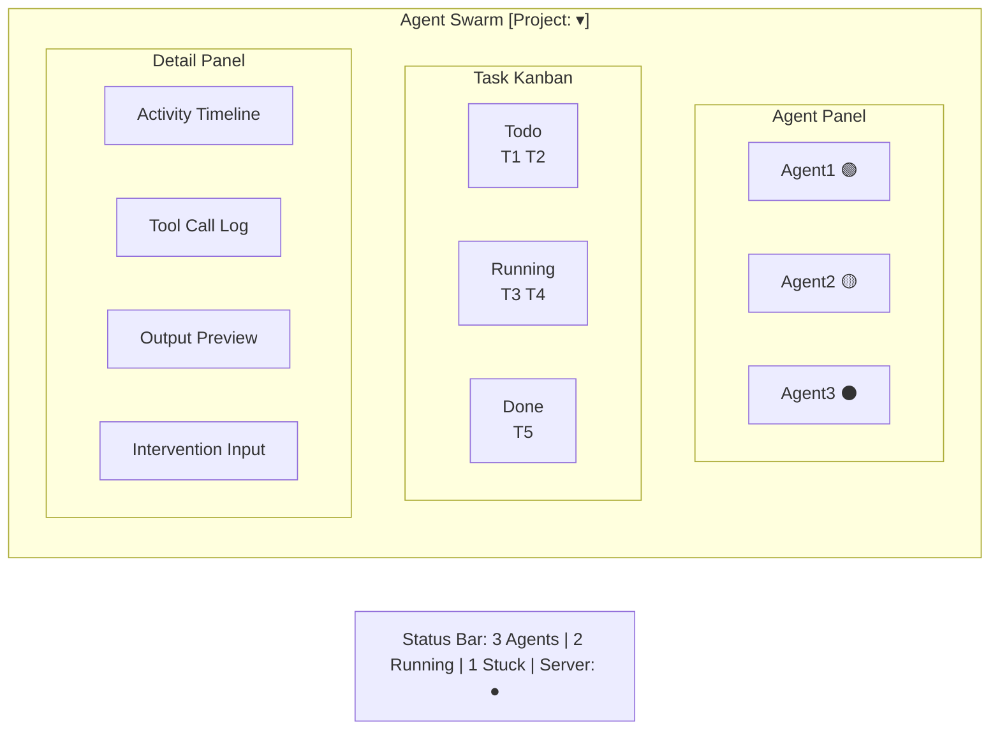
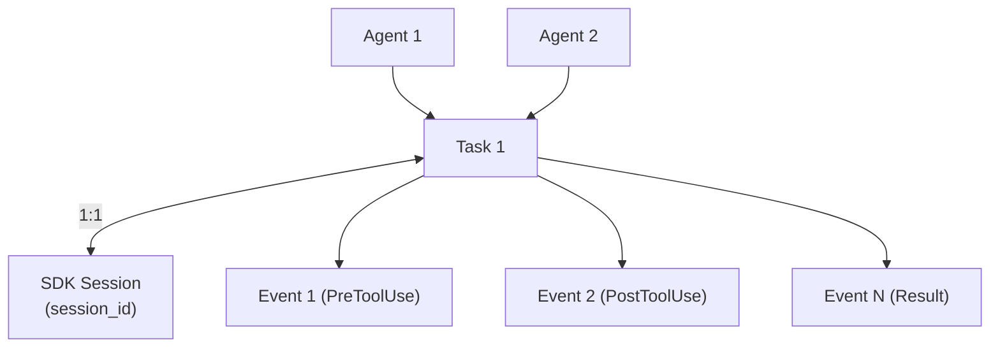
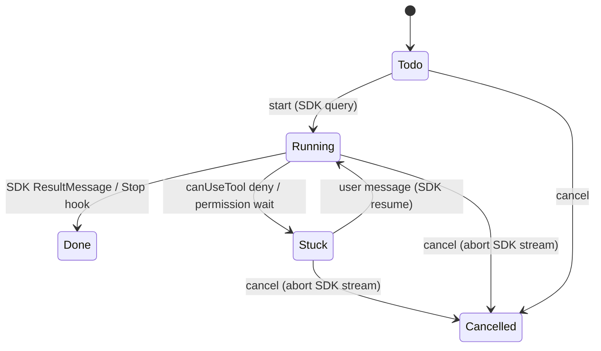
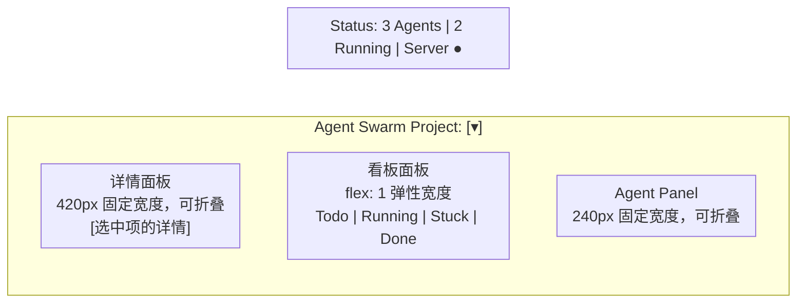
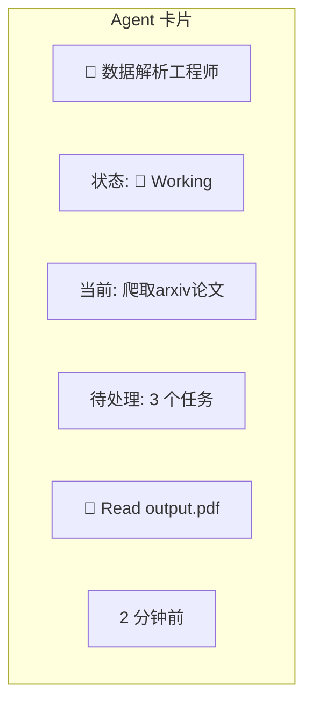
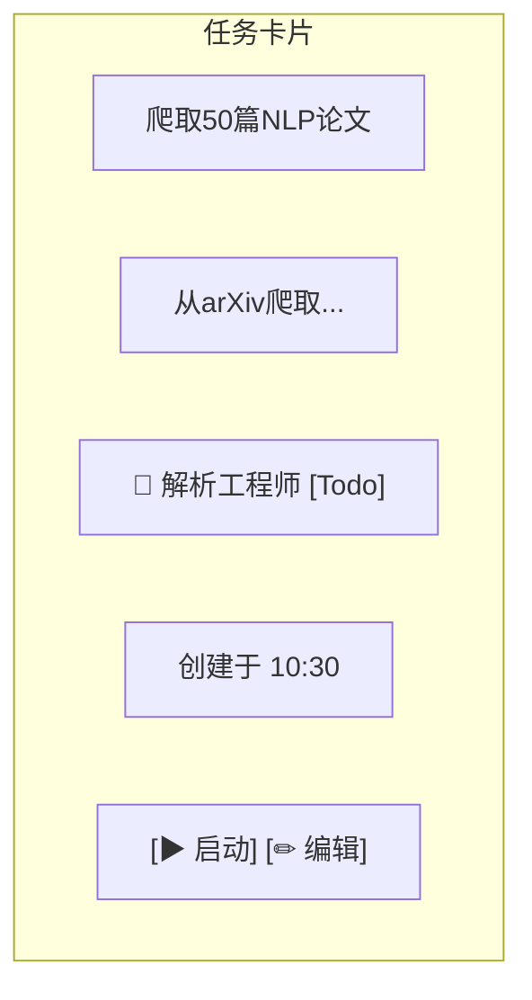
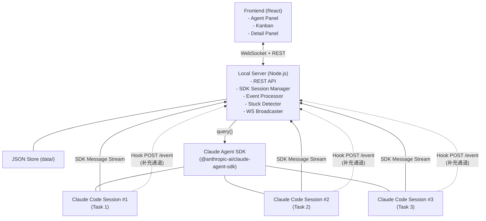

# Agent Swarm 项目架构方案

## 1. 产品定义

### 1.1 系统概述

Agent Swarm 是一个**本地 Web 应用**，用于管理和协调多个 AI Agent 完成各类专业化任务。系统本身**不实现任何 Agent 推理逻辑**——真正的执行后端是 **Claude Code**（Anthropic 的 CLI Agent 工具），通过 **Claude Agent SDK**（`@anthropic-ai/claude-agent-sdk`）进行程序化调用。本平台的职责是将多个 Claude Code 会话包装为多个"Agent"，以看板式界面呈现，支持任务分配、启动、进度跟踪、人工干预与取消。

**典型垂直场景**：AI4S 数据合成（爬取论文 → 解析 PDF → 合成 Q&A → 质量验证）、代码审查流水线、文档批量生成、DevOps 自动化等。

### 1.2 核心职责

| 职责 | 说明 |
|------|------|
| Agent 管理 | 用户创建、编辑、删除 Agent（本质是自定义系统提示词 + 资源限制配置） |
| Task 管理 | 创建任务、指派 Agent、启动/停止/标记完成 |
| 事件采集 | 通过 SDK 消息流（主）和 Claude Hooks（补充）实时捕获 Agent 的工具调用、状态变化 |
| 可视化呈现 | 三栏看板界面，展示 Agent 状态和任务进度 |
| 人工介入 | 检测 Agent 卡住时通知用户，支持批准/拒绝工具调用或发送自定义消息 |

### 1.3 关键约束

1. **Agent = 系统提示词 + 资源配置**：一个 Agent 本质上是一段用户自定义的 prompt（作为 `systemPrompt.append` 追加到 Claude Code 基础能力之上）以及可选的资源限制（最大轮次、预算上限、允许工具列表）。平台不实现 Agent 的推理、记忆、工具调用等能力——这些全部由 Claude Code 提供。
2. **Agent 由用户创建**：用户定义每个 Agent 的名称、角色、专长、提示词和资源配置。Agent 不是系统预设的。
3. **Task 可分配给任意 Agent**：任务的指派是灵活的，同一 Task 可以从一个 Agent 转移到另一个 Agent（在未启动时）。
4. **Task 启动后绑定唯一 Session**：一个 Task 启动时，系统通过 Claude Agent SDK 创建一个受管理的会话，该 Session 通过 `session_id` 与 Task 一一绑定，直到 Task 完成。
5. **用户视角 = AI 团队管理面板**：用户看到的是一群"数字员工"在工作，而非一堆终端窗口。界面应该像项目管理工具（如 Trello/Jira），而非终端可视化器。

### 1.4 目标用户场景

开发者或团队负责人需要编排多个 AI Agent 完成复杂工作流（数据合成、代码重构、文档生成、测试自动化等），通过创建专业化的 Agent 并行处理多个任务，并通过可视化界面监控和干预整个过程。

**示例场景 — AI4S 数据合成**：科研人员或数据工程师需要批量完成数据合成任务（爬取论文 → 解析 PDF → 合成 Q&A → 质量验证），通过创建多个专业化的 Agent（如"爬虫专家"、"解析工程师"、"QA 合成师"、"质检员"），并行处理多个任务。

### 1.5 平台要求

- **运行时**：Node.js >= 18
- **操作系统**：Windows / macOS / Linux
- **核心依赖**：`@anthropic-ai/claude-agent-sdk`（Claude Agent SDK）
- **前置条件**：Claude Code CLI 已安装并完成登录认证

---

## 2. 核心理念

### 2.1 Agent 是"数字员工"

Agent 不应被呈现为一个配置项或一段代码，而应被视为一个正在工作的"个体"。用户需要感受到：这不是一个自动化脚本，而是一个团队。

具体表达：
- **身份感**：每个 Agent 有名称、头像、角色描述（如"数据爬虫专家"、"PDF 解析工程师"）
- **工作状态可见**：当前在做什么（正在读取文件、正在执行命令、正在等待权限...）、属于哪个 project、已工作多长时间
- **是否卡住**：如果 Agent 在等待用户权限确认，界面应明确标记为"需要帮助"
- **最近事件**：展示 Agent 最近执行的工具调用、输出摘要，让用户快速了解 Agent 在做什么
- **归属感**：Agent 被指派到某个 project，用户能一眼看到每个 Agent 的职责范围

### 2.2 任务是第一视角

用户的核心操作对象是**任务（Task）**，而非 Agent。用户思考的是"我需要完成什么"，而不是"我需要启动哪个 Agent"。因此：
- 看板以 Task 为中心组织，按状态分列（Todo → Running → Done）
- Task 卡片上显示指派的 Agent 信息，但主角是 Task 本身
- 所有关注点（进度、事件、问题）都围绕 Task 展开
- Agent 面板是辅助视角，帮助用户了解"团队状态"

### 2.3 Claude Agent SDK 是执行引擎

平台不自建 Agent 推理引擎，也不依赖终端模拟（如 tmux）。通过 Claude Agent SDK 的 `query()` API 直接调用 Claude Code 的全部能力：

- **自然语言理解与推理**：LLM 驱动的对话和决策
- **工具调用**：文件读写、Shell 执行、搜索等内置工具
- **上下文管理**：对话历史的自动压缩和恢复
- **权限控制**：通过 `canUseTool` 回调实现程序化审批
- **会话恢复**：通过 `session_id` 的 `resume` 机制实现多轮交互

平台的定位是 Claude Code 的**编排层和可视化层**：
- 编排层：决定"哪个 Agent 执行哪个 Task"，通过 SDK 管理多个会话的生命周期
- 可视化层：将 SDK 消息流中的事件（工具调用、输出等）转换为用户友好的界面

### 2.4 能力边界

本平台**能做**：
- 管理多个 Agent 和 Task 的生命周期
- 实时采集并展示 Agent 的执行事件
- 检测 Agent 卡住并通知用户
- 让用户通过界面介入 Agent 的工作（批准/拒绝工具调用、发送自定义消息）
- 控制 Agent 的资源消耗（轮次上限、预算上限）

本平台**不做**：
- 不实现 Agent 的推理、记忆、学习逻辑
- 不提供 Agent 间的自动协作编排（如自动拆分任务、自动分配）
- 不实现底层 LLM 推理——由 Anthropic API 提供
- 不提供云端部署或多用户支持

---

## 3. 产品形态

### 3.1 整体架构

本地 Web 应用，采用经典三栏布局，在浏览器中运行。



### 3.2 Agent 面板（左栏）

左侧展示所有已创建的 Agent，每张 Agent 卡片包含：
- **名称**：如"数据爬虫专家"
- **拟人头像**：基于 emoji 或图标自动生成
- **当前状态**：
  - 🟢 Idle（空闲，无进行中任务）
  - 🔵 Working（正在执行任务）
  - 🟡 Stuck（等待权限或需要帮助）
  - ⚫ Offline（未启动）
- **未完成 Task 数量**：如"3 个任务待处理"
- **最近事件摘要**：最后一行显示"刚刚：读取了 output/papers/*.pdf"
- **点击行为**：点击 Agent 卡片，右侧详情面板切换为该 Agent 的活动流

### 3.3 看板面板（中栏）

任务状态看板，采用经典 Kanban 布局：
- **Todo 列**：已创建但未启动的任务
- **Running 列**：正在执行的任务
- **Done 列**：已完成的任务
- **Stuck 列**：需要人工介入的任务（SDK 的 `canUseTool` 回调使 Stuck 检测可靠，作为标准特性）

看板上方提供 **Project 筛选器**，用户可以选择查看特定 project 下的任务。

每张任务卡片显示：标题、指派 Agent 头像和名称、状态标签、创建时间。

---

## 4. 拟人化视觉设计方向

### 4.1 设计原则：不使用 Three.js

本产品不需要 3D 渲染。拟人化通过以下 2D 元素实现：
- **图标与头像**：使用 emoji 或 SVG 图标作为 Agent 头像
- **面板与卡片**：清晰的卡片式布局
- **时间线**：垂直时间线展示 Agent 的活动历史
- **色彩编码**：不同状态用不同颜色
- **插画**：必要时使用简单的 2D 插画增强氛围

### 4.2 视觉关键词

| 关键词 | 体现 |
|--------|------|
| 温暖 | 圆角、柔和阴影、暖色调点缀（橙色、绿色） |
| 专业 | 清晰的信息层次、等宽字体展示工具调用、深色主题支持 |
| 清晰 | 充分留白、状态色彩编码、图标+文字双重表达 |
| 可信赖 | 稳定的布局结构、实时更新无闪烁、操作有明确反馈 |

### 4.3 Agent 的拟人化表达方式

**头像系统**：
- 用户创建 Agent 时从预设 emoji 库选择（如 🔬🕷️📝✅📊）
- 或根据角色关键词自动匹配（"爬虫"→🕷️，"质检"→✅）
- 头像在卡片、看板、详情面板中一致使用

**状态指示**：
- Idle：灰色头像，呼吸灯动画（缓慢透明度变化）
- Working：蓝色脉冲动画，卡片左边缘蓝色指示条
- Stuck：黄色闪烁，卡片左边缘橙色指示条 + "需要帮助" 标签
- Done：绿色静态，完成动画（一次性 fade-in）

**活动时间线**：
- 在详情面板中以垂直时间线形式展示 Agent 事件
- 每个事件节点显示：时间、事件类型图标、工具名称、简短摘要
- 当前正在执行的事件高亮显示

**工具调用可视化**：
- 文件操作：📁 图标 + 文件路径
- Shell 命令：⌨️ 图标 + 命令摘要
- 搜索操作：🔍 图标 + 搜索关键词
- 写入操作：✏️ 图标 + 目标文件

---

## 5. 实现方案

### 5.1 Claude Agent SDK：执行引擎

系统通过 `@anthropic-ai/claude-agent-sdk` 的 `query()` API 直接管理 Agent 会话，无需 tmux 或终端模拟。

#### 核心 API 使用

```typescript
import { query } from "@anthropic-ai/claude-agent-sdk";

// 启动新任务
const messageStream = query({
  prompt: taskDescription,
  options: {
    systemPrompt: {
      type: "preset",
      preset: "claude_code",      // 保留 Claude Code 全部基础能力
      append: agentPrompt,        // 平台默认指令（§5.1.1）+ 用户自定义 Agent 提示词
    },
    cwd: projectDir,
    maxTurns: 200,                 // 防止无限循环
    maxBudgetUsd: 5.0,             // 每个 Task 的预算上限（美元）
    allowedTools: ["Bash", "Read", "Write", "Edit", "Grep", "Glob", "WebFetch"],
    permissionMode: "default",
    canUseTool: async (toolName, input, options) => {
      // 权限拦截和事件采集
      // 需要人工审批时阻塞等待用户决策
      return { behavior: "allow" };
    },
  }
});

// 消费消息流
for await (const message of messageStream) {
  if (message.type === "system" && message.subtype === "init") {
    // 获取 session_id，绑定到 Task
    sessionId = message.session_id;
  }
  if (message.type === "assistant") {
    // 处理助手消息（工具调用、文本输出）
  }
  if ("result" in message) {
    // 任务完成（含费用、耗时等统计）
  }
}
```

#### 会话恢复（人工介入）

```typescript
// 通过 session_id 恢复会话，发送用户消息
const resumedStream = query({
  prompt: userMessage,
  options: { resume: sessionId }
});
```

#### 资源控制

| 参数 | 说明 | 默认值 |
|------|------|--------|
| `maxTurns` | 最大对话轮次 | 200 |
| `maxBudgetUsd` | 每个 Task 的 API 费用上限（美元） | $5.00 |
| `allowedTools` | 允许使用的工具列表 | 全部内置工具 |
| `permissionMode` | 权限模式 | `"default"` |

#### 上下文隔离与任务拆分（关键约束）

**核心原则：每个 Task 是独立的上下文边界。**

1. **任务之间上下文完全隔离**：每次 `query()` 调用是全新会话，不继承上一次 Task 的任何对话历史。Agent 无法通过上下文"记住"之前做了什么。
2. **跨任务信息传递机制**：由于上下文隔离，Agent 之间的信息传递**只能通过文件系统**：
   - 每个项目的 `progress.md` 文件是 Agent 间的主要通信渠道
   - Agent 在 Task 开始时必须先读取 `progress.md` 了解当前状态
   - Agent 在 Task 完成前必须更新 `progress.md`，记录本次操作和结果
3. **任务拆分策略**：编排层（或用户）在创建 Task 时，必须确保：
   - 单个 Task 的复杂度控制在模型上下文安全范围内（建议 maxTurns 不超过 100）
   - 一个 Task 应该是一个**可独立验证的工作单元**，例如："实现 Agent CRUD API 并通过单元测试"
   - 避免"完成整个后端"这类跨度过大的任务，应拆分为多个小 Task
4. **Progress 文件规范**：

```markdown
# Progress — <项目名称>

## 最近更新
- [2026-04-20 14:30] Agent:解析工程师 | Task:实现Agent CRUD | 状态:Done | 摘要:完成5个API端点,全部测试通过
- [2026-04-20 14:15] Agent:爬虫专家 | Task:爬取论文列表 | 状态:Done | 摘要:成功爬取50篇NLP论文元数据

## 当前状态
- 后端: Agent CRUD ✓ | Task CRUD 待实现 | SDK集成 待验证
- 前端: 项目初始化待开始
- 数据层: JSON存储基础设施已完成

## 详细记录

### Task #12: 实现Agent CRUD API
- 执行者: 解析工程师
- 时间: 2026-04-20 14:20 ~ 14:30
- 操作: 创建 routes/agents.ts, 实现 GET/POST/PUT/DELETE 5个端点
- 测试: vitest 5/5 passed
- 文件变更: server/routes/agents.ts(新建), server/services/agentService.ts(新建)
- Git commit: feat: implement agent CRUD API with tests (abc1234)

### Task #11: JSON存储基础设施
- 执行者: 解析工程师
- ...
```

5. **默认 Prompt 注入**：平台在 `systemPrompt.append` 中自动注入上下文管理指令（见下方 5.1.1），无需用户手动编写。

#### 5.1.1 默认 Prompt 注入模板

平台在启动每个 Task 时，会将以下内容自动追加到 `systemPrompt.append` 的**最前面**（在用户自定义 prompt 之前）：

```
你是 Agent Swarm 平台中的一个智能体。以下是你的工作规范：

## 上下文约束
- 你的上下文窗口是有限的资源。每个任务都是一个全新的会话，你无法访问之前任务的历史。
- 你必须高效利用上下文：避免冗余输出，保持回复简洁，不要重复已有信息。

## 工作流程（严格遵守）
1. **读取进度**：开始任何操作前，先读取项目根目录的 progress.md 了解当前状态和之前的操作历史。
2. **执行任务**：按照任务描述完成工作。如果是代码实现任务，遵循：编写代码 → 编译验证 → 运行测试 → 确认通过。
3. **验证结果**：如果是功能性任务，启动服务、打开浏览器验证效果（使用截图工具），确保功能正常。
4. **提交代码**：验证通过后，使用 git 提交代码，commit message 遵循 conventional commits 格式。
5. **更新进度**：任务完成前，必须更新 progress.md 文件，在"最近更新"添加一条记录，在"详细记录"添加完整的操作日志。其他智能体将依赖你的记录来了解项目状态。

## 输出规范
- 所有回复使用中文。
- 代码注释使用英文。
- Git commit message 使用英文 conventional commits 格式。
- progress.md 中的记录使用中文。
```

### 5.2 事件采集机制（双通道）

事件采集通过两个通道实现，确保可靠性和完整性：

#### 通道一：SDK 消息流（主要通道）

通过 `query()` 返回的 `AsyncGenerator<SDKMessage>` 实时获取所有事件。

| 消息类型 | 说明 | 用途 |
|----------|------|------|
| `SDKSystemMessage`（subtype: `"init"`） | 会话初始化，含 `session_id` | 绑定 session → Task 映射 |
| `SDKAssistantMessage` | 助手回复，含工具调用和文本输出 | 记录工具调用、输出摘要 |
| `SDKResultMessage` | 任务完成/失败，含费用和耗时统计 | 标记 Task 完成 |
| `SDKUserMessage` | 用户介入消息 | 记录人工介入 |

#### 通道二：Claude Hooks（补充通道）

保留 Hook 机制用于以下场景：
- 跨会话事件聚合（如 Server 重启后恢复）
- 关键事件的冗余记录
- `Stop` 事件捕获（确保任务完成不遗漏）

| Hook 事件 | 触发时机 | 用途 |
|-----------|----------|------|
| `SessionStart` | 会话启动 | 备份 session → Task 绑定 |
| `SessionEnd` | 会话结束 | 备份标记完成 |
| `Stop` | Agent 停止 | 备份检测完成 |
| `Notification` | 系统通知 | 兜底 Stuck 检测 |

### 5.3 本地 Server

技术栈：**Node.js**（与 Claude Agent SDK 同生态）。

Server 职责：
1. 通过 SDK `query()` 管理 Agent 会话生命周期
2. 处理 SDK 消息流，转换为结构化事件
3. 接收 Hook 事件作为补充（`POST /event`）
4. 事件去重（同一 tool_use_id 不重复处理）
5. 维护 Agent / Task / Session 的内存状态
6. 通过 `session_id` 直接映射 Task（不再用 cwd 匹配）
7. 广播 WebSocket 消息给前端
8. 实现 `canUseTool` 回调逻辑，用于权限拦截和 Stuck 检测

### 5.4 Agent / Task / Session 的关系模型



关系说明：
- Agent : Task = 1 : N（一个 Agent 可负责多个 Task，但同时只执行一个）
- Task : Session = 1 : 1（一个 Task 启动后绑定唯一 Session）
- Task : Event = 1 : N（一个 Task 产生多个 Event）

---

## 6. 系统数据模型（核心实体）

### 6.0 Project

```typescript
interface Project {
  id: string              // UUID
  name: string            // 项目名称，只允许 [a-zA-Z0-9_-]
  path: string            // 绝对路径，对应 Claude Code 的 cwd
  description?: string    // 可选描述
  createdAt: number       // 创建时间戳
  updatedAt: number       // 更新时间戳
}
```

存储文件：`data/projects.json` → `{ "_schema_version": N, "projects": [Project, ...] }`

Project API：

```
GET    /api/projects                    → { projects: Project[] }
POST   /api/projects                    → { project: Project }
         请求体: { name, path, description? }
PUT    /api/projects/:id                → { project: Project }
         请求体: { name?, path?, description? }
DELETE /api/projects/:id                → { ok: true }
         约束: 有 Running Task 的 Project 不可删除
```

> **注意**：原始设计中 `Task.project` 存储的是 project name（字符串），现改为存储 `projectId`，在 GET 接口中 join Project 信息返回完整数据。这样改名操作不会影响 Task 数据。

### 6.1 Agent

```typescript
interface Agent {
  id: string              // UUID
  name: string            // 显示名称，如"数据爬虫专家"
  avatar: string          // emoji 或图标标识，如"🕷️"
  role: string            // 角色描述，如"专注于学术论文的爬取和下载"
  prompt: string          // 角色提示词（作为 systemPrompt.append 使用）
  isEnabled: boolean      // 是否启用，false 时为 offline 状态，与运行状态解耦
  status: AgentStatus     // idle | working | stuck | offline
  projectId?: string      // 默认关联的 project（可选）
  currentTaskId?: string  // 当前正在执行的 Task ID（运行时计算，可持久化）
  maxTurns?: number       // 最大对话轮次覆盖值（默认 200）
  maxBudgetUsd?: number   // 预算上限覆盖值（默认 5.0 美元）
  allowedTools?: string[] // 允许使用的工具列表（默认全部内置工具）
  taskCount: number       // 未完成任务数（存储字段，Task 创建/完成/取消时更新）
  stats: AgentStats       // 历史执行统计
  lastEventAt: number     // 最后一次事件的时间戳
  createdAt: number       // 创建时间
  updatedAt: number       // 更新时间
}

type AgentStatus = 'idle' | 'working' | 'stuck' | 'offline'

interface AgentStats {
  totalTasksCompleted: number   // 历史完成 Task 总数
  totalTasksCancelled: number   // 历史取消 Task 数
  totalCostUsd: number          // 历史累计 API 花费（美元）
  avgDurationMs: number         // 平均任务耗时（毫秒）
}
```

Agent 状态语义：

| 状态 | 触发条件 | 含义 | 可执行操作 |
|------|---------|------|-----------|
| idle | Task 完成/取消，或刚创建 | 空闲，可立即接受新 Task | 分配 Task、编辑、删除 |
| working | Task 处于 Running 状态 | 正在执行任务 | 停止 Task、查看详情 |
| stuck | 当前 Task 处于 Stuck 状态 | 等待用户干预 | 批准/拒绝工具、发送消息 |
| offline | 用户手动停用（isEnabled=false），或 Server 判断 Agent 长时间无响应（>30min 无心跳且无活跃 Session） | 暂停服务，不接受新 Task | 启用（重置为 idle） |

### 6.2 Task

```typescript
interface Task {
  id: string              // UUID
  title: string           // 任务标题
  description: string     // 任务详细描述
  status: TaskStatus      // Todo | Running | Done | Stuck | Cancelled
  agentId: string         // 指派的 Agent ID
  projectId: string       // 所属 Project ID（替换原来的 project: string）
  sessionId?: string      // SDK session_id，启动后直接映射
  parentTaskId?: string   // 重试来源 Task ID（可选追踪）
  output?: string         // Agent 完成后的最终输出摘要（来自 SDKResultMessage）
  completedReason?:       // 完成/取消/失败原因
    | 'sdk_result'        // SDK 正常完成
    | 'max_turns'         // 达到最大轮次
    | 'max_budget'        // 达到预算上限
    | 'user_cancelled'    // 用户主动取消
    | 'user_done'         // 用户手动标记完成
    | 'error'             // SDK 异常
  priority: 0 | 1 | 2    // 0=低，1=中（默认），2=高
  tags: string[]          // 用户自定义标签，如 ["nlp", "urgent"]
  eventCount: number      // Event 总数（替代 events: string[]，避免 ID 列表无限增长）
  turnCount: number       // 当前对话轮次计数
  budgetUsed: number      // 已消耗的 API 费用（美元）
  maxTurns: number        // 本次任务的最大轮次（从 Agent 继承）
  maxBudgetUsd: number    // 本次任务的预算上限（从 Agent 继承）
  deletedAt?: number      // 软删除时间戳（仅 Done 状态的 Task 支持软删除）
  createdAt: number       // 创建时间
  startedAt?: number      // 启动时间
  completedAt?: number    // 完成时间
  stuckReason?: string    // Stuck 原因（如"请求执行 Bash 命令: rm -rf ..."）
}
```

> **Event 查询**通过 `GET /api/tasks/:id/events?page=N&limit=50` 分页访问 JSONL 文件，不再在 Task 中存储事件 ID 列表。单个 JSONL 文件超过 100MB 时归档为 `.jsonl.gz`，API 仍可读取。



### 6.3 Event

```typescript
interface Event {
  id: string              // UUID
  taskId: string          // 所属 Task ID
  sessionId: string       // 来源 Session ID
  eventType: EventType    // 事件类型（SDK 消息或 Hook 事件）
  source: 'sdk' | 'hook' // 事件来源
  toolName?: string       // 工具名称（Bash, Read, Write, Edit, Grep...）
  toolInput?: string      // 工具输入（JSON 字符串）
  toolOutput?: string     // 工具输出摘要
  duration?: number       // 执行耗时（毫秒）
  timestamp: number       // 事件时间戳
  raw: string             // 原始数据（用于调试）
}

type EventType =
  // SDK 消息流事件（主要）
  | 'SDKInit'             // SDKSystemMessage(subtype: "init")，含 session_id
  | 'SDKAssistant'        // SDKAssistantMessage，含工具调用和输出
  | 'SDKResult'           // SDKResultMessage，任务完成/失败
  // Hook 事件（补充）
  | 'SessionStart'
  | 'SessionEnd'
  | 'PreToolUse'
  | 'PostToolUse'
  | 'Stop'
  | 'UserPromptSubmit'
  | 'Notification'
```

### 6.4 Session

```typescript
interface Session {
  id: string              // SDK session_id
  taskId: string          // 绑定的 Task ID
  agentId: string         // 所属 Agent ID
  cwd: string             // 工作目录
  status: SessionStatus   // active | paused | completed | killed
  startedAt: number       // 启动时间
  endedAt?: number        // 结束时间
}

type SessionStatus = 'active' | 'paused' | 'completed' | 'killed'
```

运行时管理字段（不持久化）：
- `sdkStreamActive: boolean` — SDK 消息流是否活跃
- `abortController: AbortController` — 用于中止正在运行的 SDK 查询
- `pendingToolApproval: Map<string, Promise<"allow" | "deny">>` — 等待用户决策的工具调用

---

## 7. 任务流转设计

### 7.1 创建任务

用户通过界面输入：
- **标题**（必填）：如"爬取 50 篇 NLP 论文"
- **描述**（必填）：详细说明任务要求和上下文
- **所属 Project**（必填）：从已有 project 中选择，或新建
- **指派 Agent**（必填）：从已有 Agent 列表中选择
- **最大轮次**（可选）：覆盖 Agent 的默认 maxTurns
- **预算上限**（可选）：覆盖 Agent 的默认 maxBudgetUsd

创建后 Task 进入 `Todo` 状态，在看板 Todo 列中显示。

### 7.2 启动任务

用户点击"启动"按钮后，系统执行以下步骤：

1. **验证 Agent 状态**：确认指派 Agent 当前为 idle
2. **构造 SDK 参数**：
   - `prompt` = Task.description（包含具体的任务要求）
   - `systemPrompt` = `{ type: "preset", preset: "claude_code", append: DEFAULT_INJECTION + Agent.prompt }`
     - `DEFAULT_INJECTION`：平台默认注入的工作流指令（见 §5.1.1），包含上下文约束、读取 progress.md、更新 progress.md 等规范
     - `Agent.prompt`：用户自定义的角色专长 prompt
     - 拼接顺序：默认指令在前，用户 prompt 在后
   - `cwd` = Task.project 对应的工作目录
   - `maxTurns` = Task.maxTurns（继承自 Agent，可被任务覆盖）
   - `maxBudgetUsd` = Task.maxBudgetUsd（继承自 Agent，可被任务覆盖）
   - `canUseTool` = 包装后的权限回调（见 10.3）
3. **调用 SDK query()**：启动异步消息流
4. **捕获 SDKInit 消息**：从 `SDKSystemMessage(subtype: "init")` 中获取 `session_id`
5. **绑定 session_id → Task**：直接通过 session_id 映射，无需 cwd 匹配
6. **更新 Task 状态**：`Todo → Running`
7. **更新 Agent 状态**：`idle → working`
8. **启动后台消息消费协程**：异步迭代 SDK 消息流，将每条消息转换为 Event
9. **广播 WebSocket**：通知前端状态变化

### 7.3 自动状态变化

事件驱动的状态更新（双通道）：

| 事件来源 | 事件类型 | 状态变化 | 说明 |
|----------|----------|----------|------|
| SDK 消息流 | SDKInit | Task.sessionId 记录 | 直接通过 session_id 绑定 |
| SDK 消息流 | SDKAssistant | 无状态变化 | 记录工具调用和输出，前端实时展示 |
| SDK 消息流 | SDKResult | `Running → Done` | 任务完成（含 result 信息） |
| SDK canUseTool | 回调拦截 | `Running → Stuck` | 工具需要人工审批，等待用户决策 |
| Hook（补充） | Notification（权限提示） | `Running → Stuck` | 兜底检测 |
| Hook（补充） | Stop | `Running → Done` | 兜底检测 |
| Hook（补充） | SessionEnd | `Running → Done` | 会话结束 |

### 7.4 人工介入

当 Task 处于 `Stuck` 状态时：

1. 界面自动弹出通知，告知用户哪个 Agent 遇到了问题
2. 右侧详情面板显示 Stuck 原因（如"请求执行 Bash 命令: rm -rf ..."）
3. 用户有两种介入方式：
   - **批准/拒绝**（针对 canUseTool 拦截的工具调用）：
     - 用户点击"允许" → canUseTool 对该次调用返回 `allow`，同时将 `(toolName, toolInputHash)` 记入当前 Task 的内存缓存，当前 Task 生命周期内后续同类调用自动批准
     - 用户点击"拒绝" → canUseTool 返回 `deny`，Agent 收到拒绝信息
   - **发送自定义消息**（通用介入）：
     - 用户在"介入输入框"中输入回复消息
     - 系统调用 SDK resume：`query({ prompt: userMessage, options: { resume: sessionId } })`
     - Task 状态从 `Stuck → Running`
4. 所有消息通过 SDK 直接传递，不经过终端模拟

### 7.5 手动标记 Done

用户可以在以下情况下手动标记 Task 为 Done：
- Agent 的 Stop Hook 未触发，但用户确认任务已完成
- 用户对结果满意，不需要 Agent 继续优化

操作：点击 Task 卡片上的"标记完成"按钮。系统会：
1. 中止对应的 SDK 消息流（调用 AbortController.abort()）
2. 更新 Task 状态为 Done
3. 更新 Agent 状态为 idle（如无其他 Running 任务）
4. 广播 WebSocket 通知

### 7.6 Agent 编辑

| 场景 | 设计决策 | 理由 |
|------|---------|------|
| 编辑 idle Agent 的 prompt/配置 | 立即生效，无影响 | Agent 无活跃 Session |
| 编辑 working/stuck Agent 的 prompt | 允许编辑，prompt 变更仅影响下一次 Task 启动（当前 Session 不重启） | 修改 SDK 系统提示需重启 Session，代价过高 |
| 编辑 working/stuck Agent 的 maxTurns/maxBudgetUsd | 仅允许提高上限，不允许降低（降低操作提示"当前 Task 完成后生效"） | 防止强制中断正在运行的 Task |
| 编辑 Agent 名称/头像/角色 | 立即生效，无影响 | 不影响已启动的 Session |

### 7.7 Agent 删除

| 场景 | 处理方式 |
|------|---------|
| Agent 有 Running/Stuck Task | 拒绝删除，返回 409 Conflict，提示"请先停止所有运行中的 Task" |
| Agent 有 Todo Task | 拒绝删除，返回 409，提示"请先取消或重新分配 Todo 中的 Task" |
| Agent 只有 Done/Cancelled Task | 允许删除；Task 记录保留，agentId 字段保持原值，前端显示"[已删除 Agent]"占位符 |
| Agent 无任何 Task | 直接删除 |

前端在删除确认弹窗中显示："该 Agent 有 N 条历史任务记录将保留，但 Agent 配置将永久删除。"

### 7.8 Task 编辑

`PUT /api/tasks/:id`

字段编辑规则：

| 字段 | Todo 状态 | Running/Stuck 状态 | Done/Cancelled 状态 |
|------|----------|-------------------|-------------------|
| title / description | ✅ 可编辑 | ✅ 可编辑（不影响 Session） | ❌ 只读 |
| agentId（重新分配） | ✅ 可编辑 | ❌ 禁止（需先停止） | ❌ 只读 |
| projectId | ✅ 可编辑 | ❌ 禁止（cwd 已绑定） | ❌ 只读 |
| priority / tags | ✅ 可编辑 | ✅ 可编辑 | ✅ 可编辑（用于归档分类） |
| maxTurns / maxBudgetUsd | ✅ 可编辑 | ⚠️ 只允许提高上限 | ❌ 只读 |

### 7.9 Task 删除

`DELETE /api/tasks/:id`

| 状态 | 处理方式 |
|------|---------|
| Todo / Cancelled | 直接删除 Task 记录 + 对应 events JSONL 文件 |
| Done | 软删除（添加 deletedAt 时间戳），API 默认过滤，支持 `?includeDeleted=true` 查询 |
| Running / Stuck | 拒绝删除，返回 409，提示"请先停止 Task" |

### 7.10 Task 重试

失败或取消的 Task 支持重试：`POST /api/tasks/:id/retry`

重试逻辑：
1. 以原 Task 的 title、description、agentId、projectId、maxTurns、maxBudgetUsd 创建一个新 Task
2. 新 Task 的 title 自动追加 "(重试)" 后缀，可在创建后编辑
3. 原 Task 记录保留，status 不变，新 Task 的 `parentTaskId` 指向原 Task

不选择"原地重试"（重置同一 Task 状态）的原因：避免丢失原始执行历史，便于对比两次运行结果。

### 7.11 Task 重新分配 Agent

§1.3 明确说明支持此功能。`PUT /api/tasks/:id` 请求体 `{ agentId: "new-agent-id" }`。

约束：仅允许对 `status === "Todo"` 的 Task 执行。

流程：验证目标 Agent 存在 → 更新 Task.agentId → 更新原 Agent 的 taskCount（-1）→ 更新新 Agent 的 taskCount（+1）→ 广播 WebSocket `task:update` 和 `agent:update`。

### 7.12 Server 崩溃恢复

#### 7.12.1 崩溃时正在写文件

原设计已采用"先写临时文件 → rename"策略，补充文件锁机制：

```typescript
import { lock } from "proper-lockfile";

async function safeWrite(filePath: string, data: object) {
  const release = await lock(filePath, { retries: 5, stale: 10000 });
  try {
    const tmp = filePath + ".tmp." + process.pid;
    fs.writeFileSync(tmp, JSON.stringify(data, null, 2));
    fs.renameSync(tmp, filePath);
  } finally {
    await release();
  }
}
```

#### 7.12.2 崩溃恢复后的 session_id 有效性

Server 重启后，原有 SDK Session 的 session_id 是否仍有效取决于 SDK 的会话持久化策略。处理原则：不依赖 SDK 的 session 持久化保证，在 Server 侧做好状态恢复。

#### 7.12.3 崩溃时正在执行工具调用

若 Server kill -9 时 Agent 正在执行 Bash 命令，Claude Code 子进程会继续运行（与 Server 进程无关）。恢复后按 Task 状态处理：

| Task 状态 | 恢复策略 |
|----------|---------|
| Todo | 无需处理，保持 Todo 状态 |
| Running（有 sessionId） | 标记为 Stuck，stuckReason = "Server 重启，请点击恢复或重新启动"，由用户决定是否 resume |
| Running（无 sessionId） | 标记为 Cancelled，completedReason = "error"，stuckReason = "server_restart_no_session" |
| Stuck | 保持 Stuck，等待用户介入 |
| Done / Cancelled | 保持原状，无需处理 |

---

## 8. 前端产品设计要求

### 8.1 整体布局



**布局参数**：
- 左栏（Agent 面板）：固定宽度 240px，可折叠
- 中栏（看板面板）：弹性宽度 `flex: 1`
- 右栏（详情面板）：固定宽度 420px，可折叠
- 顶部栏：高度 56px，包含项目名称和 project 筛选下拉框
- 底部状态栏：高度 32px

**Project 筛选器**：位于顶部栏右侧，下拉选择 project 后，看板只显示该 project 下的任务。

### 8.2 Agent 卡片设计



**交互**：
- 点击卡片：右侧详情面板切换为该 Agent 的活动时间线
- 状态颜色：
  - Idle: `#9CA3AF`（灰色）
  - Working: `#3B82F6`（蓝色）
  - Stuck: `#F59E0B`（橙色）
  - Offline: `#6B7280`（深灰）
- 卡片左边缘有 4px 宽的状态色条

### 8.3 任务卡片设计



**任务卡片操作按钮矩阵**：

| Task 状态 | 卡片上显示的操作按钮 |
|----------|-------------------|
| Todo | ▶ 启动、✏ 编辑、🗑 删除 |
| Running | ⏹ 停止、✅ 标记完成 |
| Stuck | ⏹ 停止（取消）、详情面板内：批准/拒绝 + 发送消息 |
| Done | 🔄 重试、🗑 删除 |
| Cancelled | 🔄 重试、🗑 删除 |

**状态标签颜色**：
- Todo: `#6B7280`（灰色背景）
- Running: `#3B82F6`（蓝色背景）
- Done: `#10B981`（绿色背景）
- Stuck: `#F59E0B`（橙色背景 + 闪烁动画）
- Cancelled: `#EF4444`（红色背景）

### 8.4 详情面板

详情面板根据用户选择展示两种内容：

**A. Task 详情**（点击看板中的任务卡片时）：
- 任务标题和完整描述
- 指派 Agent 信息
- 活动流（垂直时间线，展示该 Task 的所有 Event）
- 工具调用日志（表格：时间 | 工具 | 输入摘要 | 耗时）
- Agent 输出预览（最近 SDK 消息流的文本输出）
- 预算消耗进度条（已用 / 上限）
- 人工介入区域：
  - 工具审批面板（Task 处于 Stuck 时显示"允许"/"拒绝"按钮）
  - 自定义消息输入框

**B. Agent 详情**（点击左侧 Agent 卡片时）：
- Agent 完整信息（名称、角色、prompt 编辑、资源配置）
- 当前 Task 状态
- 历史完成 Task 列表
- 最近 50 条事件时间线

### 8.5 创建表单规范

#### Agent 创建表单

| 字段 | 类型 | 验证规则 | 是否必填 |
|------|------|---------|---------|
| 名称 | 文本输入 | 1–50 字符 | 是 |
| 头像 | Emoji 选择器 | 从预设库选择（默认 🤖） | 是 |
| 角色描述 | 文本输入 | 1–200 字符 | 是 |
| 提示词 | 多行文本 | 10–5000 字符 | 是（平台自动在前面注入默认工作流指令，用户只需填写角色专长相关的 prompt） |
| 默认 Project | 下拉选择 | 从已有 Project 列表选择 | 否 |
| 最大轮次 | 数字输入 | 1–500，默认 200 | 否 |
| 预算上限（$） | 数字输入 | 0.1–50.0，默认 5.0 | 否 |
| 允许工具 | 多选 | 从内置工具列表选择，默认全选 | 否 |

#### Task 创建表单

| 字段 | 类型 | 验证规则 | 是否必填 |
|------|------|---------|---------|
| 标题 | 文本输入 | 1–100 字符 | 是 |
| 描述 | 多行文本 | 10–10000 字符，Markdown 支持 | 是 |
| 所属 Project | 下拉选择+新建 | 必须为已有 Project 或新建 | 是 |
| 指派 Agent | 下拉选择 | 必须为已有 Agent，显示当前状态 | 是 |
| 优先级 | 单选按钮 | 低/中/高，默认中 | 否 |
| 标签 | 标签输入 | 每个标签 1–20 字符，最多 10 个 | 否 |
| 最大轮次 | 数字输入 | 不填则继承 Agent 配置 | 否 |
| 预算上限（$） | 数字输入 | 不填则继承 Agent 配置 | 否 |

### 8.6 空状态设计

| 位置 | 空状态内容 |
|------|-----------|
| Agent 面板（无 Agent） | 图标 🤖 + "还没有 Agent" + "创建你的第一个 AI 数字员工来开始工作" + "创建 Agent" 按钮 |
| 看板 Todo 列（无 Task） | 图标 📋 + "没有待处理的任务" + "创建任务" 按钮 |
| 看板 Done 列（无完成任务） | 图标 ✅ + "还没有已完成的任务" |
| 详情面板（未选中） | 图标 👆 + "点击任务卡片或 Agent 卡片查看详情" |
| Project 筛选后无结果 | "当前 Project 下没有任务" + "创建任务" 或 "切换 Project" |

### 8.7 错误与加载状态

**加载状态**：
- 首屏加载：三栏骨架屏（灰色矩形占位），持续超过 3 秒显示"加载中..."文字
- Task 列表刷新：看板内 spinner，不阻塞其他操作
- 详情面板切换：面板内局部 spinner（右上角），内容区保持上一次内容直到新数据加载完成
- 按钮操作（启动/停止等）：按钮变为 loading 状态（spinner + 禁用），防止重复提交

**错误状态**：
- API 调用失败：顶部 Toast 通知，红色，显示 error.message，5 秒后自动消失
- WebSocket 断连：底部状态栏显示 🔴 连接中断，持续尝试重连
- SDK 错误（Task 变为 Stuck）：Task 卡片显示红色警告 + stuckReason，详情面板显示完整错误信息
- 表单验证错误：字段下方红色错误提示，提交按钮保持禁用直到验证通过

### 8.8 通知系统

通知队列：同时最多显示 3 条，超出时新通知替换最旧的非 Stuck 通知。Stuck 通知始终保留直到用户处理。

| 通知类型 | 触发条件 | 样式 | 位置 | 自动消失 |
|---------|---------|------|------|---------|
| Stuck 警告 | Task 变为 Stuck | 橙色，带"查看"按钮 | 右上角 | 不消失，需用户点击 |
| 任务完成 | Task 变为 Done | 绿色 | 右上角 | 5 秒 |
| 操作成功 | CRUD 成功 | 绿色 | 右上角 | 3 秒 |
| 操作失败 | API 返回错误 | 红色 | 右上角 | 5 秒（或手动关闭） |
| 连接恢复 | WebSocket 重连 | 蓝色 | 底部状态栏 | 3 秒 |

### 8.9 其他前端规格

| 规格项 | 设计决策 |
|--------|---------|
| 最小宽度 | 1280px，低于此宽度显示"请使用更大屏幕"提示 |
| 拖拽交互 | 本期不实现，卡片通过按钮操作状态迁移 |
| Agent 头像 Emoji 库 | 🤖🔬🕷️📝✅📊🔧🎯💡🔍📦🚀🛡️⚡🎨📐🗂️🔮🧩🌐（共 20 个预设，用户也可手动输入任意 emoji） |
| 最大 Task 卡片高度 | 看板列中每张卡片最大高度 180px，超出以"..."截断，点击查看完整详情 |

---

## 9. 后端要求

### 9.1 Server 运行时结构

技术栈：**Node.js** + Express + ws（WebSocket）

模块划分：

```
server/
├── index.ts              # 入口：启动 HTTP + WebSocket
├── routes/
│   ├── agents.ts         # Agent CRUD
│   ├── tasks.ts          # Task CRUD + 启动/停止/完成
│   ├── events.ts         # Hook 事件接收（补充通道）
│   └── projects.ts       # Project 列表
├── services/
│   ├── eventProcessor.ts     # 事件处理：去重、duration 计算
│   ├── taskManager.ts        # Task 状态机管理
│   ├── sdkSessionManager.ts  # SDK 会话生命周期管理（核心）
│   ├── stuckDetector.ts      # Stuck 检测（canUseTool 回调 + Hook 兜底）
│   └── wsBroadcaster.ts      # WebSocket 广播
├── sdk/
│   ├── queryWrapper.ts       # SDK query() 的封装（含 canUseTool 回调逻辑）
│   ├── messageParser.ts      # SDK 消息流 → Event 转换
│   └── sessionStore.ts       # 运行时 session 管理（AbortController 等）
├── store/
│   ├── agents.json           # Agent 数据持久化
│   ├── tasks.json            # Task 数据持久化
│   └── sessions.json         # Session 映射持久化
└── hooks/
    └── eventHook.sh          # Hook 脚本模板（补充通道）
```

启动流程：
1. 加载 JSON 数据文件（如不存在则初始化空结构）
2. 启动 Express HTTP Server（默认端口 3456）
3. 启动 WebSocket Server（同一端口 upgrade）
4. 恢复未完成的 SDK 会话（如果有 Task 处于 Running 状态）
5. 注册 Hook 脚本到 Claude Code settings（可选，补充通道）
6. 打印 Server URL 和状态

### 9.2 最小 REST API

#### Agent 管理

```
POST   /api/agents
请求：{ name, avatar, role, prompt, projectId?, maxTurns?, maxBudgetUsd?, allowedTools? }
响应：{ agent: Agent }

GET    /api/agents
响应：{ agents: Agent[] }

GET    /api/agents/:id
响应：{ agent: Agent }

PUT    /api/agents/:id
请求：{ name?, avatar?, role?, prompt?, projectId?, maxTurns?, maxBudgetUsd?, allowedTools? }
响应：{ agent: Agent }

DELETE /api/agents/:id
响应：{ ok: true }
```

#### Task 管理

```
POST   /api/tasks
请求：{ title, description, agentId, projectId, priority?, tags?, maxTurns?, maxBudgetUsd? }
响应：{ task: Task }

GET    /api/tasks
查询参数：
  projectId=<id>         // 按 project 过滤
  status=<status>        // 按状态过滤（支持多值：status=Todo,Running）
  agentId=<id>           // 按 Agent 过滤
  q=<keyword>            // 关键词搜索（title + description）
  page=1                 // 页码，默认 1
  limit=20               // 每页数量，默认 20，最大 100
  sort=createdAt         // 排序字段：createdAt | priority | status
  order=desc             // 排序方向：asc | desc
响应：{ tasks: Task[], total: number, page: number, limit: number, totalPages: number }

GET    /api/tasks/:id
响应：{ task: Task }

PUT    /api/tasks/:id
请求：{ title?, description?, agentId?, priority?, tags?, maxTurns?, maxBudgetUsd? }
约束：按 §7.8 节的字段编辑规则执行
响应：{ task: Task }

DELETE /api/tasks/:id
约束：Running/Stuck 状态返回 409
响应：{ ok: true }

POST   /api/tasks/:id/start
响应：{ task: Task }
说明：启动为异步操作，Task 状态先变为 Running，sessionId 通过 WebSocket 通知

POST   /api/tasks/:id/stop
响应：{ task: Task }

POST   /api/tasks/:id/message
请求：{ message: string, allowTool?: { toolName: string, decision: "allow" | "deny" } }
说明：向 Stuck 状态的 Task 发送用户消息（通过 SDK resume）。allowTool 可同时附带一个工具审批决策，实现"发送消息 + 批准工具"的原子操作，避免需要两次 API 调用。如仅需审批工具（无自定义消息），使用 POST /api/tasks/:id/approve-tool。
响应：{ ok: true }

POST   /api/tasks/:id/approve-tool
请求：{ toolName: string, toolInput: string, decision: "allow" | "deny" }
响应：{ ok: true }

POST   /api/tasks/:id/done
响应：{ task: Task }

POST   /api/tasks/:id/retry
响应：{ task: Task }  // 新建 Task，复制原 Task 配置，title 追加 "(重试)"

GET    /api/tasks/:id/events
查询参数：page=1  limit=50  type=<eventType>
响应：{ events: Event[], total: number, page: number, limit: number }

GET    /api/tasks/:id/sdk-status
响应：{ running: boolean, turnCount: number, budgetUsed: number, maxBudgetUsd: number }
```

#### 统一错误响应格式

所有 4xx / 5xx 响应统一为：

```json
{
  "error": {
    "code": "TASK_NOT_FOUND",
    "message": "Task 不存在",
    "details": {}
  }
}
```

常用错误码表：

| HTTP 状态 | 错误码 | 场景 |
|-----------|--------|------|
| 400 | VALIDATION_ERROR | 请求参数格式错误 |
| 404 | AGENT_NOT_FOUND / TASK_NOT_FOUND / PROJECT_NOT_FOUND | 资源不存在 |
| 409 | TASK_ALREADY_RUNNING | 尝试启动已在运行的 Task |
| 409 | AGENT_BUSY | 尝试启动 Task 时 Agent 正忙 |
| 409 | RESOURCE_HAS_DEPENDENTS | 删除有依赖关系的资源 |
| 500 | SDK_ERROR | Claude Agent SDK 调用失败 |
| 500 | FILE_WRITE_ERROR | JSON 持久化失败 |

#### 健康检查与统计

```
GET    /api/health
响应：{ status: "ok", version: "1.0.0", uptime: number, activeTaskCount: number, sdkAvailable: boolean, storageOk: boolean }

GET    /api/agents/:id/stats
响应：{ totalTasksCompleted: number, totalTasksCancelled: number, totalCostUsd: number, avgDurationMs: number, recentTasks: Task[] }
```

启动脚本在 Server 启动后轮询 `/api/health`，确认返回 200 后再打开浏览器，避免前端访问到未就绪的 Server。

#### Hook 事件入口（补充通道）

```
POST   /event
请求：{ hook_event_name, session_id, cwd, tool_name?, tool_input?, tool_output?, source: "hook" }
响应：{ ok: true }
```

#### Project 管理

```
GET    /api/projects
响应：{ projects: Project[] }

POST   /api/projects
请求：{ name: string, path: string, description?: string }
响应：{ project: Project }

PUT    /api/projects/:id
请求：{ name?, path?, description? }
响应：{ project: Project }

DELETE /api/projects/:id
约束：有 Running Task 的 Project 不可删除
响应：{ ok: true }
```

### 9.3 WebSocket 设计

**连接地址**：`ws://localhost:3456/ws`

**消息格式**（Server → Client）：

```json
{
  "type": "task:update",
  "data": { "task": { "id": "...", "status": "Running" } }
}
```

```json
{
  "type": "agent:update",
  "data": { "agent": { "id": "...", "status": "working" } }
}
```

```json
{
  "type": "event:new",
  "data": { "event": { "id": "...", "toolName": "Bash", "toolInput": "..." } }
}
```

```json
{
  "type": "tool:approval",
  "data": {
    "taskId": "...",
    "toolName": "Bash",
    "toolInput": { "command": "rm -rf ..." },
    "stuckReason": "请求执行危险命令"
  }
}
```

```json
{
  "type": "task:budget",
  "data": { "taskId": "...", "budgetUsed": 1.23, "maxBudgetUsd": 5.0 }
}
```

**事件类型**：
- `task:update` — Task 状态变化
- `agent:update` — Agent 状态变化
- `event:new` — 新事件到达
- `tool:approval` — 工具调用需要人工审批
- `task:budget` — 预算消耗更新
- `notification` — 系统通知（如 Stuck 警告）
- `error` — SDK 异常/错误（与 `task:update` → Stuck 区分，`error` 携带错误详情，前端据此区分"工具审批等待"和"SDK 崩溃"两种 Stuck 场景）

**重连机制**：前端使用指数退避重连（1s → 2s → 4s → 最大 30s），断连期间在状态栏显示"连接中断"。

### 9.4 数据存储方案

采用本地 JSON 文件存储，简单可靠，无需数据库。

**文件结构**：

```
data/
├── agents.json          # { "_schema_version": N, "agents": [Agent, ...] }
├── tasks.json           # { "_schema_version": N, "tasks": [Task, ...] }
├── sessions.json        # { "_schema_version": N, "sessions": [Session, ...] }
├── projects.json        # { "_schema_version": N, "projects": [Project, ...] }
├── events/
│   ├── <task-id>.jsonl  # 每个 Task 的事件日志（JSONL 格式，追加写入）
│   ├── <task-id>.jsonl.gz  # 归档的压缩事件日志（超过 100MB 时归档）
│   └── ...
└── logs/
    ├── hooks.log        # Hook 原始日志备份
    └── server.log       # Server 运行日志
```

**写入策略**：
- agents.json / tasks.json / sessions.json / projects.json：每次变更时全量写入（数据量小，性能足够）
- events/*.jsonl：追加写入，每个 Event 一行 JSON
- 写入前先写临时文件，再 rename，防止断电丢数据
- JSONL 事件文件超过 100MB 时归档为 .jsonl.gz，API 仍可读取归档文件
- 所有 JSON 文件包含 `_schema_version` 字段，Server 启动时自动执行数据迁移（详见 §11.6.4）

---

## 10. SDK 会话管理与 Hooks 补充

### 10.1 SDK 会话管理

#### SDKSessionManager 类

```typescript
class SDKSessionManager {
  // 运行中的 SDK 查询映射：taskId → { stream, abortController, sessionId }
  private activeQueries: Map<string, {
    stream: AsyncGenerator<SDKMessage>,
    abortController: AbortController,
    sessionId?: string,
  }>

  // 启动新任务
  async startTask(task: Task, agent: Agent, projectDir: string): Promise<void> {
    const abortController = new AbortController();

    const stream = query({
      prompt: task.description,
      options: {
        systemPrompt: {
          type: "preset",
          preset: "claude_code",
          append: agent.prompt,
        },
        cwd: projectDir,
        maxTurns: task.maxTurns,
        maxBudgetUsd: task.maxBudgetUsd,
        allowedTools: agent.allowedTools,
        canUseTool: this.createCanUseToolCallback(task.id),
        abortSignal: abortController.signal,
      }
    });

    this.activeQueries.set(task.id, { stream, abortController });
    this.consumeStream(task.id, stream);
  }

  // 发送用户消息（通过 resume）
  async sendMessage(taskId: string, sessionId: string, message: string): Promise<void> {
    const abortController = new AbortController();
    const stream = query({
      prompt: message,
      options: { resume: sessionId, abortSignal: abortController.signal }
    });
    this.activeQueries.set(taskId, { stream, abortController });
    this.consumeStream(taskId, stream);
  }

  // 停止任务
  async stopTask(taskId: string): Promise<void> {
    const entry = this.activeQueries.get(taskId);
    if (entry) {
      entry.abortController.abort();
      this.activeQueries.delete(taskId);
    }
  }

  // canUseTool 回调工厂
  private createCanUseToolCallback(taskId: string): CanUseTool {
    return async (toolName, input, options) => {
      // 1. 记录事件
      this.recordToolCall(taskId, toolName, input);

      // 2. 检查自动批准规则
      if (this.isAutoAllowed(toolName, input)) {
        return { behavior: "allow" };
      }

      // 3. 需要人工审批 → 标记 Stuck，广播给前端
      this.markTaskStuck(taskId, `${toolName}: ${this.summarize(input)}`);
      this.broadcastToolApproval(taskId, toolName, input);

      // 4. 阻塞直到用户做出决策（含超时保护，详见 §12.10）
      const decision = await Promise.race([
        this.waitForUserDecision(taskId, toolName),
        new Promise<"deny">((resolve) => {
          setTimeout(() => resolve("deny"), TOOL_APPROVAL_TIMEOUT_MS);
        })
      ]);
      return { behavior: decision };
    };
  }

  // 消息流消费循环
  private async consumeStream(taskId: string, stream: AsyncGenerator<SDKMessage>): Promise<void> {
    try {
      for await (const message of stream) {
        if (message.type === "system" && message.subtype === "init") {
          // 绑定 session_id
          this.bindSession(taskId, message.session_id);
        }
        // 转换为 Event，更新状态，广播 WebSocket
        this.processMessage(taskId, message);
      }
    } catch (error) {
      // SDK 查询异常（中止、网络错误等）
      this.handleStreamError(taskId, error);
    }
  }
}
```

#### 10.1.1 事件如何绑定到 Task

核心机制：通过 **session_id 直接映射**。

1. Task 启动时，Server 调用 SDK `query()` 并记录 `taskId → activeQuery` 映射
2. SDK 返回 `SDKSystemMessage(subtype: "init")` 时，直接包含 `session_id`
3. Server 将 `session_id` 写入 Task 记录，同时建立 `sessionId → taskId` 反向映射
4. 后续所有事件（无论来自 SDK 消息流还是 Hook）都通过 `session_id` 找到对应 Task
5. 不需要 cwd 匹配逻辑

### 10.2 Hook 脚本（补充通道）

#### Hook 脚本（Shell 模板）

```bash
#!/bin/bash
# Claude Code Hook: 事件转发到本地 Server（补充通道）
# 从 stdin 读取 JSON，转发到 Server

INPUT=$(cat)
EVENT_NAME=$(echo "$INPUT" | jq -r '.hook_event_name')
SESSION_ID=$(echo "$INPUT" | jq -r '.session_id')
CWD=$(echo "$INPUT" | jq -r '.cwd')
TOOL_NAME=$(echo "$INPUT" | jq -r '.tool_name // empty')
TOOL_INPUT=$(echo "$INPUT" | jq -r '.tool_input // empty')
TOOL_OUTPUT=$(echo "$INPUT" | jq -r '.tool_output // empty')

# 构造事件 payload
PAYLOAD=$(jq -n \
  --arg event "$EVENT_NAME" \
  --arg sid "$SESSION_ID" \
  --arg cwd "$CWD" \
  --arg tool "$TOOL_NAME" \
  --arg input "$TOOL_INPUT" \
  --arg output "$TOOL_OUTPUT" \
  '{hook_event_name: $event, session_id: $sid, cwd: $cwd, tool_name: $tool, tool_input: $input, tool_output: $output, source: "hook"}')

# 写本地日志
echo "$(date -Iseconds) $PAYLOAD" >> ./data/logs/hooks.log

# POST 到本地 Server
curl -s -X POST http://localhost:3456/event \
  -H "Content-Type: application/json" \
  -d "$PAYLOAD" > /dev/null 2>&1
```

#### Hook 注册（Claude Code settings.json）

```json
{
  "hooks": {
    "Stop": [{ "command": "bash ./hooks/eventHook.sh" }],
    "SessionStart": [{ "command": "bash ./hooks/eventHook.sh" }],
    "SessionEnd": [{ "command": "bash ./hooks/eventHook.sh" }],
    "Notification": [{ "command": "bash ./hooks/eventHook.sh" }]
  }
}
```

说明：SDK 内的 `canUseTool` 和消息流已覆盖大部分事件采集需求，Hook 仅作为补充兜底。

### 10.3 Stuck 检测（双通道）

#### 通道一：SDK canUseTool 回调（主要，精确）

在 SDK `query()` 的 `canUseTool` 回调中，根据策略决定是否拦截：

```typescript
// 自动批准规则
function isAutoAllowed(toolName: string, input: Record<string, unknown>): boolean {
  // 只读操作自动批准
  if (["Read", "Glob", "Grep"].includes(toolName)) return true;
  // 非破坏性 Bash 命令自动批准
  if (toolName === "Bash") {
    const cmd = String(input.command || "");
    const dangerous = ["rm -rf", "format", "del /s", "shutdown"];
    return !dangerous.some(d => cmd.includes(d));
  }
  return false;
}
```

不满足自动批准条件时，标记 Stuck 并阻塞等待用户决策。

#### 通道二：Hook Notification 关键词检测（补充，兜底）

```typescript
function isPermissionPrompt(event: Event): boolean {
  const keywords = ['Claude wants to', 'permission', 'Allow', 'Deny', 'approve']
  const text = event.toolOutput || ''
  return keywords.some(kw => text.toLowerCase().includes(kw.toLowerCase()))
}
```

### 10.4 Setup 与 Server 的启动流程

#### 系统要求

- Node.js >= 18
- Claude Code CLI 已安装并登录
- 支持 Windows / macOS / Linux

#### 启动脚本（start.js — 跨平台）

```javascript
// start.js — Node.js 脚本，跨平台兼容
const { execSync, spawn } = require('child_process');
const fs = require('fs');
const path = require('path');

console.log('=== Agent Swarm 启动 ===');

// 1. 检查依赖
try { execSync('node --version', { stdio: 'pipe' }); }
catch { console.error('需要 Node.js >= 18'); process.exit(1); }

try { execSync('claude --version', { stdio: 'pipe' }); }
catch { console.error('需要 Claude Code CLI'); process.exit(1); }

// 2. 初始化数据目录
const dataDir = path.join(__dirname, 'data');
['events', 'logs'].forEach(dir => {
  fs.mkdirSync(path.join(dataDir, dir), { recursive: true });
});

// 3. 安装 Server 依赖（含 @anthropic-ai/claude-agent-sdk）
execSync('npm install', { cwd: path.join(__dirname, 'server'), stdio: 'inherit' });

// 4. 注册 Hooks（可选，补充通道）
require('./scripts/register-hooks');

// 5. 启动 Server（开发模式用 tsx，生产模式需先 tsc 编译）
const isDev = !process.env.NODE_ENV || process.env.NODE_ENV === 'development';
const serverCmd = isDev ? 'tsx' : 'node';
const serverArgs = isDev ? ['watch', 'index.ts'] : ['dist/index.js'];
const server = spawn(serverCmd, serverArgs, {
  cwd: path.join(__dirname, 'server'),
  stdio: 'inherit'
});

// 6. 启动前端
const web = spawn('npm', ['run', 'dev'], {
  cwd: path.join(__dirname, 'web'),
  stdio: 'inherit'
});

console.log('=== 启动完成 ===');
console.log('按 Ctrl+C 停止所有服务');
process.on('SIGINT', () => {
  server.kill();
  web.kill();
  process.exit(0);
});
```

### 10.5 Project 输入与校验

Project 代表一个工作目录（通常是一个 git 仓库或数据目录）。

**校验规则**：
- 路径必须是绝对路径（使用 `path.isAbsolute()` 跨平台检测）
- 路径必须存在且可访问
- Project 名称不能包含特殊字符，只允许 `[a-zA-Z0-9_-]`

```typescript
const pathModule = require('path');

function validateProject(name: string, dirPath: string): { valid: boolean; error?: string } {
  if (!/^[a-zA-Z0-9_-]+$/.test(name))
    return { valid: false, error: '项目名只能包含字母、数字、下划线和连字符' }
  if (!pathModule.isAbsolute(dirPath))
    return { valid: false, error: '路径必须是绝对路径' }
  if (!fs.existsSync(dirPath))
    return { valid: false, error: '路径不存在' }
  return { valid: true }
}
```

---

## 11. 可省略功能

以下功能明确**不在本期实现**，避免范围蔓延：

| 功能 | 原因 |
|------|------|
| 多用户认证与权限 | 本地单用户场景，无需认证 |
| 云端部署 | 本地工具，不需要云服务 |
| Agent 自动编排/调度 | 复杂度过高，用户手动分配即可 |
| Agent 间通信/协作 | 本期每个 Agent 独立工作 |
| 数据库存储 | JSON 文件足够，如需升级可选 SQLite（better-sqlite3），但初期不引入 |
| Agent 记忆/学习 | 由 Claude Code 自身管理 |
| 移动端适配 | 本地桌面使用场景 |
| 国际化（i18n） | 中文优先 |
| 深色/浅色主题切换 | 先做一种 |
| 任务模板/预设 | 后续版本 |

### 11.5 SDK 集成验证方案（P0）

> 最高优先级：SDK API 假设如有偏差，大量架构需要返工。必须在任何开发工作开始前完成验证。

#### 11.5.1 SDK 探针脚本

在开发前先写一个最小验证脚本 `scripts/sdk-probe.ts`，逐一验证关键假设。

#### 11.5.2 待验证的关键假设

| 假设 | 验证方法 | 失败时备选方案 |
|------|---------|--------------|
| query() 参数签名与文档一致 | 探针脚本验证 | 查阅 SDK 源码/类型定义调整参数 |
| SDKSystemMessage subtype "init" 包含 session_id | 观察消息结构 | 改用 cwd 匹配（回退方案） |
| abortSignal 参数被 SDK 支持 | 探针脚本验证 | 改用 stream.return() 或其他中止方式 |
| resume 机制可从外部发起新 query() | 探针脚本验证 | 研究 SDK 其他 resume 方式或禁用人工介入 |
| canUseTool 可阻塞等待（返回 Promise） | 在 canUseTool 中延迟 3 秒再返回 | 改为"审批队列"模式，不阻塞 SDK |
| 预算超限时 SDK 行为（异常 vs ResultMessage） | 设置 maxBudgetUsd=0.001 触发超限 | 调整 Task 完成检测逻辑 |
| SDK 已公开发布，npm 可安装 | npm install 验证 | 联系 Anthropic 获取内测版本 |

### 11.6 工程化方案

#### 11.6.1 技术选型论证

| 技术 | 选择 | 理由 | 备选（及放弃原因） |
|------|------|------|-----------------|
| 后端框架 | Express | 生态成熟，与 ws 搭配直接 | Fastify（插件系统复杂）；Hono（社区较小） |
| 前端框架 | React + Vite | React 生态最成熟，Vite 构建快 | Vue（团队 React 经验更丰富） |
| 数据存储 | JSON 文件 | 无需安装数据库，调试友好 | SQLite（初期增加复杂度，后期可迁移） |
| TS 运行 | tsx（开发）+ tsc（生产） | tsx 启动最快，tsc 编译可控 | ts-node（较慢）；bun（跨平台兼容性） |
| WebSocket | ws 库 | 轻量，无额外协议开销 | Socket.IO（功能过重） |

#### 11.6.2 构建与打包策略

**开发模式**：
- 前端：Vite dev server（默认 5173 端口，热更新）
- 后端：tsx watch（文件变更自动重启）
- 通过 vite.config.ts 配置 proxy，将 `/api/*` 转发到 localhost:3456

**生产模式**：
1. `npm run build --prefix web` → 输出到 `web/dist/`
2. `tsc --project server/tsconfig.json` → 输出到 `server/dist/`
3. Express 同时提供前端静态文件和 API

最终交付物：单一 Node.js 进程（端口 3456）同时提供前端页面和后端 API。

#### 11.6.3 测试策略

测试优先级：SDK 集成验证 > 单元测试 > 集成测试 > E2E 测试。

| 测试类型 | 框架 | 覆盖范围 | 目标覆盖率 |
|---------|------|---------|-----------|
| 单元测试 | Vitest | taskManager 状态机、isAutoAllowed、validateProject、事件去重、safeWrite | 核心函数 80%+ |
| 集成测试 | Supertest + Vitest | REST API 全部端点（mock SDK）、WebSocket 消息推送 | API 端点 70%+ |
| SDK 集成测试 | 手动探针脚本 | 7 个关键假设验证 | 100% |
| E2E 测试 | Playwright（可选） | 完整流程：创建 Agent → 创建 Task → 启动 → 完成 | 核心流程 1 条 |

#### 11.6.4 数据迁移策略

JSON 文件加版本号，Server 启动时自动迁移：

```json
{ "_schema_version": 2, "agents": [...] }
```

```typescript
const MIGRATIONS: Record<number, MigrationFn> = {
  1: (data) => { /* v1 → v2 迁移逻辑 */ return data; },
  2: (data) => { /* v2 → v3 */ return data; },
};

function migrate(data: any, filePath: string) {
  let version = data._schema_version || 1;
  while (version < CURRENT_VERSION) {
    data = MIGRATIONS[version](data);
    version++;
  }
  data._schema_version = CURRENT_VERSION;
  safeWrite(filePath, data);
  return data;
}
```

#### 11.6.5 TypeScript 运行方式

| 环境 | 工具 | 命令 |
|------|------|------|
| 开发 | tsx | `tsx watch server/index.ts` |
| 生产 | tsc + node | `tsc && node server/dist/index.js` |
| 调试 | tsx --inspect | `tsx --inspect server/index.ts` |

---

## 12. 安全与工程约束

### 12.1 API Key 管理

- 所有 API Key（Claude API Key 等）通过环境变量或 `.env` 文件管理
- `.env` 文件加入 `.gitignore`，禁止提交到版本库
- Server 启动时从环境变量读取，不硬编码在代码中

### 12.2 SDK 会话安全

- 每个 SDK 会话通过独立 AbortController 管理，可随时中止
- 会话与 Task 一一绑定，sessionId 在服务端维护，不可被前端篡改
- Server 退出时（graceful shutdown）中止所有活跃 SDK 查询
- 会话恢复（resume）需要验证 sessionId 对应的 Task 确实存在

### 12.3 文件系统安全

- Claude Code 的工作目录限制在用户指定的 project 目录内
- 事件日志存储在 `data/events/` 下，不与 project 混合

### 12.4 Hook 脚本安全

- Hook 脚本只做"读取 stdin → 构造 JSON → POST 到本地 Server"三件事
- 不解析和执行任何来自 Claude Code 的命令内容
- 对 `tool_input` 做长度截断（最大 10KB），防止异常数据

### 12.5 前端安全

- 本地应用，无用户认证需求
- 使用 CSP（Content Security Policy）防止 XSS
- WebSocket 只接受来自 localhost 的连接
- REST API 只监听 localhost（`127.0.0.1`），不暴露到网络

### 12.6 错误处理与降级

- Hook 脚本 POST 失败时，数据不丢失（本地日志文件有备份）
- Server 重启时从 JSON 文件恢复状态
- SDK 消息流异常终止时，Server 检测并更新 Task 状态
- SDK 查询异常时（网络中断、API 错误），标记 Task 为 Stuck，通知用户
- SDK 预算超限（maxBudgetUsd）时，自动中止查询并标记 Task 为 Done（附原因）
- SDK 轮次超限（maxTurns）时，自动中止查询并标记 Task 为 Done（附原因）
- 前端 WebSocket 断连时显示状态，自动重连

### 12.7 日志策略

- Hook 原始日志：`data/logs/hooks.log`（JSONL 格式，追加写入）
- Server 运行日志：标准输出 + `data/logs/server.log`
- 日志轮转：单文件超过 50MB 时自动轮转，保留最近 5 个文件

### 12.8 并发限制

| 限制项 | 默认值 | 配置方式 | 超出时行为 |
|--------|--------|---------|-----------|
| 同时运行的 Task 数上限 | 10 | `.env: MAX_CONCURRENT_TASKS=10` | 前端提示"已达到并发上限" |
| 单个 Agent 同时运行 Task 数 | 1 | 固定（设计约束） | 前端禁用其他 Task 的启动按钮 |
| WebSocket 并发连接数 | 10 | `.env: MAX_WS_CLIENTS=10` | 拒绝新连接 |
| 单次 API 请求体大小 | 10MB | Express bodyParser 配置 | 返回 413 |

#### Agent "同时只执行一个 Task" 的 API 层强制

`POST /api/tasks/:id/start` 执行时的验证逻辑：
1. 获取 Task 的 agentId
2. 查询该 Agent 是否有 `status === "Running"` 的 Task
3. 如有，返回 409 `{ error: { code: "AGENT_BUSY", message: "Agent 当前正在执行任务 <taskTitle>" } }`
4. 前端：若指派 Agent 处于 working 状态，"启动"按钮置灰 + tooltip 提示

### 12.9 JSON 并发写入安全

多个 Task 并发时可能同时更新 tasks.json，解决方案：
1. **写锁机制**：使用 `proper-lockfile` 对 JSON 文件加文件锁（详见 §7.12.1）
2. **内存优先**：所有读写操作先操作内存中的数据结构，再异步持久化到 JSON 文件
3. **异步写入队列**：将 JSON 写入操作放入 async 队列，串行执行

```typescript
import PQueue from "p-queue";

class FileStore {
  private writeQueue = new PQueue({ concurrency: 1 });
  async save(data: object) {
    return this.writeQueue.add(() => safeWrite(this.path, data));
  }
}
```

### 12.10 canUseTool 超时机制

`waitForUserDecision` 必须有超时，防止 Agent 永久挂起：

```typescript
const decision = await Promise.race([
  this.waitForUserDecision(taskId, toolName),
  new Promise<"deny">((resolve) => {
    setTimeout(() => resolve("deny"), TOOL_APPROVAL_TIMEOUT_MS);
  })
]);
```

| 超时场景 | 默认超时 | 配置项 | 超时后行为 |
|---------|---------|--------|-----------|
| 等待工具调用审批 | 5 分钟 | `.env: TOOL_APPROVAL_TIMEOUT_MS=300000` | 自动拒绝，发送 WebSocket 通知 |
| 等待用户消息 | 30 分钟 | `.env: USER_MESSAGE_TIMEOUT_MS=1800000` | Task 保持 Stuck，不自动处理 |

### 12.11 磁盘空间管理

| 数据类型 | 增长模式 | 管理策略 |
|---------|---------|---------|
| events/*.jsonl | 每个工具调用 ~1KB | 超过 100MB 归档为 .jsonl.gz；保留最近 30 天未归档文件 |
| data/logs/*.log | 每次 Hook ~0.5KB | 50MB 轮转，保留最近 5 个文件 |
| agents/tasks/sessions.json | 几乎不增长 | 无需特殊管理 |

启动脚本在初始化阶段检查可用磁盘空间，低于 500MB 警告用户（不阻止启动）。

---

## 13. 交付物清单

### 13.1 后端 Server

| 文件/目录 | 说明 |
|-----------|------|
| `server/index.ts` | Server 入口，启动 HTTP + WebSocket |
| `server/routes/agents.ts` | Agent CRUD API |
| `server/routes/tasks.ts` | Task CRUD + 启动/停止 API |
| `server/routes/events.ts` | Hook 事件接收端点（补充通道） |
| `server/routes/projects.ts` | Project 管理 API |
| `server/services/eventProcessor.ts` | 事件去重、duration 计算 |
| `server/services/taskManager.ts` | Task 状态机 |
| `server/services/sdkSessionManager.ts` | SDK 会话生命周期管理 |
| `server/services/stuckDetector.ts` | Stuck 检测（双通道） |
| `server/services/wsBroadcaster.ts` | WebSocket 广播 |
| `server/sdk/queryWrapper.ts` | SDK query() 封装（含 canUseTool 回调） |
| `server/sdk/messageParser.ts` | SDK 消息流 → Event 转换 |
| `server/sdk/sessionStore.ts` | 运行时 session 管理（AbortController 等） |
| `server/package.json` | 依赖声明（含 `@anthropic-ai/claude-agent-sdk`） |

### 13.2 Hook 脚本（补充通道）

| 文件 | 说明 |
|------|------|
| `hooks/eventHook.sh` | Hook 事件转发脚本（补充通道） |
| `scripts/register-hooks.js` | 注册 Hook 到 Claude Code settings（补充通道） |

### 13.3 前端 Web 应用

| 文件/目录 | 说明 |
|-----------|------|
| `web/` | 前端项目（React + Vite） |
| `web/src/components/AgentPanel.tsx` | Agent 列表面板 |
| `web/src/components/KanbanBoard.tsx` | 任务看板 |
| `web/src/components/DetailPanel.tsx` | 详情面板 |
| `web/src/components/AgentCard.tsx` | Agent 卡片组件 |
| `web/src/components/TaskCard.tsx` | 任务卡片组件 |
| `web/src/components/ActivityTimeline.tsx` | 活动时间线 |
| `web/src/components/ToolApproval.tsx` | 工具审批组件 |
| `web/src/components/BudgetBar.tsx` | 预算消耗进度条 |
| `web/src/hooks/useWebSocket.ts` | WebSocket 连接 Hook |
| `web/src/api/client.ts` | REST API 客户端 |

### 13.4 脚本与配置

| 文件 | 说明 |
|------|------|
| `start.js` | 跨平台启动脚本（Node.js） |
| `stop.js` | 跨平台停止脚本（Node.js） |
| `data/` | 数据目录（agents.json, tasks.json, sessions.json, projects.json） |
| `.env.example` | 环境变量模板 |

### 13.5 文档

| 文件 | 说明 |
|------|------|
| `README.md` | 项目说明和使用指南 |
| `requirement.md` | 本架构设计文档 |

---

## 14. 验收标准

### 14.1 Agent 管理

- [ ] 可通过界面创建 Agent（名称、头像、角色、prompt、资源配置）
- [ ] 可编辑 Agent 信息（含 maxTurns、maxBudgetUsd、allowedTools）
- [ ] 可删除 Agent（仅当无 Running 任务时）
- [ ] Agent 列表正确显示所有 Agent 及其状态

### 14.2 Task 管理

- [ ] 可创建 Task（标题、描述、指派 Agent、所属 Project、可选资源配置）
- [ ] Task 创建后在看板 Todo 列中显示
- [ ] 可启动 Task（调用 SDK query() → 获取 session_id → 状态变为 Running）
- [ ] 可停止 Task（中止 SDK 查询流 → 状态变为 Cancelled）
- [ ] 可手动标记 Task 为 Done
- [ ] Task 达到 maxTurns 或 maxBudgetUsd 时自动停止并标记完成

### 14.3 事件采集

- [ ] SDK 消息流事件被正确采集并转换为 Event
- [ ] SDK SDKInit 消息中的 session_id 被正确绑定到 Task
- [ ] Hook 脚本正确注册到 Claude Code（补充通道）
- [ ] PreToolUse / PostToolUse 事件被采集并关联到正确 Task
- [ ] Stop 事件触发 Task 状态自动更新为 Done

### 14.4 状态同步（WebSocket）

- [ ] Task 状态变化时，前端在 1 秒内更新
- [ ] 新事件到达时，详情面板的活动流实时追加
- [ ] Agent 状态变化时，Agent 卡片实时更新
- [ ] 工具审批请求通过 WebSocket 实时推送到前端
- [ ] 预算消耗定期更新显示
- [ ] WebSocket 断连后可自动重连

### 14.5 人工介入

- [ ] 工具调用被 canUseTool 拦截时，Task 自动标记为 Stuck
- [ ] Stuck 状态在前端有明显视觉提示
- [ ] 用户可批准/拒绝被拦截的工具调用
- [ ] 用户可通过输入框向 Agent 发送自定义消息（SDK resume）
- [ ] 消息发送后 Task 从 Stuck 恢复为 Running

### 14.6 视觉呈现

- [ ] 三栏布局正确显示（Agent 面板 / 看板 / 详情面板）
- [ ] Agent 卡片显示头像、名称、状态、未完成 Task 数
- [ ] 看板按状态分列显示任务
- [ ] Project 筛选器可正确过滤任务
- [ ] 详情面板展示事件时间线和工具调用日志
- [ ] 预算消耗进度条正确显示

### 14.7 端到端验证

- [ ] 完整流程可跑通：创建 Agent → 创建 Task → 启动 → 监控 → 完成
- [ ] 多个 Task 可并行运行（多个 SDK 查询同时执行）
- [ ] Server 重启后可恢复已有状态
- [ ] 启动脚本可在 Windows / macOS / Linux 上正常运行

---

## 附录：技术架构总览图



**架构变更说明**：
- **删除**：tmux 层（不再需要终端复用器）
- **新增**：Claude Agent SDK 层（直接管理 Agent 会话）
- **变更**：事件采集从"Hook 单通道"改为"SDK 消息流（主）+ Hook（补充）双通道"
- **变更**：用户消息从"tmux send-keys"改为"SDK resume"
- **变更**：会话绑定从"cwd 匹配"改为"session_id 直接映射"
- **变更**：启动脚本从 bash 改为 Node.js 跨平台脚本
