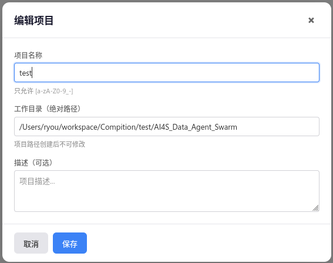
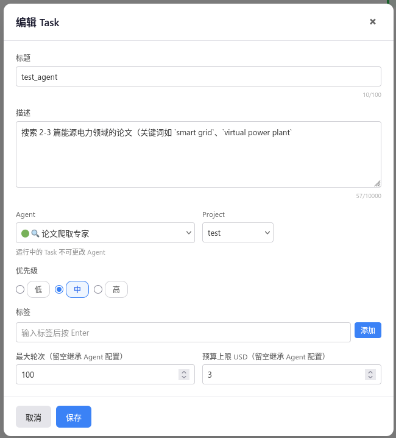
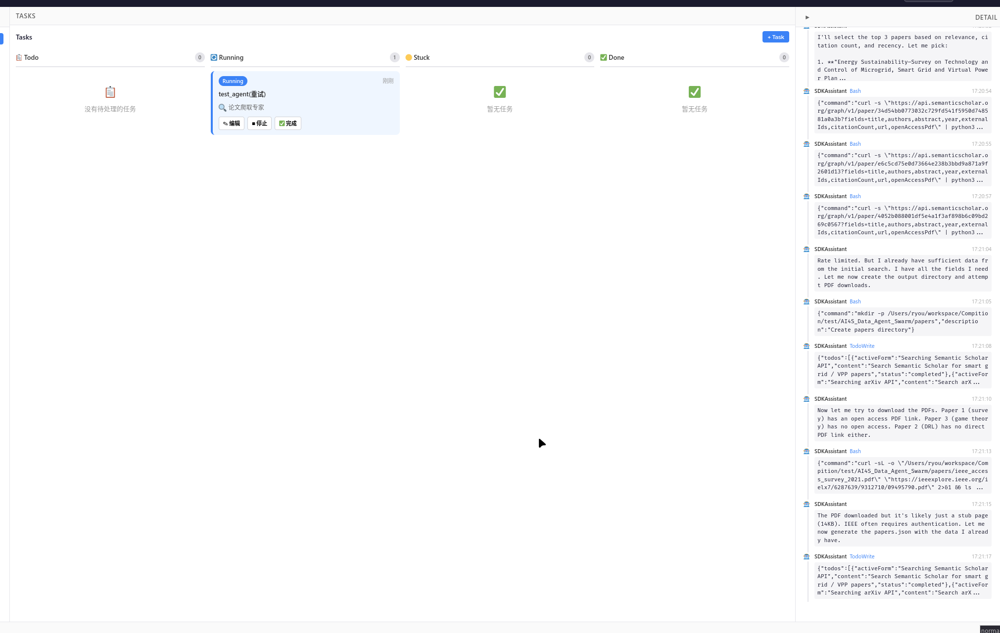
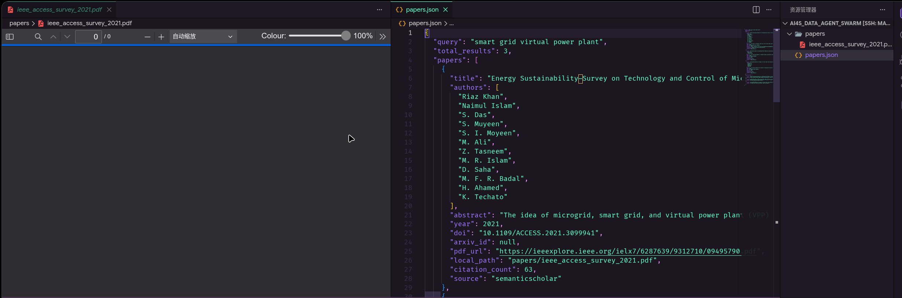
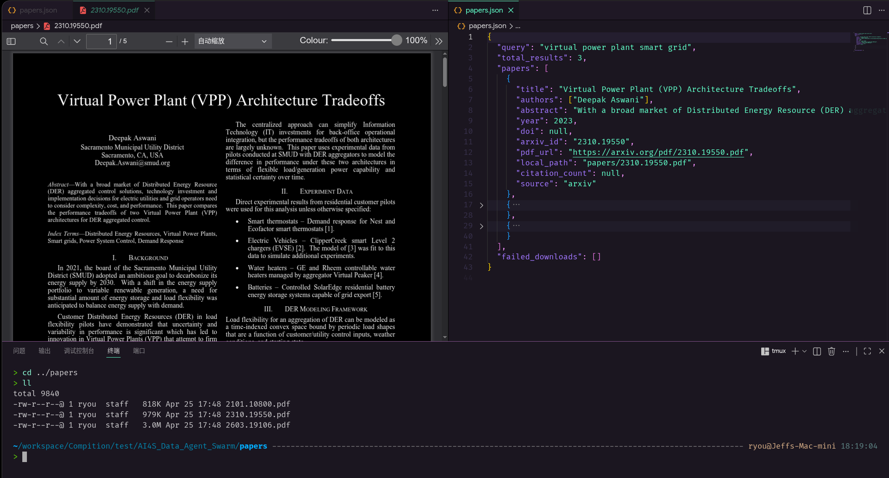

# Agent 1 论文爬取专家 — 端到端测试规范

## 人类操作
### 1. 添加 project


```plaintext
项目名称：test
工作目录：/Users/ryou/workspace/Compition/test/AI4S_Data_Agent_Swarm
描述：无
```
### 2. 添加task


```plaintext
任务名称：test_agent1
任务描述：搜索 2-3 篇能源电力领域的论文（关键词如 `smart grid`、`virtual power plant`
```
### 3. 任务执行


### 4. 结果展示


问题1: 只下载了一篇打不开的论文，paper json中有三篇论文的链接，但实际只下载了一篇，并且打不开。

### 5. 修复结果
