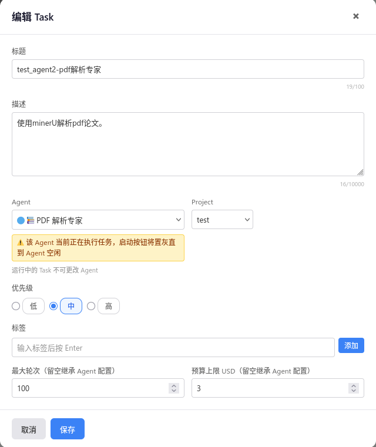
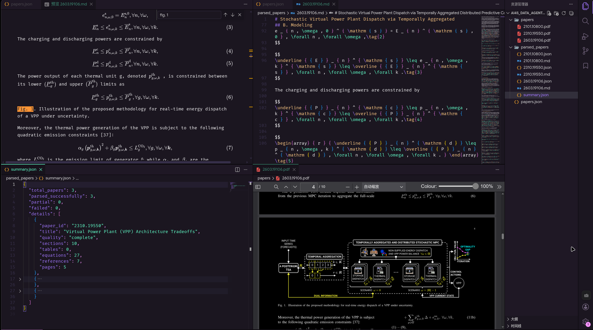
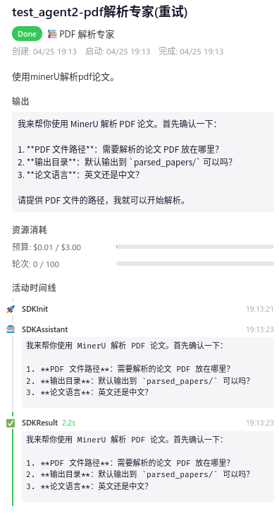
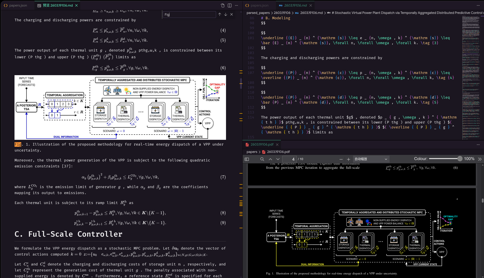
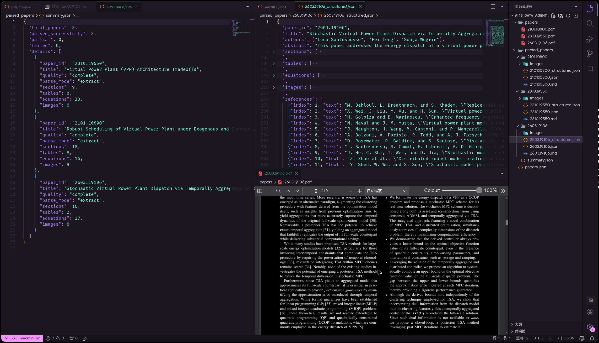

## Agent 2 PDF 解析专家

### 1. 复用 Project
### 2. 配置MinerU CLI 与API
```bash
> bun install -g mineru-open-api
> mineru-open-api version
mineru-open-api version v0.5.9
  commit: e268d90b
  built:  2026-04-10T13:47:57Z
  go:     go1.21.13
  os:     darwin/arm64
# 测试 flash-extract 功能 不需要API 但没有./imges/image.png
> mineru-open-api flash-extract ./examples/papers/2510_04815.pdf -o ./out
Thinking... 2510_04815.pdf (flash)
Done: out/2510_04815.md (73.9 KB)
# 测试 auth 功能 需要API
> mineru-open-api auth
Please input your API key: ********************
Auth successful!
# 学术论文（复杂排版）配置 Token（前往 https://mineru.net/apiManage/token 创建）
> mineru-open-api extract document.pdf --model vlm -o ./output/
```
### 3. 添加task



```plaintext
标题：test_agent2-pdf解析专家
描述：使用minerU解析pdf论文。
Agent：论文解析专家
project：test
```
### 4. 结果
```plaintext
{"command":"mineru-open-api flash-extract papers/2310.19550.pdf -o ./parsed_papers/ --language en","description":"Parse 2310.19550.pdf with flash-extract","timeout":120000}
```
强制使用 flash-extract 模式解析论文，生成 JSON 文件。


### 5. 修复结果

